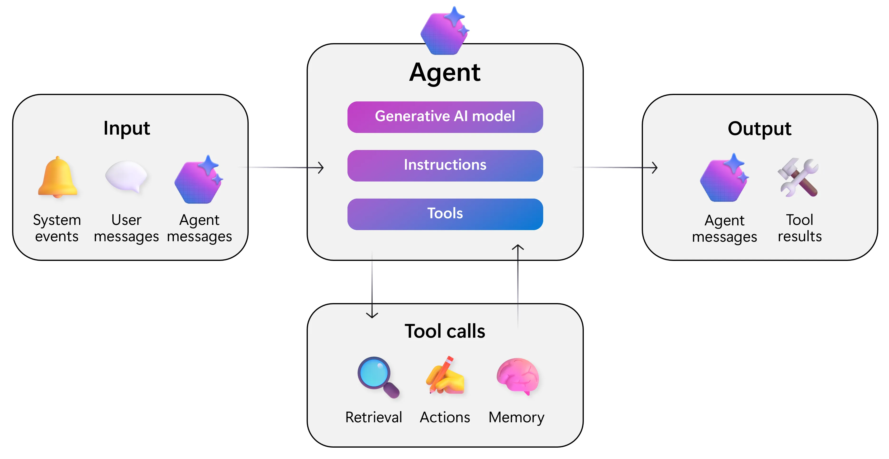
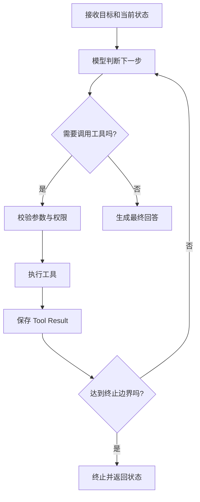
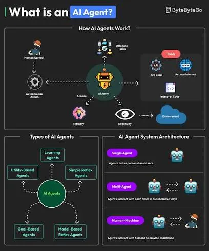
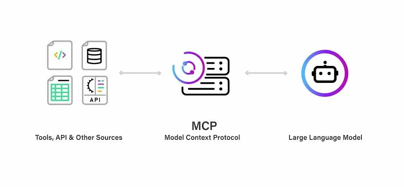
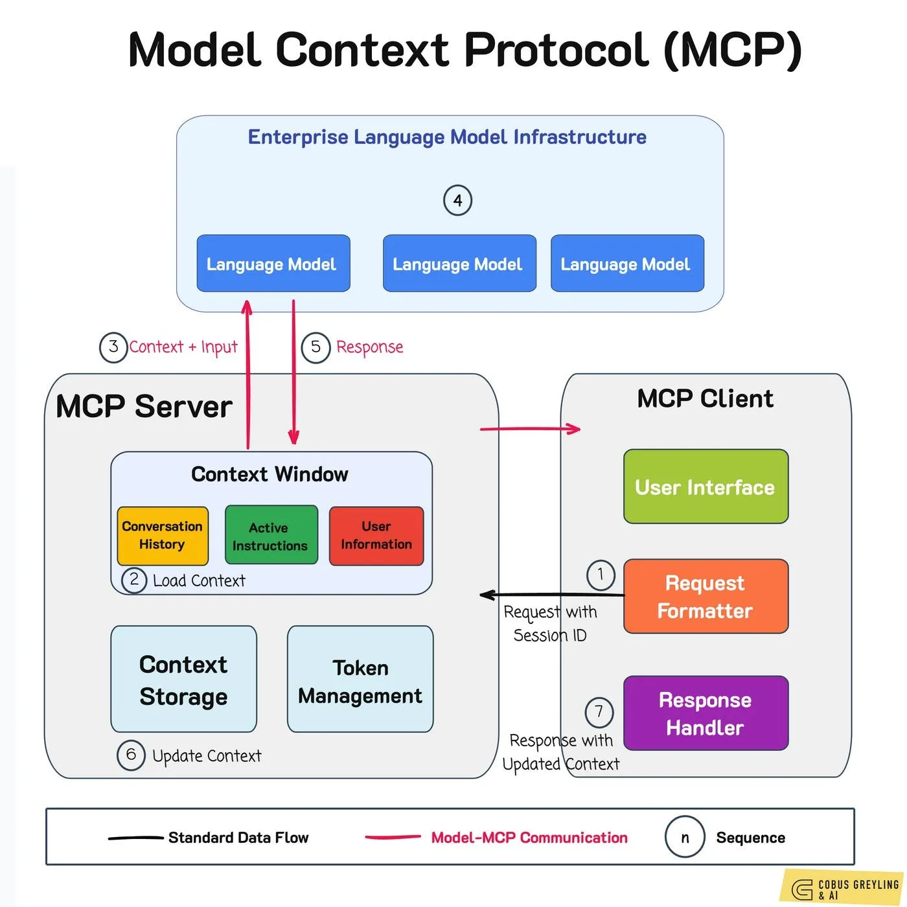

前面的文章已经分别讨论了模型 API、Structured Outputs、Function Calling、多轮对话、Token 和 RAG。这些能力组合起来后，应用可以理解请求、维护状态、检索知识并调用业务系统。

但有些任务需要根据中间结果动态决定下一步。例如：

```text
查询项目当前版本，检查近期相关故障，
整理故障原因，并给出处理建议。
```

系统可能需要查询版本、搜索日志、读取发布记录、检索技术文档，再根据每一步结果决定是否继续调查。这已经不只是一次模型调用或一次 Tool Call，而是一个包含目标、状态、工具、循环和终止条件的执行系统。

Agent 负责围绕目标组织多步骤执行；MCP（Model Context Protocol）负责用统一协议向 AI 应用暴露工具和上下文。二者解决不同问题，却经常共同构成工具型 AI 应用的核心。

## Agent 的运行模型

### Agent 不是一种新模型

从工程角度看，Agent 是由模型驱动的运行系统。它持续读取目标和状态、选择工具、处理结果，并决定下一步动作，直到任务完成或触发终止条件。

可以把它概括为：

```text
Goal + Model + Tools + State + Execution Loop
```

普通模型调用主要完成输入到输出的映射；Agent 则在模型之外增加了工具执行、状态更新和流程控制。模型并没有突然获得不同类型的智能，改变的是应用的运行方式。



### Agent Loop

Function Calling 已经提供了 Agent Loop 的基础。模型产生 Tool Call，应用执行工具，再把 Tool Output 返回模型；只要任务尚未结束，这个过程就可以继续。



最小实现可以直接建立在 Responses API 上：

```python
import json

from openai import OpenAI

client = OpenAI()


def run_agent(
    user_input: str,
    tools: list,
    functions: dict,
    max_turns: int = 10,
) -> str:
    response = client.responses.create(
        model='gpt-5.6',
        input=user_input,
        tools=tools,
    )

    for _ in range(max_turns):
        calls = [
            item
            for item in response.output
            if item.type == 'function_call'
        ]

        if not calls:
            return response.output_text

        outputs = []

        for call in calls:
            function = functions.get(call.name)
            if function is None:
                raise ValueError(f'Unknown tool: {call.name}')

            arguments = json.loads(call.arguments)
            result = function(**arguments)

            outputs.append(
                {
                    'type': 'function_call_output',
                    'call_id': call.call_id,
                    'output': json.dumps(
                        result,
                        ensure_ascii=False,
                    ),
                }
            )

        response = client.responses.create(
            model='gpt-5.6',
            previous_response_id=response.id,
            input=outputs,
            tools=tools,
        )

    raise RuntimeError('Agent exceeded maximum turns')
```

这段代码只展示核心循环。生产系统还要处理超时、并发、重试、幂等、审批、预算和 Trace。

### State 与终止条件

假设任务是“订单发货后继续查询物流”，订单工具返回的状态必须进入 Agent State，模型下一轮才能判断是否调用物流工具。

State 可能包含：

- 用户目标与 Conversation；
- Tool Call 和 Tool Result；
- 中间结构化数据；
- 已完成步骤和待办步骤；
- Token、费用和时间预算。

Agent 不能依赖无限 `while True`。应用应设置最大推理轮次、最大工具调用数、超时、Token 或费用预算，以及明确的业务终止条件。模型负责提出下一步，Runtime 负责决定这一步是否允许继续。



## 工具与执行边界

### 工具数量和职责

把企业全部 API 同时暴露给一个 Agent，会增加 Tool Definition Token、选择难度和权限风险。更合理的方式是根据职责提供较小的工具集合：

| Agent | 典型工具 |
|---|---|
| Order Agent | `get_order`、`query_logistics`、`cancel_order` |
| DevOps Agent | `query_service`、`search_logs`、`restart_service` |
| Documentation Agent | `search_document`、`read_document` |

工具应优先表达高层业务能力，例如 `cancel_order`，而不是暴露 `execute_any_sql`、`run_any_shell` 之类的万能接口。参数 Schema、返回结构和错误语义也应稳定明确。

工具库很大时，可以通过 Tool Search 按需加载相关定义，避免一次把所有工具放入模型上下文。工具发现降低了静态注册成本，但不代表 Agent 应拥有无限能力。

### Read Tool 与 Action Tool

工具可以按风险分为两类：

| 类型 | 示例 | 主要控制 |
|---|---|---|
| Read Tool | 查询订单、搜索文档、读取日志 | 数据范围、脱敏、访问审计 |
| Action Tool | 退款、重启服务、发送邮件、删除文件 | 鉴权、审批、幂等、事务、回滚 |

高风险操作适合采用 Human in the Loop。Agent 生成操作建议和参数，用户或审批系统确认后，再由应用执行。批准的应是具体动作，而不是给 Agent 一次永久的宽泛授权。

### Agent 与 Workflow

Workflow 的步骤主要由程序员预先确定，Agent 则允许模型根据中间状态选择下一步。固定流程如“上传、解析、摘要、保存”通常直接编写 Workflow 更可靠；线上故障调查等下一步高度依赖现场信息的任务，才更能体现 Agent 的价值。

判断标准不是“能不能使用 Agent”，而是动态决策带来的收益是否超过额外的成本、延迟和不确定性。

## MCP 的角色

### MCP 解决标准化接入

没有 MCP 时，每个 AI 应用通常要为 GitHub、工单、数据库、文件系统和内部服务分别实现工具适配。MCP 让外部能力通过统一协议被发现和调用，从而降低 Tool Provider 与 AI Application 的耦合。



MCP 不替代 REST、gRPC、数据库协议或 API Gateway。MCP Server 内部通常仍然通过这些传统接口访问业务系统，它处于面向 AI 的集成层。

### Host、Client 与 Server

MCP 系统可以用三个角色理解：

| 角色 | 职责 |
|---|---|
| Host | 运行 AI 应用，例如 IDE、助手或 Agent Runtime |
| Client | Host 内负责与 MCP Server 通信的组件 |
| Server | 暴露工具、资源或其他上下文能力 |

MCP Server 可以封装 GitHub、数据库、文件系统或企业知识库。一个受控的 DevOps MCP Server 可以提供 `query_service_status`、`search_logs` 和 `get_deployment`，供多个 Agent 或 AI 客户端复用。



### MCP 与相邻概念

| 概念 | 解决的问题 |
|---|---|
| Agent | 如何围绕目标组织多步骤执行 |
| Function Calling | 模型如何请求应用执行某个函数 |
| MCP | 工具提供方如何标准化暴露和执行能力 |
| RAG | 如何检索外部知识并加入上下文 |
| API Gateway | 路由、认证、限流和流量治理 |

Agent 可以只使用普通 Function Tools，也可以连接多个 MCP Server；MCP Tool 也可以被普通模型调用，而不一定存在复杂的 Agent Loop。MCP 还可以把内部 RAG 服务包装成 `search_internal_docs` 工具，但它并不替代 RAG 本身。

## 连接 MCP Server

### Remote MCP

Responses API 可以通过 `mcp` Tool 连接远程 MCP Server：

```python
response = client.responses.create(
    model='gpt-5.6',
    input='查询与故障 E10023 相关的内部资料。',
    tools=[
        {
            'type': 'mcp',
            'server_label': 'internal_docs',
            'server_description': (
                'Search approved internal technical documents.'
            ),
            'server_url': 'https://example.com/mcp',
            'allowed_tools': ['search_documents'],
            'require_approval': 'always',
        }
    ],
)
```

API 会先发现 Server 暴露的工具，产生 `mcp_list_tools` 输出项；模型决定调用时会产生 `mcp_call`。`allowed_tools` 可以限制导入范围，减少 Token、延迟和不必要的权限暴露。

公网可访问的 MCP Server 可以通过 Remote MCP 连接。私有网络或防火墙后的 Server 可以通过 Secure MCP Tunnel 接入，避免直接暴露到公网。

### 本地与环境内连接

开发工具经常需要访问本机代码仓库、Git、文件和构建命令。这些能力不适合部署为公网服务，因此 stdio 或运行环境内的 HTTP MCP 更合适。

不同 Runtime 支持的连接位置和传输方式并不完全相同。选择 Remote MCP、Secure MCP Tunnel、环境内 HTTP 或 stdio 时，需要同时考虑 Server 可达性、凭证位置、执行环境和信任边界。

### Tool Discovery 也有成本

MCP Server 暴露的工具定义需要进入模型上下文。一个 Server 如果发布数百个工具，会增加 Token、延迟和选择难度。

应使用 `allowed_tools`、职责拆分和延迟加载控制工具范围，并在多轮流程中复用已经获得的工具列表。标准化协议解决的是接入问题，不会自动解决上下文预算和工具治理。

## 安全与审批

### MCP 不是安全边界

MCP 只定义连接和能力暴露方式，不负责替业务系统完成 Authentication、Authorization、ACL、审计和事务控制。即使工具通过 MCP 提供，服务端仍必须验证当前身份是否能够执行该操作。

最小权限原则同样适用：只读任务使用只读数据库账号；仓库查询使用只读 Token；不同租户和项目使用明确的资源范围。优先使用服务提供方运营的官方 MCP Server，并审查第三方 Server 的实现和数据处理方式。

### Prompt Injection 与不可信结果

MCP Tool 返回的 Issue、网页、日志或数据库字段都可能包含恶意内容，例如诱导模型忽略规则并调用高风险工具。这些内容属于不可信数据，而不是 Developer Instructions。

应用应保证：

- Tool Result 不能提升自身指令权限；
- 敏感动作由服务端重新鉴权和校验；
- 从 Tool Result 得到的 URL 不被盲目加载或展示；
- 外发到 MCP Server 的数据经过最小化和审计；
- Prompt Injection 不能绕过审批或资源权限。

连接不可信 MCP Server 可能导致上下文数据泄漏或未授权操作，因此 Server 信任本身就是安全决策。

### Approval

Remote MCP 默认可以要求工具调用审批。审批请求应向用户展示 Server、Tool、参数、将要共享的数据和预期影响。

只读且范围明确的工具可以按策略自动允许；删除、支付、部署和权限修改等操作应逐次批准。审批不能替代服务端鉴权，也不应把敏感凭证暴露给模型。

## Agent Runtime 的选择

### Responses API、Agents SDK 与 Agents API

OpenAI 当前提供不同层级的 Agent 构建方式：

| 方案 | 控制边界 | 更适合 |
|---|---|---|
| Responses API | 应用自行管理循环、状态与本地工具 | 定制 Runtime、学习核心机制 |
| Agents SDK | SDK 管理 Runner、Tools、Handoff 与 Tracing | 在应用内构建可组合 Agent |
| Agents API | 托管 Agent Harness、Session 与运行基础设施 | 长任务和托管执行环境 |

选择哪一层取决于状态存储、部署、审批、沙箱和可观测性由谁负责。Agent Session、Responses Conversation 和 Sandbox 是不同资源，生命周期不能混为一谈。

### Handoff 与 Multi-Agent

Handoff 可以把任务交给更专业的 Agent，例如客服 Agent 将退款问题转给 Billing Agent。但 Multi-Agent 会增加 Token、延迟、状态和调试复杂度。

一个 Agent 能清晰完成的任务，不应为了架构形式强行拆分。只有当专业工具集、权限边界或任务所有权确实不同，Handoff 才有明显价值。

### Guardrail 的边界

Guardrail 可以检查输入、输出或部分运行条件，但不能代替数据库权限、参数校验和业务规则。可靠系统应同时具备模型层约束与传统软件控制，而不是把安全责任全部交给 Prompt 或分类模型。

## 可观测性与成本

### Trace 执行过程

Agent 可能经历多次模型和工具调用。只记录最终回答无法解释失败原因，至少应追踪：

```text
trace_id / conversation_id
每轮模型响应
Tool 名称、参数与结果摘要
审批与权限判断
执行时间和错误
输入、输出及缓存 Token
终止原因
最终结果
```

敏感参数和 Tool Result 应脱敏，不应为了排查问题把凭证或完整私密数据写入日志。

### 分层分析错误

| 错误层级 | 典型表现 |
|---|---|
| Planning | 选择错误工具或步骤 |
| Parameters | Tool Arguments 不正确 |
| Tool | 外部系统超时或执行失败 |
| Retrieval | RAG 找到错误资料 |
| State | 中间结果没有正确保存 |
| Permission | 凭证或资源范围不匹配 |
| Loop | 重复调用或无法终止 |
| Generation | 最终总结与事实不一致 |

Agent Evaluation 不应只看最终答案，还要评估工具选择、参数正确性、多余调用、高风险动作和执行轨迹。

### 控制 Token 与 Tool Result

每轮 Agent 都会增加历史 Context、工具定义、Tool Result 和模型输出。日志工具一次返回上万行内容，如果之后每轮都继续携带，Token 会迅速增长。

Runtime 应对结果进行字段筛选、截断、摘要或持久化后引用，并设置最大轮次、最大 Tool Call、Token、费用和时间预算。Streaming 改善的是用户感知延迟，不会消除这些成本。

## 生产架构原则

### 推荐的模块边界

一个可维护的 Agent 系统通常包含：

```text
API Layer
Agent Runtime
Context Manager
Tool Registry
MCP Clients
Guardrails
Business Services
Approval Service
Observability
```

Agent 不应直接承载核心业务逻辑。工具调用最终仍应进入具备鉴权、校验、事务、幂等、限流和审计的业务服务。

### 自主程度按风险分级

| 等级 | 能力 | 适用范围 |
|---|---|---|
| Read Only | 搜索、读取、分析和总结 | 默认起点 |
| Proposal | 生成操作方案或草稿 | 需要人工执行 |
| Approved Action | 获批后执行具体动作 | 中高风险操作 |
| Autonomous Action | 自动执行 | 低风险、可回滚、可审计任务 |

Agent 的可靠性主要来自清晰工具、最小权限、可控状态、失败恢复和完整审计，而不是单纯依赖更强的模型。一个好的执行环境应该让模型即使判断失误，也难以造成不可恢复的后果。

## 总结

Agent 解决的是如何围绕目标持续判断、选择工具、更新状态并完成多步骤任务；MCP 解决的是外部能力如何以统一协议被 AI 应用发现和调用。

两者结合后，可以构建连接代码、文档、工单、监控和业务服务的工具型 AI 系统。但能力越多，越需要坚持最小权限、明确工具边界、执行预算、敏感操作审批、完整 Trace 和服务端鉴权。

Agent Engineering 的目标不是让模型获得尽可能多的权限，而是在严格的软件工程边界内，为模型提供完成任务所需的最小能力。

本文 API 行为参考：

- [OpenAI Agents 官方文档](https://developers.openai.com/api/docs/guides/agents)
- [OpenAI MCP Servers 官方文档](https://developers.openai.com/api/docs/guides/tools-connectors-mcp)
- [OpenAI Function Calling 官方文档](https://developers.openai.com/api/docs/guides/function-calling)
