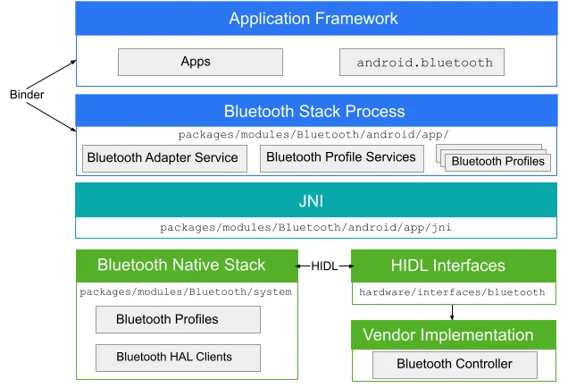
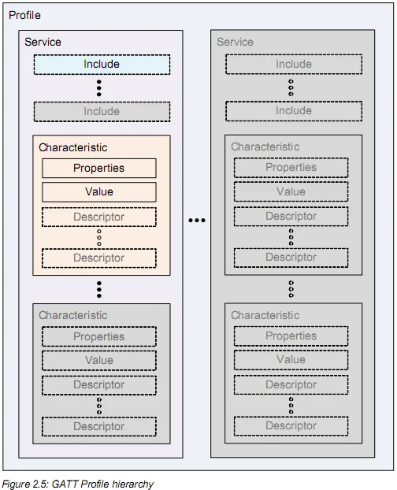
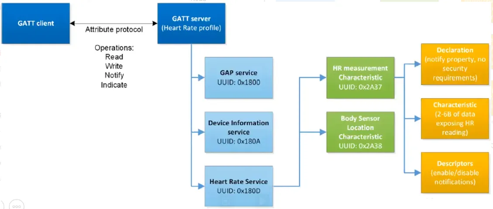

在 Android 开发里，蓝牙一直是一个“看起来 API 不多，真正做起来坑很多”的方向。尤其是 BLE 场景，代码主流程并不复杂，但只要涉及权限适配、扫描、连接状态切换、服务发现、通知订阅、设备兼容性，问题就会一个接一个冒出来。

这篇文章不打算把所有 API 文档逐个展开，而是从**开发者真正需要建立的认知主线**出发，把 Android 蓝牙开发里最核心的内容串起来。读完之后，至少应该能回答下面这些问题：

- Android 蓝牙和 BLE 到底在解决什么问题
- 经典蓝牙和 BLE 有什么区别
- Android 12 之后蓝牙权限为什么突然变复杂了
- 一个 BLE 设备从扫描到通信，主流程到底是什么
- 为什么“明明连上了”，但还是不能立即读写数据
- 为什么蓝牙开发经常表现得“不稳定”



## 什么是 Android 蓝牙开发

简单来说，Android 蓝牙开发就是让手机和附近的蓝牙设备建立连接，并完成发现、配对、通信等操作。

常见场景包括：

- 连接蓝牙耳机、键盘、打印机等经典蓝牙设备
- 连接手环、体脂秤、血压计、门锁、Beacon、IoT 模块等 BLE 设备
- 在手机和硬件设备之间传递控制指令、状态信息、传感器数据

如果从今天大多数业务场景来看，移动端开发更常遇到的是 **BLE（Bluetooth Low Energy，低功耗蓝牙）**。Android 官方文档也明确说明，Android 提供了 BLE central role 的平台支持，应用可以用这些 API 来发现设备、查询服务并传输数据。与此同时，BLE 相比经典蓝牙的一个重要特点就是**更低的功耗**，适合心率带、传感器、近场设备等场景。这个判断来自 Android Developers 的 BLE 概览文档。  
参考：<https://developer.android.com/develop/connectivity/bluetooth/ble/ble-overview>

## 经典蓝牙和 BLE 的区别

在正式写代码之前，最好先把这两个概念区分开。

### 经典蓝牙

经典蓝牙更适合持续连接、数据量更大、实时性要求更高的场景，比如：

- 蓝牙耳机音频传输
- 车载设备
- 键盘鼠标
- 打印机

### BLE

BLE 更适合低功耗、小数据量、间歇性通信的场景，比如：

- 智能手环
- 健康设备
- 环境传感器
- 智能门锁
- Beacon 广播设备

如果一句话概括：

- 经典蓝牙偏“持续稳定的数据通道”
- BLE 偏“低功耗设备之间的轻量通信”

所以当我们在 Android 业务开发里说“蓝牙开发”时，很多时候其实默认指的是 **BLE 开发**。

## BLE 里最重要的几个概念

很多人写 BLE 代码时容易乱，本质原因不是 API 太多，而是对 BLE 模型没有建立稳定认知。Android 官方文档里把几个关键术语讲得很清楚，这里用最实用的方式整理一下。

### Central 和 Peripheral

这是**连接层面的角色**。

- `Central`：主动扫描附近设备，并发起连接
- `Peripheral`：负责广播自己，等待别人连接

在常见业务里：

- 手机通常扮演 `Central`
- 手环、传感器、硬件模块通常扮演 `Peripheral`

### GATT Client 和 GATT Server

这是**通信层面的角色**。

- `GATT Client`：发起数据请求
- `GATT Server`：提供服务和数据

在大多数 BLE 场景里：

- Android 手机是 `Central`
- 同时也是 `GATT Client`
- 外部 BLE 设备是 `Peripheral`
- 同时也是 `GATT Server`

### Service、Characteristic、Descriptor

这是 BLE 数据组织的核心。

- `Service`：一组相关功能的集合
- `Characteristic`：真正承载数据的特征值
- `Descriptor`：对特征值的补充描述

可以把它理解成下面这种层级：

```text
Device
└── Service
    ├── Characteristic
    │   └── Descriptor
    └── Characteristic
```

Android 官方文档提到，GATT 是 BLE 链路上传输 attribute 的通用规范，而当前 BLE 应用几乎都建立在 GATT 之上。这也是为什么 Android BLE 开发会不断围绕 `BluetoothGatt`、`Service`、`Characteristic` 这些对象展开。  
参考：<https://developer.android.com/develop/connectivity/bluetooth/ble/ble-overview>



## Android 蓝牙开发的主流程

如果只记一条主线，我建议记下面这个：

```text
检查设备是否支持蓝牙
-> 获取 BluetoothAdapter
-> 检查蓝牙是否开启
-> 申请运行时权限
-> 扫描目标设备
-> 发起 GATT 连接
-> 连接成功后发现服务
-> 找到目标 Characteristic
-> 读 / 写 / 订阅通知
-> 断开连接并释放资源
```

这条链路几乎覆盖了大多数 Android BLE 项目。

真正开发时，很多 bug 都发生在两个地方：

1. 权限和系统状态没有处理完整
2. 连接时序没有处理对

## 第一步：检查设备和蓝牙状态

首先要确认设备是否支持蓝牙，以及蓝牙是否已经开启。

```kotlin
val bluetoothManager =
    getSystemService(Context.BLUETOOTH_SERVICE) as BluetoothManager
val bluetoothAdapter = bluetoothManager.adapter

if (bluetoothAdapter == null) {
    // 当前设备不支持蓝牙
}

if (!bluetoothAdapter.isEnabled) {
    // 提示用户开启蓝牙
}
```

这一步看起来很简单，但它的意义在于：**不要默认系统环境一定满足业务前提**。蓝牙功能、蓝牙开关、定位开关、权限状态，这些都属于运行时条件，任何一个不成立，都可能让你后面的逻辑看起来“像是失效了”。

## 第二步：权限适配

Android 蓝牙开发里，权限是最容易把人绕晕的一部分。

### Android 12 及以上

从 Android 12 开始，蓝牙权限拆得更细。Android Developers 文档给出的规则是：

- 扫描设备需要 `BLUETOOTH_SCAN`
- 让设备可被发现需要 `BLUETOOTH_ADVERTISE`
- 与已配对设备通信需要 `BLUETOOTH_CONNECT`

而且这些权限都是**运行时权限**，需要在代码里动态申请。  
参考：<https://developer.android.com/develop/connectivity/bluetooth/bt-permissions>

Manifest 可以这样写：

```xml
<uses-permission
    android:name="android.permission.BLUETOOTH"
    android:maxSdkVersion="30" />

<uses-permission
    android:name="android.permission.BLUETOOTH_ADMIN"
    android:maxSdkVersion="30" />

<uses-permission android:name="android.permission.BLUETOOTH_SCAN" />
<uses-permission android:name="android.permission.BLUETOOTH_CONNECT" />
```

如果你的业务需要让本机对外广播，再补：

```xml
<uses-permission android:name="android.permission.BLUETOOTH_ADVERTISE" />
```

### Android 11 及以下

Android 官方文档说明，在 Android 11 及以下，如果应用要执行蓝牙扫描，通常还需要位置权限，因为扫描结果可能被用于推导用户物理位置。  
参考：<https://developer.android.com/develop/connectivity/bluetooth/bt-permissions>

这也是很多开发同学的困惑来源：

- “我明明是在做蓝牙，为啥要定位权限？”

答案是：**因为系统从隐私角度把蓝牙扫描和位置推断绑定考虑了。**

### `neverForLocation`

如果你的应用确实不会通过蓝牙扫描结果推导用户位置，Android 官方提供了 `neverForLocation` 的声明方式，但文档也提醒：加上这个标记后，**部分 BLE beacon 结果可能会被过滤掉**。这不是一个“随手加了更省事”的配置，而是带有功能权衡的声明。  
参考：<https://developer.android.com/develop/connectivity/bluetooth/bt-permissions>

```xml
<uses-permission
    android:name="android.permission.BLUETOOTH_SCAN"
    android:usesPermissionFlags="neverForLocation" />

<uses-permission
    android:name="android.permission.ACCESS_FINE_LOCATION"
    android:maxSdkVersion="30" />
```

### 动态申请权限

以 Android 12+ 为例，可以这样申请：

```kotlin
private val bluetoothPermissionLauncher =
    registerForActivityResult(ActivityResultContracts.RequestMultiplePermissions()) { result ->
        val scanGranted = result[Manifest.permission.BLUETOOTH_SCAN] == true
        val connectGranted = result[Manifest.permission.BLUETOOTH_CONNECT] == true
        if (scanGranted && connectGranted) {
            startBleScan()
        }
    }

private fun requestBluetoothPermissions() {
    if (Build.VERSION.SDK_INT >= Build.VERSION_CODES.S) {
        bluetoothPermissionLauncher.launch(
            arrayOf(
                Manifest.permission.BLUETOOTH_SCAN,
                Manifest.permission.BLUETOOTH_CONNECT
            )
        )
    }
}
```

:::tip[经验建议]
不要把蓝牙权限写成一套“永远通用”的固定模板。应该根据系统版本、业务是否需要扫描、是否需要连接、是否需要广播，拆成最小权限集合。
:::

## 第三步：扫描 BLE 设备

权限准备好之后，通常就进入扫描阶段。

Android 里常用的是 `BluetoothLeScanner`：

```kotlin
private var bluetoothLeScanner: BluetoothLeScanner? = null

private val scanCallback = object : ScanCallback() {
    override fun onScanResult(callbackType: Int, result: ScanResult) {
        val device = result.device
        val deviceName = device.name
        val mac = device.address
        // 根据名称、MAC、厂商数据或 Service UUID 过滤目标设备
    }

    override fun onScanFailed(errorCode: Int) {
        // 处理扫描失败
    }
}

private fun startBleScan() {
    bluetoothLeScanner = bluetoothAdapter.bluetoothLeScanner
    bluetoothLeScanner?.startScan(scanCallback)
}

private fun stopBleScan() {
    bluetoothLeScanner?.stopScan(scanCallback)
}
```

如果业务比较明确，建议一开始就做过滤，不要把所有结果无差别展示出来。可用的过滤条件一般包括：

- 设备名
- MAC 地址
- Service UUID
- 广播包中的厂商数据

### 为什么扫描最好设置超时

扫描本身是持续动作，如果没有超时控制，可能会带来几个问题：

- 持续耗电
- 页面退出后仍然占资源
- 结果回调重复触发，状态管理变乱

所以更稳妥的做法是：

- 进入页面后开始扫描
- 找到目标设备立即停止扫描
- 超过固定时间自动停止

```kotlin
private val handler = Handler(Looper.getMainLooper())

private fun startBleScanWithTimeout() {
    startBleScan()
    handler.postDelayed({
        stopBleScan()
    }, 10_000L)
}
```

## 第四步：建立 GATT 连接

找到目标设备后，就可以发起 GATT 连接。

```kotlin
private var bluetoothGatt: BluetoothGatt? = null

private fun connectDevice(device: BluetoothDevice) {
    bluetoothGatt = if (Build.VERSION.SDK_INT >= Build.VERSION_CODES.M) {
        device.connectGatt(this, false, gattCallback, BluetoothDevice.TRANSPORT_LE)
    } else {
        device.connectGatt(this, false, gattCallback)
    }
}
```

核心回调通常长这样：

```kotlin
private val gattCallback = object : BluetoothGattCallback() {

    override fun onConnectionStateChange(gatt: BluetoothGatt, status: Int, newState: Int) {
        if (status == BluetoothGatt.GATT_SUCCESS &&
            newState == BluetoothProfile.STATE_CONNECTED
        ) {
            gatt.discoverServices()
        } else if (newState == BluetoothProfile.STATE_DISCONNECTED) {
            gatt.close()
        }
    }

    override fun onServicesDiscovered(gatt: BluetoothGatt, status: Int) {
        if (status == BluetoothGatt.GATT_SUCCESS) {
            // 服务发现完成，此时才能进行后续读写操作
        }
    }
}
```

这里有一个非常关键的认知：

> **连接成功不等于可以立刻通信。**

很多初学者看到 `STATE_CONNECTED` 就马上去读写 Characteristic，结果不是失败就是没反应。正确的时机通常是：

1. 连接建立成功
2. 调用 `discoverServices()`
3. 收到 `onServicesDiscovered()`
4. 再开始查找 service / characteristic 并通信

这一点是 BLE 开发时序里最容易犯错的地方。

## 第五步：发现服务与特征值

服务发现完成后，需要根据 UUID 找到目标 Service 和 Characteristic。

```kotlin
private val serviceUuid =
    UUID.fromString("0000180D-0000-1000-8000-00805F9B34FB")
private val characteristicUuid =
    UUID.fromString("00002A37-0000-1000-8000-00805F9B34FB")

private fun findCharacteristic(gatt: BluetoothGatt): BluetoothGattCharacteristic? {
    val service = gatt.getService(serviceUuid) ?: return null
    return service.getCharacteristic(characteristicUuid)
}
```

这里一定要有一个心理预期：

- 不同设备的 UUID 设计不同
- 同一个厂商不同型号也可能不完全一致
- 有些设备文档写得非常清楚
- 有些设备只能靠协议说明书或者对接文档确认

所以 Android 蓝牙开发从来不是只会写移动端代码就够了，很多时候还需要和硬件、固件或者协议同学对齐。

## 第六步：读取、写入和通知

服务和特征值找到之后，正式进入通信阶段。

### 读取数据

```kotlin
private fun readCharacteristic(
    gatt: BluetoothGatt,
    characteristic: BluetoothGattCharacteristic
) {
    gatt.readCharacteristic(characteristic)
}
```

回调里拿结果：

```kotlin
override fun onCharacteristicRead(
    gatt: BluetoothGatt,
    characteristic: BluetoothGattCharacteristic,
    value: ByteArray,
    status: Int
) {
    if (status == BluetoothGatt.GATT_SUCCESS) {
        // 解析 value
    }
}
```

### 写入数据

```kotlin
private fun writeCharacteristic(
    gatt: BluetoothGatt,
    characteristic: BluetoothGattCharacteristic,
    data: ByteArray
) {
    characteristic.value = data
    gatt.writeCharacteristic(characteristic)
}
```

### 订阅通知

在真实项目里，很多设备数据并不是“你去读一次，它就回一次”，而是设备在状态变化时主动推送。这种场景更常见的方式是 `notify`。

```kotlin
private val cccdUuid =
    UUID.fromString("00002902-0000-1000-8000-00805F9B34FB")

private fun enableNotification(
    gatt: BluetoothGatt,
    characteristic: BluetoothGattCharacteristic
) {
    gatt.setCharacteristicNotification(characteristic, true)

    val descriptor = characteristic.getDescriptor(cccdUuid) ?: return
    descriptor.value = BluetoothGattDescriptor.ENABLE_NOTIFICATION_VALUE
    gatt.writeDescriptor(descriptor)
}
```

收到通知时的回调：

```kotlin
override fun onCharacteristicChanged(
    gatt: BluetoothGatt,
    characteristic: BluetoothGattCharacteristic,
    value: ByteArray
) {
    // 设备主动上报数据
}
```

:::important[注意]
`setCharacteristicNotification()` 只是本地开关，很多设备还要求你继续写入 CCCD Descriptor，通知才会真正生效。只调用前者而不写 Descriptor，是非常常见的坑。
:::



## BLE 开发里最容易忽略的时序问题

Android BLE 代码看起来像是“调用一个 API 就完成一个动作”，但实际上大部分操作都是**异步的**。也就是说：

- 扫描不是立即出结果
- 连接不是立即成功
- 服务发现不是立即完成
- 读写也不是同步返回

因此一个更贴近真实项目的思维方式应该是：

```text
发起操作
-> 等待回调
-> 在正确回调里发起下一步操作
```

而不是：

```text
connectGatt()
discoverServices()
readCharacteristic()
writeCharacteristic()
```

把这些 API 连着一口气调用下去，通常只会制造出“偶现问题”。

### 为什么很多 BLE 操作要串行

在工程实践里，BLE 常见问题之一就是多个操作并发发起，导致状态错乱或者失败。因此更稳妥的方案通常是：

- 建立一个操作队列
- 一次只执行一个 GATT 操作
- 等当前操作回调完成，再发下一个

这类设计对提高稳定性非常有帮助。

## 常见踩坑总结

这一部分通常比 API 介绍更有价值，因为很多问题不是“不会写”，而是“为什么明明这样写了还是不工作”。

### 1. 扫描不到设备

常见原因有：

- 权限没申请全
- 用户没有授予运行时权限
- 蓝牙没开
- 设备本身没有在广播
- 过滤条件写错
- 使用 `neverForLocation` 后部分 beacon 被过滤

### 2. 连接成功但发现不到服务

这通常意味着：

- 连接状态还不稳定就过早发起了发现
- 设备端 GATT 服务没有按预期准备好
- 某些机型存在兼容性问题
- 连接虽然建立了，但实际通信链路没有稳定下来

### 3. 写入没报错，但设备没有反应

可以重点检查：

- 写入的 UUID 是否正确
- 数据协议是否正确
- 写入类型是否匹配
- 是否需要先完成某个握手动作
- 是否应该写入另一个 Characteristic

### 4. 订阅通知后收不到数据

优先排查：

- 是否只调用了 `setCharacteristicNotification()`
- 是否真正写入了 CCCD Descriptor
- 设备是否支持 notify / indicate
- 设备是否只有在特定指令后才开始上报

### 5. 页面退出后，后续再连接异常

往往是资源没释放干净。比较基本的收尾动作包括：

```kotlin
private fun releaseGatt() {
    bluetoothGatt?.disconnect()
    bluetoothGatt?.close()
    bluetoothGatt = null
}
```

如果扫描也还在跑，记得同时停止扫描。

### 6. 不同手机表现不一致

这是 Android 蓝牙开发里最现实的问题之一。即使代码一样，也可能出现：

- 某些品牌手机扫描稳定，某些不稳定
- 某些系统版本回调顺序表现不同
- 某些厂商 ROM 的蓝牙栈兼容性更差

因此蓝牙能力越重要，越要做真机覆盖测试，而不是只在单一测试机上验证。

## 一个比较稳妥的工程建议

如果项目里 BLE 是核心能力，不建议把逻辑散落在 `Activity` 或 `Fragment` 里东一块西一块地写。更推荐的方式是做一个相对独立的蓝牙管理层，至少把这些职责拆开：

- 权限管理
- 扫描管理
- 连接状态管理
- GATT 操作队列
- 数据解析
- 重连与超时处理

这样做的好处是：

- 状态更集中
- 更容易排查问题
- 更方便做机型兼容
- 后续切换协议或扩展设备时成本更低

## 总结

Android 蓝牙开发真正难的地方，不在于 API 数量，而在于**状态管理、时序控制和兼容性处理**。

如果要把它压缩成一条最核心的认知，我会这样总结：

> Android BLE 开发本质上是在和一个异步、低功耗、强状态依赖的通信系统打交道。

所以一个更靠谱的学习顺序通常是：

1. 先理解经典蓝牙和 BLE 的区别
2. 再理解 Central / Peripheral 和 GATT 模型
3. 然后打通权限、扫描、连接、服务发现、读写通知这条主链路
4. 最后再处理重连、超时、队列化和兼容性问题

只要这条主线足够清楚，Android 蓝牙开发就不会再显得那么“玄学”。

---

:::note[Reference]
- [Bluetooth permissions | Android Developers](https://developer.android.com/develop/connectivity/bluetooth/bt-permissions)
- [Bluetooth Low Energy | Android Developers](https://developer.android.com/develop/connectivity/bluetooth/ble/ble-overview)
:::
