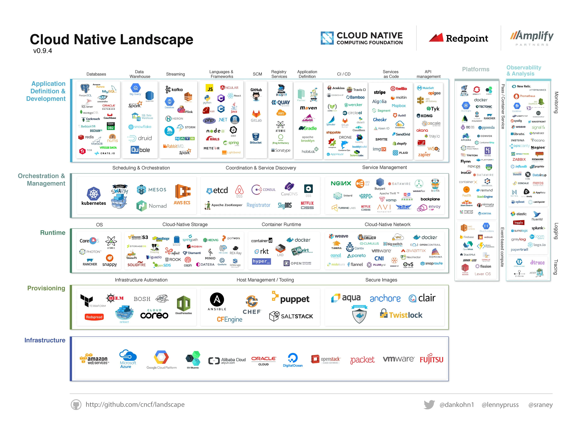
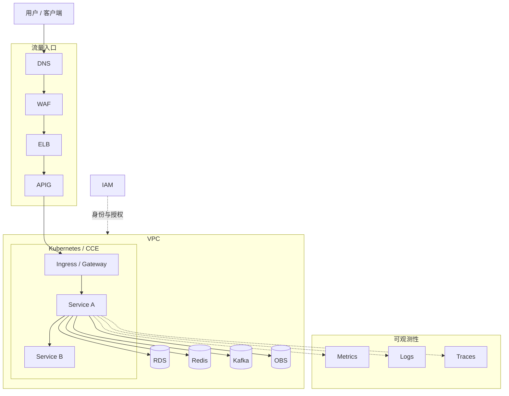
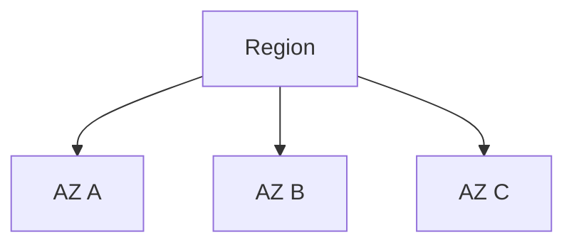
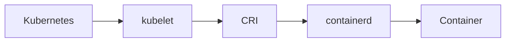
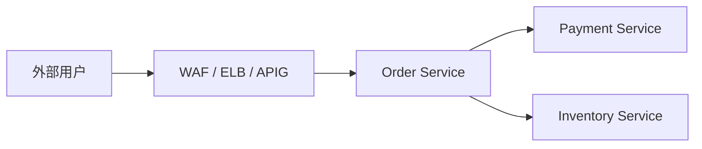
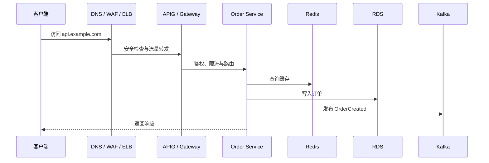
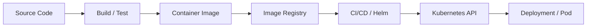

现代云上应用很少由单一服务器独立承载。一个典型的企业级后端系统，
往往同时涉及网络、计算、容器、流量治理、数据库、消息系统、对象存储、
身份认证和监控告警。

从应用开发者的视角看，一个 HTTP 请求可能只是进入 Controller 并返回结果；
但从基础设施视角看，它在到达应用容器之前，可能已经经过 DNS、WAF、
负载均衡、API 网关、Kubernetes Service 和服务网格代理。

因此，学习云服务不应从记忆某个产品的控制台开始，而应先回答三个问题：

1. 它位于整个系统的哪一层？
2. 它解决的是身份、网络、计算、流量、数据还是运维问题？
3. 它的上下游是谁，请求或数据如何经过它？

本文是云服务系列的第一篇。我们先建立一张全局地图，后续文章再逐层深入。



> 上图是 CNCF 早期发布的云原生生态版图，用于展示基础设施、运行时、编排、
> 应用开发与可观测性之间的分层关系。图中的项目版本和收录范围不代表当前状态，
> 本文关注的是其分类思路。

## 一、先建立分层模型

云原生基础设施可以归纳为六个相互协作的层面：

| 层面 | 核心问题 | 典型技术或服务 |
|---|---|---|
| 身份与权限 | 谁能操作哪些资源 | IAM、Role、Policy、临时凭证 |
| 网络与计算 | 资源在哪里运行、如何互通 | Region、AZ、VPC、Subnet、Security Group、ECS |
| 容器与交付 | 应用如何构建、部署和调度 | Image、Registry、Kubernetes、CCE、Helm |
| 流量治理 | 请求如何进入系统并在服务间流动 | DNS、WAF、ELB、APIG、Ingress、Service Mesh |
| 数据基础设施 | 业务状态保存在哪里 | RDS、Redis、Kafka、OBS |
| 可观测性 | 系统是否正常、异常发生在哪里 | Metrics、Logs、Traces、AOM、LTS、CES |

这些层面不是彼此独立的产品清单。Kubernetes 集群建立在计算和网络资源之上，
其中的应用会访问数据库、缓存和消息系统，同时向可观测性平台发送日志、指标
和链路数据。IAM 则贯穿所有层面，约束人和程序对资源的访问。



这张图不是某个系统的固定方案，而是一张定位技术的地图。例如，Helm 位于
交付流程与 Kubernetes 之间；ELB 位于外部流量入口；Service Mesh 处理集群内
服务通信；Kafka 连接事件生产者和异步消费者。

## 二、物理边界、身份与网络基础

### Region 与 AZ：资源部署在哪里

Region（区域）是云厂商在某个地理区域建设的一组数据中心基础设施，通常构成
资源规划、网络时延、数据合规和计费的重要边界。选择 Region 时需要考虑用户
位置、服务可用性、合规要求、跨区域传输成本和容灾目标。

AZ（Availability Zone，可用区）是 Region 内相对独立的故障域，通常具有独立
的供电和网络设施。生产系统常采用“同 Region、多 AZ”的部署方式，在控制时延
和成本的同时，降低单个数据中心故障的影响。



多 AZ 并不自动等于高可用。应用副本、负载均衡、数据库主备和故障切换策略
也必须跨 AZ 配置，才能真正利用故障隔离能力。

### IAM：谁能操作资源

IAM（Identity and Access Management）控制的是云平台资源访问，而不是商城、
论坛等业务系统的用户登录。它需要同时解决两个问题：

- Authentication（认证）：确认请求者是谁；
- Authorization（授权）：判断请求者可以执行什么操作。

账号通常是资源归属和计费主体；IAM User 表示账号内的独立人员身份；User
Group 用于按岗位批量分配权限；Role 和 Policy 则描述某个身份可以对哪些资源
执行哪些操作。

权限设计应遵循最小权限原则。开发人员不应共享主账号，程序也不应长期持有
超出自身职责的权限。AK/SK、Token 和临时凭证都属于机器身份凭证，其中 SK
尤其不能写入 Git 仓库、容器镜像或普通配置文件。

### VPC 与安全组：资源如何连接

VPC（Virtual Private Cloud）是云上的逻辑私有网络。一个 VPC 可以按工作负载
和安全边界划分多个 Subnet，例如：

```text
10.10.0.0/20    Kubernetes 节点与 Pod
10.10.16.0/24   数据库
10.10.17.0/24   中间件
10.10.18.0/24   通用计算实例
```

Security Group（安全组）根据方向、协议、来源和端口控制资源访问。应用即使
知道数据库 IP，如果安全组没有允许应用网段访问 `3306`，连接仍然无法建立。

判断两个服务能否通信，至少要依次检查：

```text
名称解析 → 路由可达 → 安全组放行 → 目标端口监听 → 应用层认证
```

所以，“能 ping 通”或“IP 可达”从来不等于业务一定可用。

## 三、从虚拟机到容器编排

### ECS 提供计算资源

ECS（Elastic Cloud Server）本质上是云平台提供的虚拟服务器，包括 CPU、内存、
磁盘、网络和操作系统。团队可以直接在其中安装 Java、Nginx、MySQL 或 Docker。

但当服务数量和实例规模不断增加，逐台管理虚拟机很快会遇到部署、扩缩容、
服务发现、故障恢复和滚动升级等问题。容器编排平台正是为管理这些工作负载而生。

### Image、Runtime 与 Kubernetes 各司其职

Container Image 是应用及其运行依赖的静态交付物；Container 是镜像启动后的
运行实例；containerd 等 Container Runtime 负责真正创建和管理容器。

Kubernetes 则位于更高层，负责声明、调度和维护容器化工作负载。它由控制面和
工作节点组成：控制面保存集群状态并执行调度与控制逻辑，工作节点实际运行 Pod。



CCE 是华为云提供的托管 Kubernetes 服务，而不是 Kubernetes 的替代技术。
类似的托管服务还包括 AWS EKS、Azure AKS 和 Google GKE。使用托管集群后，
团队仍然需要理解 Pod、Deployment、Service、ConfigMap 和调度机制。

Kubernetes 的核心工作方式是声明式管理。例如，`replicas: 3` 描述的是期望状态，
Controller 会持续比较实际状态与期望状态，并在实例崩溃或节点故障后尝试恢复。

## 四、请求如何进入系统并在内部流动

云原生流量可以分为两类：

- 南北向流量：外部客户端与云内服务之间的通信；
- 东西向流量：数据中心或集群内部的服务间通信。

### 南北向：DNS、WAF、ELB 与 APIG

用户访问 `https://api.example.com` 时，DNS 首先将域名解析到系统入口。之后的
链路会按业务需要组合以下组件，而不是必然全部出现：

| 组件 | 主要职责 |
|---|---|
| WAF | 检测和过滤恶意 HTTP/HTTPS 请求 |
| ELB | 在多个后端实例间分发流量并执行健康检查 |
| APIG | 管理 API 路由、鉴权、限流、参数和生命周期 |
| Ingress / Gateway | 将集群外的 HTTP/HTTPS 流量路由到 Kubernetes Service |

Security Group 和 WAF 也不能互相替代：前者更接近网络访问控制，后者关注 Web
应用层请求。ELB 主要回答“流量发给哪个后端”，APIG 则进一步理解 API 语义，
回答“谁能以什么规则访问哪个 API”。

### 东西向：Service 与 Service Mesh

Pod 会创建、销毁、扩缩容，其 IP 并不稳定。Kubernetes Service 为一组 Pod
提供稳定入口和服务发现能力。

当微服务增多，超时、重试、熔断、灰度路由、访问控制和遥测等逻辑如果全部
散落在业务代码中，会带来较高的治理成本。Service Mesh 将这些通信能力下沉
到代理层，Envoy 是常见的数据面代理，ASM 则是华为云的托管服务网格产品。



图中从用户到 Order Service 是南北向流量；Order Service 到 Payment Service
和 Inventory Service 是东西向流量。因此，系统即使已经使用 API 网关，仍然
可能需要服务网格，两者解决的问题并不相同。

## 五、数据基础设施如何分工

企业应用通常组合多种数据服务，而不是寻找一种可以解决所有问题的存储系统。

| 服务 | 典型用途 | 需要继续掌握的通用知识 |
|---|---|---|
| RDS / MySQL | 持久化关系数据与事务 | SQL、索引、事务、锁、连接池 |
| Redis | 缓存、会话、计数器、临时状态 | 缓存策略、过期、持久化、一致性 |
| Kafka | 异步消息、事件传播、削峰与流处理 | Topic、Partition、Consumer Group、Offset |
| OBS | 图片、视频、安装包、备份等对象数据 | Bucket、Object Key、分片上传、临时授权 |

托管服务把备份、高可用、升级和基础监控等部分运维责任交给云平台，但不会替代
底层知识。例如，使用 RDS 仍需设计索引和事务；使用云 Redis 仍需处理缓存穿透
和数据一致性；使用 Kafka 仍需考虑消息顺序、重复消费与积压。

## 六、可观测性：描述系统的运行状态

生产系统不仅要“能够运行”，还必须回答服务是否健康、请求为何失败、延迟发生
在哪个环节，以及何时需要通知值班人员。可观测性通常建立在三类数据之上：

- Metrics：CPU、内存、请求量、错误率和延迟等时间序列指标；
- Logs：应用和基础设施产生的离散事件记录；
- Traces：一次请求跨越多个服务形成的完整调用链。

三者解决的问题不同。指标适合发现“系统正在变差”，日志适合解释“具体发生了
什么”，链路追踪适合定位“问题发生在哪一跳”。统一传播 Trace ID，可以把一次
请求在网关、应用、消息消费者和数据库访问中的信息关联起来。

在华为云体系中，AOM 关注应用、容器和基础设施的运行监控，LTS 负责日志采集、
存储和查询，CES 提供云资源监控与告警能力。它们是相互协作的能力，而不是三选一。

## 七、用两条链路理解整套系统

面对复杂架构时，最有效的方法不是继续罗列产品，而是跟踪两条链路。

### 请求运行链路

假设用户调用 `POST /orders`，一次请求可能经历：



与此同时，应用会产生指标、日志和 Trace，IAM 与网络策略则在链路之外持续约束
访问权限。图中的组件可以按实际需求增减，关键是明确每一跳解决的问题。

### 应用交付链路

另一条链路回答“源代码如何成为运行中的服务”：



运行链路处理用户请求，交付链路改变系统版本。一个成熟的平台必须同时保证两者
安全、稳定、可追踪。

## 八、三个贯穿后续系列的架构思想

### 控制面与数据面

控制面决定系统应该如何运行，例如下发配置、调度工作负载和维护路由策略；
数据面真正处理业务数据或网络流量，例如 Pod 执行业务代码、Envoy 和 ELB 转发
请求。理解这个划分，有助于分析 Kubernetes、Service Mesh 和负载均衡系统。

### 托管服务与自建服务

自建与托管不是“懂底层”和“不懂底层”的区别，而是责任边界不同。托管服务让
云厂商承担更多基础设施运维工作，团队仍需理解通用技术原理，才能正确设计容量、
安全、高可用和故障恢复方案。

### 通用能力与厂商产品

先理解通用能力，再映射到具体产品，可以避免知识被某一家云平台锁定：

```text
虚拟私有网络 → VPC
托管 Kubernetes → CCE / EKS / AKS / GKE
关系数据库托管 → RDS 类服务
对象存储 → OBS / S3 类服务
身份与访问管理 → IAM 类服务
```

后续文章将沿着“容器交付 → Kubernetes → 云网络与流量入口 → 服务治理 →
数据基础设施 → 可观测性”的顺序展开。

这套体系最终可以压缩为一句话：

> 计算承载应用，网络连接资源，容器编排工作负载，网关治理入口流量，服务网格
> 治理内部通信，数据服务保存业务状态，可观测性描述运行状态，而身份与权限体系
> 贯穿整个云平台。

掌握这张地图后，再面对一个陌生云产品时，不必先背诵它的全部配置项。先判断它
属于哪一层、解决什么问题、处于哪条链路，再深入具体实现，学习效率会高得多。
