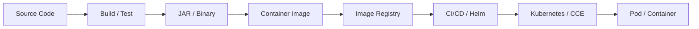
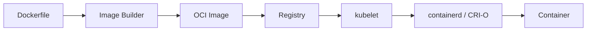
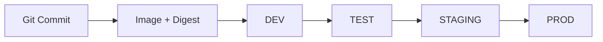
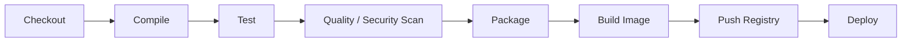
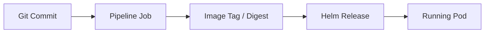
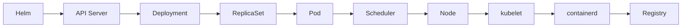
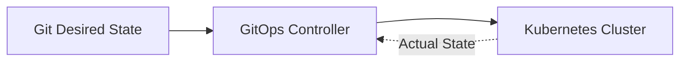

在传统部署模式中，开发人员往往把程序包复制到服务器，再手工安装运行环境、
修改配置并启动进程。服务和环境一多，这种方式很快就会暴露问题：环境不一致、
依赖冲突、操作无法复现，线上版本也难以追踪。

云原生交付的核心，是把应用从“某台服务器上的一个程序”转换为：

> 一个能够被标准化构建、分发、部署和回滚的版本化制品。

上一篇[《云服务与云原生基础设施架构体系》](/posts/cloud-native-infrastructure-overview/)
建立了云平台的整体地图。本文沿着其中的应用交付链路，解释源代码如何变成
Kubernetes 中正在运行的容器。



## 一、镜像是云原生交付的标准制品

以 Java 服务为例，Maven 或 Gradle 会先完成编译、测试和依赖解析，最终生成
JAR：

```text
Source Code → Maven / Gradle → order-service.jar
```

JAR 已经是应用制品，但还不是完整的运行环境。目标服务器仍然需要正确版本的
JDK、系统库、目录结构、配置和启动命令。容器镜像进一步把应用和运行依赖封装
为标准化制品，从而减少环境差异。

### Image、Container 与 Runtime

三个概念需要明确区分：

| 概念 | 含义 |
|---|---|
| Container Image | 静态、可分发的应用模板 |
| Container | 镜像启动后的运行实例 |
| Container Runtime | 创建和管理容器的软件，如 containerd、CRI-O |

一个镜像可以启动多个容器。Docker 可以构建符合 OCI 标准的镜像，但 Kubernetes
节点并不因此必须运行 Docker Engine。Kubernetes 通过 CRI 与 containerd 等
运行时协作，OCI 标准则使镜像、分发和运行工具能够互操作。



### Dockerfile 描述如何构建镜像

Dockerfile 不是服务器启动脚本，而是一组镜像构建规则。一个最小的 Java 运行
镜像可以写成：

```dockerfile
FROM eclipse-temurin:21-jre

WORKDIR /app
COPY target/app.jar ./app.jar

USER 10001
ENTRYPOINT ["java", "-jar", "/app/app.jar"]
```

- `FROM` 选择基础镜像；
- `WORKDIR` 设置后续指令的工作目录；
- `COPY` 把应用制品放入镜像；
- `USER` 避免应用默认以 root 身份运行；
- `ENTRYPOINT` 定义容器启动时执行的主程序。

构建命令最后的 `.` 表示 Build Context：构建器只能访问上下文内的文件。
应通过 `.dockerignore` 排除 `.git`、IDE 配置、日志、缓存和本地密钥，避免扩大
上下文、破坏缓存，甚至把敏感文件带入构建过程。

## 二、镜像分层、缓存与持久化边界

容器镜像不是一个不可拆分的压缩包，而是由多个只读 Layer 组成：

```text
Base OS Layer
+ Runtime Layer
+ Dependency Layer
+ Application Layer
= Container Image
```

分层主要带来三项收益：

1. **复用**：多个 Java 服务可以共享相同的 JRE 和基础系统层；
2. **构建缓存**：只重新执行发生变化的构建步骤；
3. **增量传输**：Registry 和节点只上传或下载缺失的 Layer。

这也解释了 Dockerfile 指令顺序为什么重要。变化频率低的依赖应放在前面，变化
频率高的业务代码放在后面，才能获得稳定的缓存命中率。

### 多阶段构建

生产镜像不应包含 Maven、源代码和编译缓存。Multi-stage Build 将构建环境与
运行环境分离：

```dockerfile
FROM maven:3.9-eclipse-temurin-21 AS builder
WORKDIR /build

COPY pom.xml .
RUN mvn dependency:go-offline

COPY src ./src
RUN mvn package -DskipTests

FROM eclipse-temurin:21-jre
WORKDIR /app
COPY --from=builder /build/target/app.jar ./app.jar

USER 10001
ENTRYPOINT ["java", "-jar", "/app/app.jar"]
```

第一阶段负责下载依赖和编译，第二阶段只保留 JRE 与 JAR。这样既能减小镜像，
也能降低构建工具和多余软件包带来的攻击面。

### 容器文件系统不是持久化存储

镜像层通常只读。容器启动后，运行时会在其上增加一个可写层。日志、上传文件或
业务数据如果只写入这个可写层，会随着容器删除而丢失。

因此容器应该尽量保持无状态，持久数据交给明确的外部系统：

- Volume 保存需要挂载的文件；
- RDS 保存关系型业务数据；
- OBS 保存对象；
- Redis 保存适合放入缓存或临时状态的数据。

## 三、Registry、Tag 与不可变制品

Image Registry 是构建系统和运行系统之间的制品边界。流水线向 Registry Push
镜像，Kubernetes 节点从中 Pull 镜像。

完整镜像引用通常写成：

```text
registry.example.com/order-service:1.4.2
```

其中：

- `registry.example.com` 是 Registry；
- `order-service` 是 Repository；
- `1.4.2` 是 Tag。

Tag 是一个可读引用，并不天然不可变。真正由镜像内容计算出的唯一标识是
Digest，例如：

```text
registry.example.com/order-service@sha256:8f07...
```

如果持续覆盖 `latest`，同一个部署声明在不同时间可能得到不同内容，进而导致
版本无法审计、节点状态不一致和回滚目标不明确。生产体系应遵循两个原则：

1. 每次构建生成唯一版本，例如 `1.4.2-a8f193c`；
2. 已发布 Tag 不允许覆盖，重要环境可记录或直接使用 Digest。

企业内部服务通常存放在 Private Registry，并通过细粒度权限、审计、保留策略、
漏洞扫描和镜像签名保护制品。Kubernetes 拉取私有镜像所需的凭证应由 Secret
或专用身份机制提供，而不是写进镜像或部署清单。

## 四、Build Once，Deploy Many

持续交付最重要的原则之一是：

> 同一份源代码只构建一次，同一个镜像逐级部署到不同环境。



不应为 DEV、TEST 和 PROD 分别编译三份镜像，否则生产环境实际运行的制品并不
是测试环境验证过的制品。环境差异应通过配置表达：

| 内容 | 归属 |
|---|---|
| 程序代码、运行时和固定依赖 | Container Image |
| 副本数、资源限制、服务地址 | Helm Values / ConfigMap |
| 密码、Token、AK/SK、私钥 | Secret Manager / Kubernetes Secret |

也就是说，Artifact 负责回答“程序是什么”，Configuration 负责回答“程序在
当前环境如何运行”。数据库密码等 Secret 不能通过 `ENV` 或 `COPY` 固化进镜像。
即使在后续 Layer 删除文件，敏感内容仍可能存在于历史 Layer 中。

代码变更需要生成新镜像；修改副本数、超时或日志级别则可能只产生一次新的部署
Revision。二者是不同类型的发布。

## 五、CI/CD 把发布经验变成标准流程

CI（Continuous Integration）关注代码变更能否被持续集成和验证；CD 既可以
指 Continuous Delivery，也可以指 Continuous Deployment：

- 持续交付保证软件始终处于可发布状态，生产前可以保留人工审批；
- 持续部署在所有门禁通过后自动进入生产环境。

一个典型 Pipeline 可以表示为：



Pipeline 是工作流定义，Runner 才是真正执行编译、测试和镜像构建的计算环境。
Runner 可以是虚拟机、容器或 Kubernetes Pod。临时、隔离的 Runner 能减少 JDK
版本冲突、依赖缓存污染和上一次构建残留造成的不可重复问题。

### Cache 与 Artifact 不可混淆

Cache 用于提高速度，例如 Maven 本地仓库或 npm Cache；Artifact 是当前构建
真正产生的结果，例如 JAR、测试报告和镜像。Cache 丢失通常只会让构建变慢，
Artifact 丢失则会中断后续阶段。

### 版本必须能够双向追踪

成熟的发布系统至少应建立以下映射：



线上 Pod 出现问题时，工程师应该能定位它使用的 Digest、构建该镜像的流水线、
对应的 Git Commit；从一个 Commit 出发，也应能查询它是否已经部署到生产环境。

这里实际存在三类版本：

- Source Version：Git Commit；
- Artifact Version：JAR 版本、Image Tag 和 Digest；
- Deployment Revision：Helm 或平台发布版本。

三者相关但并不相同。生成新镜像不代表已经上线；只修改环境配置也会产生新的
Deployment Revision，却不一定生成新镜像。

## 六、Helm 如何把镜像交给 Kubernetes

构建与部署应该分离。Build 阶段回答“发布哪个制品”，Deploy 阶段回答“把这个
制品部署到哪里、以什么参数运行”。Helm 不构建镜像，它负责把 Kubernetes
资源模板与环境参数渲染为 Manifest。

例如流水线已经生成：

```text
registry.example.com/order-service:1.4.2
```

Helm Values 只需要引用这个版本：

```yaml
image:
  repository: registry.example.com/order-service
  tag: 1.4.2

replicaCount: 3
```

模板经过渲染后，形成 Kubernetes Deployment：

```yaml
containers:
  - name: order-service
    image: registry.example.com/order-service:1.4.2
    imagePullPolicy: IfNotPresent
```

后续运行过程并不是 API Server 直接启动镜像，而是：



`imagePullPolicy` 控制节点何时拉取镜像：

- `Always`：每次启动时解析并检查镜像；
- `IfNotPresent`：本地没有镜像时才拉取；
- `Never`：只允许使用节点已有镜像。

无论选择哪种策略，都不应依赖可被覆盖的 Tag。不可变引用才能保证所有节点得到
同一份内容。

Pipeline 和 Kubernetes Controller 的职责也不同：Pipeline 发起一次发布并在
完成后退出；Controller 长期比较期望状态和实际状态，持续维持副本数与工作负载
健康。

## 七、发布、晋级与回滚策略

环境晋级的对象应该是同一个 Image Digest。生产发布前可以设置自动化测试、
安全扫描、变更单、维护窗口和人工审批等 Deployment Gate。只有满足门禁条件的
制品才能进入下一环境。

Kubernetes 上常见三类发布策略：

| 策略 | 工作方式 | 资源成本 | 适用场景 |
|---|---|---:|---|
| Rolling Update | 逐批用新实例替换旧实例 | 较低 | 大多数无状态服务 |
| Canary | 先让少量流量进入新版本 | 中等 | 需要用真实指标验证风险 |
| Blue-Green | 同时维护两套版本，再整体切流 | 较高 | 强调快速切换和隔离 |

Rolling Update 需要合理配置 `maxSurge`、`maxUnavailable` 和 Readiness Probe，
否则“滚动”不等于“无损”。Canary 还需要流量治理和指标判断能力，例如观察错误率、
延迟与业务成功率；Blue-Green 则必须处理两套环境并存时的数据兼容问题。

### 回滚依赖不可变制品

可靠回滚的本质，是重新部署一个已知且经过验证的旧 Digest，而不是重新构建旧
代码。如果 `1.4.2` 的内容可以被覆盖，或者只记录了含义不断变化的 `latest`，
所谓回滚就失去了确定目标。

数据库 Schema、消息格式和外部接口也必须考虑前后兼容。镜像能够快速回滚，
不代表整个系统状态一定能够回滚。

### Push-Based 与 GitOps

传统流水线通常主动执行 `helm upgrade`，属于 Push-Based Deployment。GitOps
则把 Git 中的声明式配置作为期望状态，由集群内 Controller 持续拉取并同步：



GitOps 强化了审计、变更评审和漂移修复，但不会取代构建流水线。CI 仍然负责
测试和生成镜像，GitOps 负责把已验证制品同步到运行环境。

## 八、软件供应链安全贯穿整条链路

从代码到运行时的路径也是一条 Software Supply Chain。任何阶段被污染，最终
都可能把风险带入生产环境：

| 阶段 | 典型风险 | 关键控制 |
|---|---|---|
| Source | 未授权提交、凭证泄露 | 分支保护、评审、签名提交、Secret 扫描 |
| Dependency | 漏洞、恶意包、依赖劫持 | 锁定版本、依赖扫描、可信源 |
| Build | Runner 污染、过程不可复现 | 隔离 Runner、最小权限、构建证明 |
| Image | 高危基础镜像、root、敏感文件 | 可信基础镜像、扫描、最小化、非 root |
| Registry | 镜像篡改、越权访问 | 不可变 Tag、签名、权限与审计 |
| Deployment | 未授权上线、配置泄露 | 发布门禁、策略校验、Secret 管理 |

SBOM（Software Bill of Materials）记录制品包含的组件和依赖，镜像签名用于验证
发布者与内容完整性，构建证明则帮助回答“这个制品由什么流程、基于什么输入生成”。
它们共同提升供应链的可验证性。

Pipeline 自身需要访问 Git、Registry、Kubernetes 和云 API，但 Token、密码、
AK/SK 与证书不应直接写在流水线文件中。应由 Credential Manager 或 Secret
Store 在任务运行时短暂注入，并限制作用域、有效期和可见范围。

## 总结

云原生持续交付不是“执行一次 Docker Build”，而是一个完整的制品流转系统：

```text
Source
→ Build
→ Artifact
→ Container Image
→ Registry
→ Release Configuration
→ Kubernetes
→ Runtime
```

其中，镜像封装应用与运行依赖，Registry 保存和分发不可变制品，CI/CD 把代码
变更转换为经过验证的版本，Helm 组合镜像与环境配置，Kubernetes 最终把期望状态
转化为 Pod 和 Container，并持续维护运行状态。

设计这套体系时，最值得坚持的是以下原则：

- Build Once，Deploy Many；
- Artifact 不可变，Tag 与 Digest 可追踪；
- 应用制品、环境配置和 Secret 分离；
- Build 与 Deploy 职责分离；
- 环境之间晋级同一个制品，而不是重新构建；
- Source、Artifact、Release 与运行实例可以相互追踪；
- 安全控制覆盖源代码到运行时的整个供应链。

理解这些边界后，Docker、Registry、Pipeline、Helm 和 Kubernetes 就不再是几套
独立工具，而是同一条云原生软件交付链路上各司其职的组成部分。
