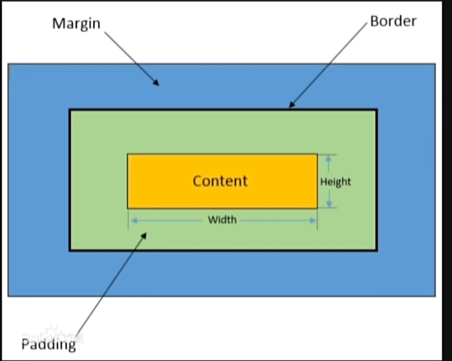

**CSS**（层叠样式表）用于定义网页的样式和布局。利用 CSS，我们可以为网页上的每个元素指定颜色、字体、大小等，从而实现对网页设计的精确控制。

## CSS 语法

典型的 CSS 规则由选择符、属性和值组成：

```css
selector {
    property1: value1;
    property2: value2;
}
```

- 一个选择器可以有多个声明。
- 每个声明必须以`;`结尾。
- 所有属性和值都以键值对的形式书写。

示例：

```css
p {
    color: blue；
    font-size: 16px；
}
```

## 应用 CSS 的三种方法

1. 内联样式： 直接在 HTML 元素中使用。
2. 内部样式表： 在 HTML `<head>`中的`<style>`标记内。
3. 外部样式表： 通过 <link rel="stylesheet" href="css/style.css"> 标记链接。

这些样式的优先顺序是 **内联 > 内部 > 外部**。

## 选择器

选择器是 CSS 的重要组成部分，因为它们定义了样式将应用于哪些元素或元素组。

```html
<style>
    h2 {
        color: aqua;
    }
    .highlight {
        background-color: yellow;
    }
    #header {
        font-size: 35px;
    }
    * { /* Universal selector */
        font-family: "KaiTi";
    }
    .father > .son { /* Child selector */
        color: yellowgreen;
    }
    .father p { /* Descendant selector */
        color: brown;
    }
    h3 + p { /* Adjacent sibling selector */
        background-color: red;
    }
    #element:hover { /* Pseudo-class selector */
        background-color: blueviolet;
    }
</style>
```

示例:

```html
<h2>Element Selector</h2>
<h3 class="highlight">Class Selector</h3>
<h4 id="header">ID Selector</h4>
<div class="father">
    <p class="son">Child Element Selector Example</p>
    <div>
        <p class="grandson">Descendant Selector Example</p>
    </div>
</div>

<p>Regular p tag</p>
<h3>Adjacent Sibling Selector Example</h3>
<p>Regular p tag</p>

<h3 id="element">Pseudo-class Selector Example</h3>
```

### CSS 属性

CSS 包含多种属性。您可以在[菜鸟教程](https://www.runoob.com/css/css-tutorial.html)上了解更多。

```html
<h1 style="font: bolder 50px 'KaiTi';">
    Example of the font shorthand property
</h1>
```

## 盒子模型

盒子模型在网页设计中至关重要，它由填充、边框和边距组成。

- padding： 元素内部、内容和边框之间的空间
- border： 环绕填充和内容
- margin： 边框周围的外部空间



```html
<style>
    .demo {
        background: aqua;
        width: 300px;
        height: 200px;
        border-style: solid;
        border-width: 10px;
        border-color: blueviolet;
    }
</style>

<div class="demo">Content inside the box</div>
```

## 浮动

浮动允许将元素从正常的文档流中移除，并将其定位到左侧或右侧，让其他内容围绕它们流动。

```css
selector {
    float: left | right | none;
}
```

## 定位

定位可以控制元素的位置。主要有三种定位方式

- 相对定位： 相对于正常位置移动元素。
- 绝对定位： 相对于位置最近的祖先移动元素。
- 固定定位： 将元素相对于浏览器窗口定位，在滚动时保持固定。

```html
<style>
    .box1 {
        height: 350px;
        background-color: aqua;
    }
    .box-normal {
        width: 100px;
        height: 100px;
        background-color: purple;
    }
    .box-relative {
        position: relative;
        left: 120px;
        top: 40px;
    }
    .box-absolute {
        position: absolute;
        left: 120px;
    }
    .box-fixed {
        position: fixed;
        top: 300px;
        right: 0;
    }
</style>

<h1>Relative Positioning</h1>
<div class="box1">
    <div class="box-normal"></div>
    <div class="box-relative"></div>
    <div class="box-normal"></div>
</div>

<h1>Absolute Positioning</h1>
<div class="box1">
    <div class="box-normal"></div>
    <div class="box-absolute"></div>
    <div class="box-normal"></div>
</div>

<h1>Fixed Positioning</h1>
<div class="box1">
    <div class="box-fixed"></div>
</div>
```

---

:::note[Reference]
- [3小时前端入门教程（HTML+CSS+JS）](https://www.bilibili.com/video/BV1BT4y1W7Aw)
:::
