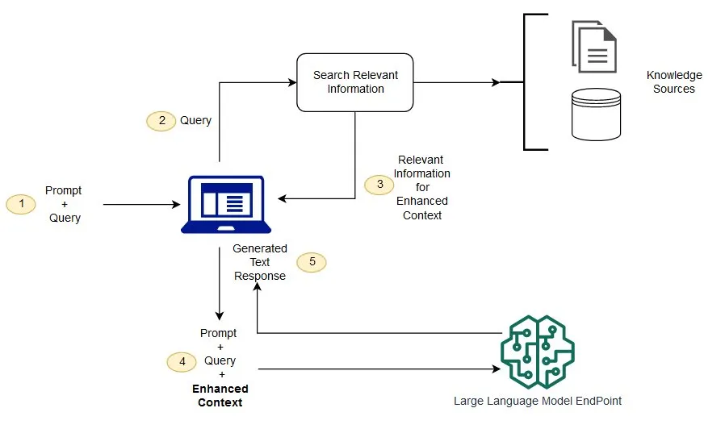

大语言模型拥有通用知识和推理能力，但并不天然知道企业内部文档、私有项目方案、用户文件、实时业务数据，以及训练完成后才产生的新资料。

假设公司内部规范写着：

```text
当支付服务出现 E10023 错误码时，首先检查 Redis 分布式锁。
如果锁记录持续超过 30 秒，需要检查 payment-worker 是否异常退出。
```

如果文档很短，可以直接把它和用户问题一起交给模型。但当知识库包含数千份 PDF、Wiki 和产品手册时，不可能在每次请求中发送全部资料。更合理的方法是先找到与问题最相关的少量内容，再将其放入模型上下文。

这就是 RAG（Retrieval-Augmented Generation，检索增强生成）：在生成回答前动态检索外部知识，而不是把所有知识永久训练进模型。

## RAG 解决什么问题

### 检索与生成

RAG 可以拆成知识库构建和在线问答两个阶段：



知识库构建通常在文档新增或更新时执行；在线问答则在每次用户请求到来时执行。将两者分开，才能独立扩展索引任务和查询服务。

RAG 更适合文档、规范、FAQ 和 Wiki。订单状态、账户余额等实时且结构化的数据，更适合通过 Function Calling 查询业务系统。真实应用常常同时使用两种能力。

### 关键词搜索为什么不够

知识库可能写着“服务端无法建立数据库连接”，用户却搜索“MySQL 连不上怎么办”。两者语义相关，但词面并不完全相同。

关键词搜索擅长错误码、类名、版本号和 API Path 等精确匹配；语义搜索则能发现用词不同但含义接近的内容。企业检索通常会组合两者形成 Hybrid Search，而不是只保留其中一种。

## Embedding 与语义相似度

### 从文本到向量

Embedding 会把文本转换成浮点数向量：

```text
Redis 是一种内存数据存储系统

[0.0214, -0.1842, 0.7311, 0.0048, ...]
```

这些数字不是摘要，也不需要人直接理解。它们把语义映射到高维空间，使程序能够计算文本之间的相关程度。

Embedding 可以用于搜索、聚类、推荐、分类和异常检测，RAG 只是其中一个重要应用。它与生成模型承担不同职责：

| 模型 | 主要职责 |
|---|---|
| Embedding Model | 把文本转换为向量 |
| Generation Model | 理解上下文、推理并生成回答 |

使用 OpenAI API 生成向量：

```python
from openai import OpenAI

client = OpenAI()

response = client.embeddings.create(
    model='text-embedding-3-small',
    input='Redis 是一种高性能的内存数据存储系统。',
)

embedding = response.data[0].embedding

print(len(embedding))
print(embedding[:10])
```

`text-embedding-3-small` 与 `text-embedding-3-large` 还支持通过 `dimensions` 调整向量维度，在检索效果、存储空间和计算成本之间取舍。同一个索引中的文档和查询必须使用兼容的模型与维度。

### 余弦相似度

文本检索经常使用余弦相似度比较两个向量的方向：

```text
similarity(A, B) = (A · B) / (|A| × |B|)
```

可以用 NumPy 实现：

```python
import numpy as np


def cosine_similarity(vector_a, vector_b) -> float:
    a = np.array(vector_a)
    b = np.array(vector_b)

    return float(
        np.dot(a, b)
        / (np.linalg.norm(a) * np.linalg.norm(b))
    )
```

一个最小语义搜索会为文档预先生成向量，再把查询转换为向量，计算相似度并按分数排序：

```python
def search(query: str, knowledge_base: list[dict], top_k: int = 3):
    query_response = client.embeddings.create(
        model='text-embedding-3-small',
        input=query,
    )
    query_vector = query_response.data[0].embedding

    results = [
        {
            'text': item['text'],
            'score': cosine_similarity(
                query_vector,
                item['embedding'],
            ),
        }
        for item in knowledge_base
    ]

    return sorted(
        results,
        key=lambda item: item['score'],
        reverse=True,
    )[:top_k]
```

少量数据可以在内存中遍历。面对数十万或数百万个向量时，则需要 FAISS、pgvector、Qdrant、Milvus、OpenSearch 或托管 Vector Store 等索引能力来快速查找近邻。

## 文档处理与 Chunk

### 为什么需要切片

如果把一本 500 页的手册生成一个向量，它只能表达非常粗略的整体主题。用户询问第 378 页的某个故障步骤时，检索粒度会过大。

Chunk 是从原始文档中切出的、可以独立建立索引和检索的一段内容。每个 Chunk 通常保存：

```json
{
  "id": "chunk_10001",
  "text": "Redis AOF 会记录服务器执行的写命令。",
  "embedding": [0.123, -0.423, 0.831],
  "metadata": {
    "source": "redis-guide.pdf",
    "page": 42,
    "section": "AOF",
    "version": "3.2"
  }
}
```

Chunk Size 通常以 Token 衡量。过大的 Chunk 会混入多个主题、增加输入成本；过小的 Chunk 则可能切断上下文，让“整个过程需要 3～5 分钟”失去指代对象。

合理的切片策略通常是：

- 优先按标题、章节、段落、列表和代码块等语义结构切分；
- 超过长度预算时再按 Token 拆分；
- 使用适量 Overlap 缓解边界信息丢失；
- 保留标题和父级章节等上下文信息。

Overlap 能减少关键段落被切断的问题，但也会增加向量数量、存储空间和重复检索结果。它不是越大越好。

### Metadata 与引用

Metadata 不只是展示信息，还参与过滤、权限和引用。常见字段包括：

```text
document_id
source
page
section
version
language
product
tenant_id
access_level
```

例如用户使用产品 V3 时，检索前就应过滤掉 V1 和 V2 文档。答案中还可以根据 `source`、`page` 和 `section` 展示引用，让用户能够回到原始资料验证结论。

文档更新后，应删除或停用旧 Chunk、重新生成受影响的 Embedding 并刷新索引。知识库还要处理重复文档、多个版本和来源优先级。RAG 是持续运行的数据系统，不是一次性导入 PDF 的脚本。

## 检索质量

### Top-K 与 Score Threshold

向量搜索通常返回最相近的 K 个 Chunk。例如 `Top-K = 5` 表示返回前五个候选结果。但“最接近”不一定代表“真正相关”。如果知识库只有 Java 文档，用户询问航空发动机，系统仍然可以勉强排出五个结果。

因此检索层应该同时考虑：

- Top-K：最多召回多少候选；
- Score Threshold：最低相关度要求；
- Context Budget：最终允许加入多少 Token；
- 无结果状态：资料不足时允许明确拒答。

Top-K 太小可能漏掉正确资料，太大则会增加 Token 和噪声。生产系统应通过评估集选择参数，而不是凭感觉固定一个数字。

### Rerank 与 Hybrid Search

向量检索适合快速召回，但距离最近的结果未必最能回答当前问题。常见做法是先召回较多候选，再使用更精确的模型或 Ranker 重新排序，最终只保留少量 Chunk。

关键词检索则适合 `E10023`、`ClassLoader`、IP 地址和版本号等精确内容。Hybrid Search 将语义结果与关键词结果融合，可以兼顾自然语言表达和精确匹配。

当 Chunk 很长、真正相关的信息很少时，还可以执行 Context Compression，只提取与问题有关的部分。但压缩本身可能丢失限定条件，因此关键数据仍需保留引用和原文访问能力。

### Query Rewrite

用户原话不一定是最佳检索 Query。例如“刚才那个错误怎么解决”需要结合会话状态重写为具体错误；“数据库连接不上”也可以扩展为连接超时、拒绝连接等同义表达。

Query Rewrite 和 Query Expansion 能改善召回，但必须避免把用户意图改错。重写后的 Query、原始问题和最终命中结果都应该进入日志，便于评估和排查。

## 构造 RAG 回答

### 最小完整示例

检索完成后，将相关内容与问题清楚分隔，再调用生成模型：

```python
def answer_with_context(query: str, results: list[dict]) -> str:
    context = '\n\n'.join(
        (
            f"[来源: {item['source']}]\n"
            f"{item['text']}"
        )
        for item in results
    )

    response = client.responses.create(
        model='gpt-5.6',
        instructions=(
            '你是企业知识库助手。只能根据参考资料回答。'
            '如果资料不足，明确说明无法从知识库确认。'
            '回答时标注使用的来源。'
        ),
        input=f'''
REFERENCE MATERIAL

{context}

USER QUESTION

{query}
''',
    )

    return response.output_text
```

显式区分参考资料和用户问题，可以让上下文边界更清楚。但 Prompt 中写“只能根据资料回答”并不能保证模型绝不出错。重要场景还需要引用核验、Structured Outputs、业务规则和人工审核。

### RAG、数据库查询与 Fine-tuning

| 需求 | 更适合的方案 |
|---|---|
| 查询技术文档、FAQ、产品手册 | RAG |
| 查询实时订单、余额或库存 | Function Calling |
| 改变固定风格和任务行为 | Fine-tuning |
| 返回稳定的数据结构 | Structured Outputs |

RAG 在运行时检索可更新的知识，不会把资料写入模型参数。Fine-tuning 更偏向调整行为模式，也不适合每天重新训练以同步业务文档。

## OpenAI Vector Store 与 File Search

### 托管检索

如果不希望自行维护 Chunk、Embedding 和向量索引，可以使用 OpenAI Vector Store。文件加入 Vector Store 后，会自动完成解析、切片、Embedding 和索引。

```python
vector_store = client.vector_stores.create(
    name='Technical Knowledge Base',
)
```

随后可以直接执行自然语言搜索：

```python
results = client.vector_stores.search(
    vector_store_id=vector_store.id,
    query='Redis AOF 的工作原理是什么？',
)
```

也可以让 Responses API 使用托管 File Search 工具：

```python
response = client.responses.create(
    model='gpt-5.6',
    input='根据知识库解释 Redis AOF 的工作原理。',
    tools=[
        {
            'type': 'file_search',
            'vector_store_ids': [vector_store.id],
        }
    ],
)

print(response.output_text)
```

File Search 会在知识库中执行语义和关键词检索，并把相关内容提供给模型，适合快速验证和常规文档问答。

### 自建还是托管

| 方案 | 优势 | 更适合 |
|---|---|---|
| OpenAI File Search | 接入快、基础设施少 | 原型、小型和常规知识库 |
| 自建 Retrieval Layer | 检索和数据控制能力高 | 复杂权限、自定义 Rerank、多数据源 |
| 本地 FAISS | 简单、无需独立服务 | 实验和小型离线数据 |
| pgvector 等数据库方案 | 可复用现有数据体系 | 已有数据库和过滤需求的系统 |

数据规模很小时，不必为了“做 RAG”搭建复杂分布式向量数据库；需要供应商无关架构、精细权限或特殊索引策略时，自建检索层通常更合适。

## 权限与多租户

### 权限必须在检索前生效

不能先检索所有文档，再通过 Prompt 要求模型不要泄露。内容一旦进入 Context，模型就已经获得数据。

正确的安全边界是先验证用户身份和会话归属，再将权限条件加入 Retrieval Filter，只允许有权访问的 Chunk 进入候选集合。

```python
filters = {
    'tenant_id': current_user.tenant_id,
    'department': current_user.department,
    'access_level': {'$lte': current_user.access_level},
}
```

多租户系统至少要确保每次查询都包含 `tenant_id`。高安全场景还可以为不同租户建立独立索引或 Vector Store，从架构上降低跨租户数据泄漏风险。

检索日志也可能包含用户问题、文件名和敏感片段，需要执行访问控制、脱敏与生命周期管理。

## 评估与生产实践

### 分层定位失败

RAG 回答错误不一定是生成模型的问题。常见故障可以分为：

| 层级 | 典型问题 |
|---|---|
| 数据 | 文档错误、过期、重复或解析失败 |
| Retrieval | 正确资料存在但没有召回 |
| Ranking | 正确资料被召回但排名过低 |
| Context | 内容重复、顺序混乱或超过预算 |
| Generation | 模型拿到正确资料仍理解或表达错误 |

检索层可以关注 Recall@K、Precision@K、MRR 和 NDCG；生成层则关注答案正确性、Faithfulness、Citation Accuracy 和 Answer Relevance。分开评估才能知道应该调整 Chunk、Retriever、Reranker 还是 Prompt。

### Token Budget 与可观测性

RAG 是上下文预算的重要消费者。Retriever 不只要考虑相关性，还要计算 Chunk 的 Token 成本，为历史对话、当前问题、模型回答和推理留出空间。

生产环境建议记录：

```text
原始 Query 与重写 Query
命中的 document_id 和 chunk_id
召回分数与 Rerank 分数
过滤条件与权限范围
进入 Context 的 Token 数
最终引用
回答延迟与用户反馈
```

这些数据既用于质量评估，也用于排查权限、版本污染和成本问题。日志中不应保存不必要的敏感正文。

### 推荐的模块边界

一个可维护的 RAG 服务通常包含文档解析、Chunk、Embedding、向量存储、Retriever、Reranker、Context Builder、LLM Client 和 Evaluation 等独立模块。

真正决定效果上限的往往不是最后几行模型调用，而是文档质量、切片策略、Metadata、查询改写、检索和上下文选择。Vector Database 只是检索基础设施，Embedding 只是文本表示方式，两者都不等于完整 RAG。

## 总结

Embedding 将文本转换成可计算语义距离的向量；Vector Search 从大量数据中找到相关内容；RAG 再把这些内容加入 Context，让模型基于外部知识生成答案。

可靠的 RAG 系统需要同时处理数据质量、Chunk、Metadata、Hybrid Search、Rerank、Token Budget、引用、权限和评估。它更像信息检索系统与生成系统的组合，而不是简单地给模型接入一个向量数据库。

当应用已经具备多轮对话、Structured Outputs、Function Calling 和 RAG 后，模型就能维护状态、获取知识并调用外部能力。继续加入任务规划、工具循环和结束条件，就会逐渐进入 Agent 系统的范畴。

本文 API 行为参考：

- [OpenAI Embeddings 官方文档](https://developers.openai.com/api/docs/guides/embeddings)
- [OpenAI Retrieval 官方文档](https://developers.openai.com/api/docs/guides/retrieval)
- [OpenAI File Search 官方文档](https://developers.openai.com/api/docs/guides/tools-file-search)
