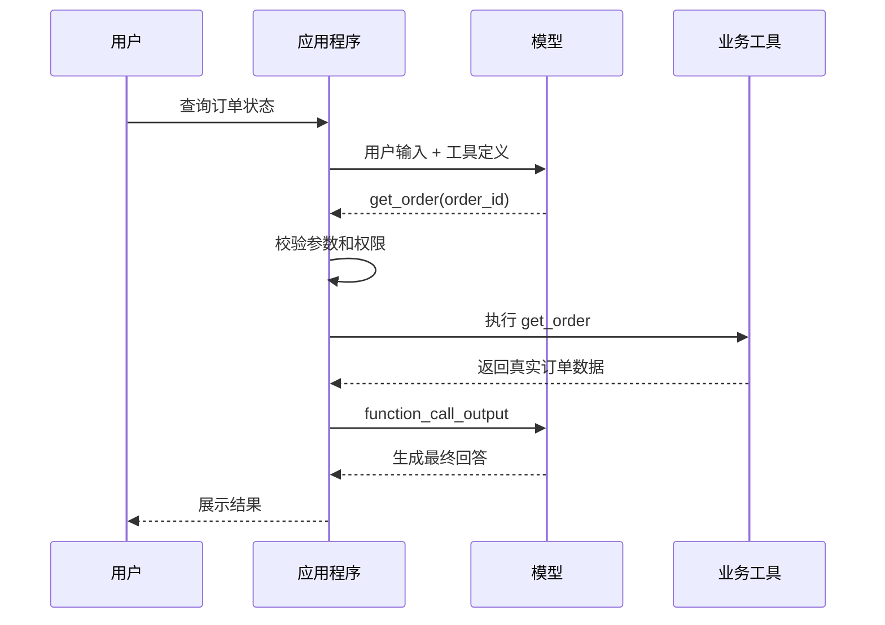
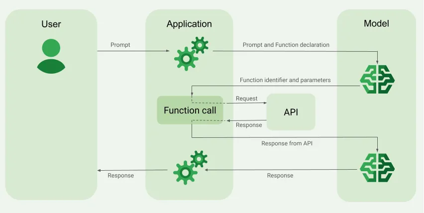
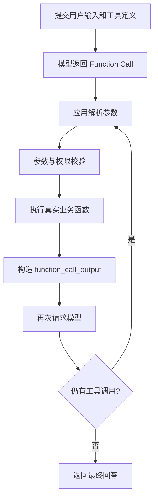
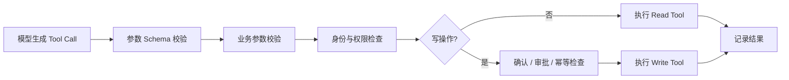
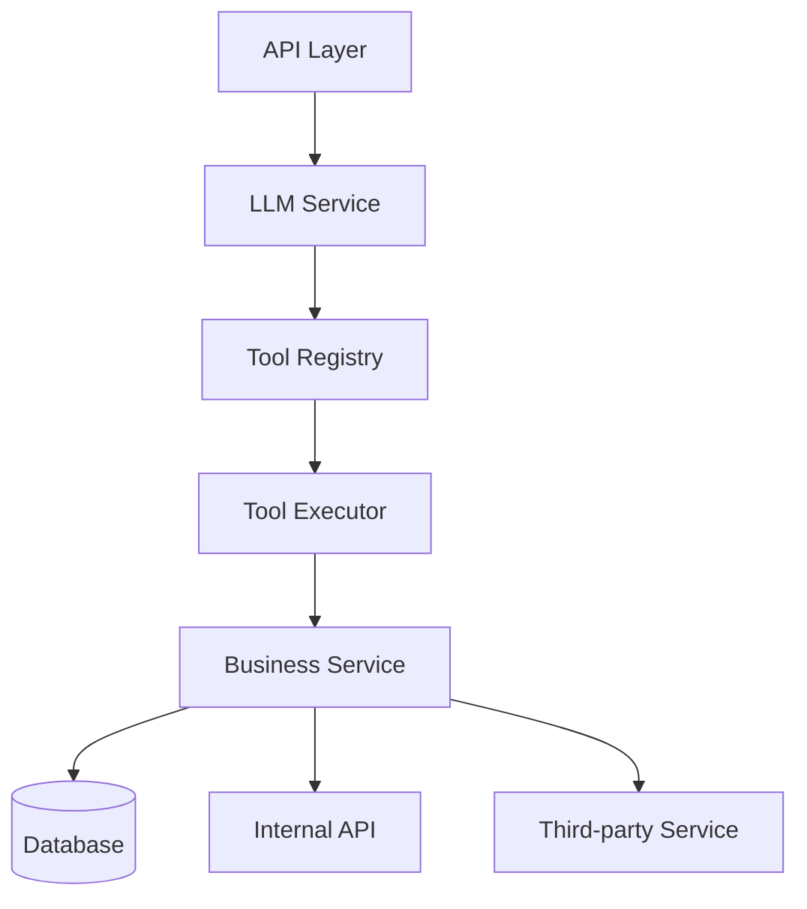
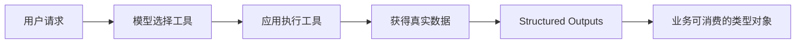
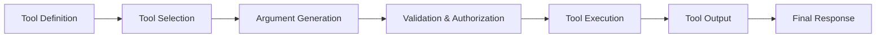

大语言模型擅长理解自然语言、生成文本和进行推理，但它并不天然拥有业务系统中的各种能力。例如，模型本身不能直接查询企业数据库、读取订单状态、调用内部接口、发送邮件或执行部署任务。

如果用户向模型询问：

```text
帮我查询订单 20260919001 当前是什么状态。
```

真正知道答案的不是模型，而是应用程序中的函数：

```python
query_order("20260919001")
```

或者某个远程接口：

```http
GET /api/orders/20260919001
```

Function Calling 解决的问题是：**让模型根据自然语言判断需要使用哪个工具，并生成工具调用所需的结构化参数。**

需要特别注意，模型只会生成工具调用请求。真实函数仍然由应用程序执行，权限、校验和业务规则也仍然由应用程序负责。

## Function Calling 解决什么问题

假设系统中已经存在一个订单查询函数：

```python
def get_order(order_id: str) -> dict:
    ...
```

用户可能用很多方式表达同一个需求：

```text
帮我看看订单 20260919001 现在怎么样了。
这个单子发货了吗？
查一下 20260919001。
我的订单到哪了？
```

传统程序需要自己完成意图识别、关键词匹配和参数提取。Function Calling 提供了不同的职责划分：

| 参与者 | 职责 |
|---|---|
| 用户 | 使用自然语言描述需求 |
| 模型 | 理解需求、选择工具、生成参数 |
| 应用程序 | 校验请求、执行函数、控制权限 |
| 业务系统 | 查询或修改真实数据 |

程序向模型声明存在一个 `get_order` 工具，以及它需要的 `order_id` 参数。模型就可以把自然语言转换成类似下面的调用请求：

```json
{
  "name": "get_order",
  "arguments": {
    "order_id": "20260919001"
  }
}
```

应用程序执行函数后，把真实结果返回给模型：

```json
{
  "order_id": "20260919001",
  "status": "SHIPPED",
  "carrier": "SF Express"
}
```

模型再组织最终回答：

```text
订单 20260919001 已发货，目前由顺丰承运。
```



模型承担的是自然语言理解和语义路由，而不是业务系统的直接执行权。



## 定义并调用第一个工具

### 准备业务函数

先定义一个与 AI 无关的普通 Python 函数：

```python
def get_order(order_id: str) -> dict:
    # 实际项目通常会查询数据库或远程服务
    mock_data = {
        "20260919001": {
            "order_id": "20260919001",
            "status": "SHIPPED",
            "carrier": "SF Express",
        }
    }

    return mock_data.get(
        order_id,
        {
            "order_id": order_id,
            "status": "NOT_FOUND",
        },
    )
```

接下来需要通过 Tool Definition 告诉模型这个函数的用途和参数结构。

### 声明 Function Tool

```python
tools = [
    {
        "type": "function",
        "name": "get_order",
        "description": "根据系统订单编号查询订单当前状态",
        "parameters": {
            "type": "object",
            "properties": {
                "order_id": {
                    "type": "string",
                    "description": (
                        "系统订单编号，例如 20260919001；"
                        "不是物流运单号"
                    ),
                }
            },
            "required": ["order_id"],
            "additionalProperties": False,
        },
        "strict": True,
    }
]
```

Tool Definition 的几个核心字段是：

| 字段 | 作用 |
|---|---|
| `type` | 声明这是一个 Function Tool |
| `name` | 模型调用工具时使用的名称 |
| `description` | 说明工具适合解决什么问题 |
| `parameters` | 使用 JSON Schema 定义参数 |
| `strict` | 要求生成的参数遵循 Schema |

工具名称和描述实际上是模型理解业务能力的接口文档。存在多个相近工具时，应明确说明各自边界：

```python
order_tools = [
    {
        "type": "function",
        "name": "get_order",
        "description": (
            "查询订单本身的状态，例如待支付、已支付、"
            "已取消和已发货；不查询详细物流轨迹"
        ),
        # parameters ...
    },
    {
        "type": "function",
        "name": "query_logistics",
        "description": (
            "查询已发货订单的物流公司、运单号和物流轨迹"
        ),
        # parameters ...
    },
]
```

参数说明也应避免歧义，尤其是 `order_id`、`tracking_number`、`user_id` 等容易混淆的标识。

### 用 Schema 约束参数

如果参数只能从有限集合选择，应使用 Enum：

```python
"priority": {
    "type": "string",
    "enum": ["LOW", "MEDIUM", "HIGH"],
}
```

否则模型可能生成 `high`、`urgent`、`P0` 或“严重”等不同表达，业务代码很难统一处理。

开启严格模式时，工具参数 Schema 应明确必要字段，并禁止未定义属性：

```python
"required": ["order_id"],
"additionalProperties": False,
"strict": True,
```

如果某个字段业务上可以为空，可以让字段类型包含 `null`，而不是让模型随意省略字段。

### 让模型选择工具

```python
from openai import OpenAI

client = OpenAI()

response = client.responses.create(
    model="gpt-5.5",
    input="帮我查一下订单 20260919001 当前是什么状态。",
    tools=tools,
)
```

与普通文本调用相比，关键区别是传入了 `tools`。此时 `response.output_text` 不一定已经包含最终回答，模型可能先在 `response.output` 中返回 `function_call`。

```python
for item in response.output:
    if item.type == "function_call":
        print(item.name)
        print(item.arguments)
        print(item.call_id)
```

一次工具调用包含三个重要信息：

- `name`：模型选择的工具；
- `arguments`：模型生成的 JSON 参数；
- `call_id`：这次工具调用的唯一标识。

`call_id` 用来把工具执行结果与对应的调用请求关联起来。

## 完成工具调用闭环

模型返回 Function Call 后，应用程序需要解析参数、找到函数、执行工具，并将结果作为 `function_call_output` 返回给模型。

### 执行函数并返回结果

```python
import json

tool_outputs = []

for item in response.output:
    if item.type != "function_call":
        continue

    arguments = json.loads(item.arguments)

    if item.name == "get_order":
        result = get_order(order_id=arguments["order_id"])
    else:
        raise ValueError(f"未知工具：{item.name}")

    tool_outputs.append(
        {
            "type": "function_call_output",
            "call_id": item.call_id,
            "output": json.dumps(result, ensure_ascii=False),
        }
    )
```

把结果交回模型：

```python
final_response = client.responses.create(
    model="gpt-5.5",
    previous_response_id=response.id,
    input=tool_outputs,
    tools=tools,
)

print(final_response.output_text)
```

工具返回的是机器数据，而用户通常需要符合当前语境的自然语言。第二次模型请求负责将工具结果组织成最终回答。

### 一个完整示例

```python
import json

from openai import OpenAI

client = OpenAI()


def get_order(order_id: str) -> dict:
    mock_data = {
        "20260919001": {
            "order_id": "20260919001",
            "status": "SHIPPED",
            "carrier": "SF Express",
        }
    }
    return mock_data.get(
        order_id,
        {"order_id": order_id, "status": "NOT_FOUND"},
    )


tools = [
    {
        "type": "function",
        "name": "get_order",
        "description": "根据系统订单编号查询订单当前状态",
        "parameters": {
            "type": "object",
            "properties": {
                "order_id": {
                    "type": "string",
                    "description": "系统订单编号",
                }
            },
            "required": ["order_id"],
            "additionalProperties": False,
        },
        "strict": True,
    }
]


response = client.responses.create(
    model="gpt-5.5",
    input="查询订单 20260919001 当前是什么状态。",
    tools=tools,
)

tool_outputs = []

for item in response.output:
    if item.type != "function_call":
        continue

    arguments = json.loads(item.arguments)

    if item.name != "get_order":
        raise ValueError(f"未知工具：{item.name}")

    result = get_order(order_id=arguments["order_id"])

    tool_outputs.append(
        {
            "type": "function_call_output",
            "call_id": item.call_id,
            "output": json.dumps(result, ensure_ascii=False),
        }
    )

if tool_outputs:
    response = client.responses.create(
        model="gpt-5.5",
        previous_response_id=response.id,
        input=tool_outputs,
        tools=tools,
    )

print(response.output_text)
```

整个闭环可以概括为：



## 多工具与执行循环

实际系统通常会向模型提供多个工具，例如：

```text
get_order
query_logistics
get_refund_status
cancel_order
```

模型根据用户语义选择合适的工具，因此 Function Calling 也可以理解为在一组程序能力之间进行语义路由。

### 控制工具选择

`tool_choice` 可以控制模型是否使用工具：

```python
response = client.responses.create(
    model="gpt-5.5",
    input=user_input,
    tools=tools,
    tool_choice="auto",
)
```

常见策略包括：

| 策略 | 含义 |
|---|---|
| `auto` | 模型自行决定不调用、调用一个或多个工具 |
| `required` | 本轮必须调用工具 |
| `none` | 禁止调用工具 |
| 指定 Function | 强制使用特定工具 |

如果必须调用指定工具，可以传入：

```python
tool_choice={
    "type": "function",
    "name": "get_order",
}
```

`tool_choice` 控制模型如何选择工具，但不代表业务授权。即使模型被要求调用某个工具，应用仍然必须进行权限和状态检查。

### 处理并行工具调用

用户可能一次查询多个订单，模型也可能在同一轮生成多个 Function Call。不要假设 `response.output[0]` 是唯一调用，应遍历全部输出项：

```python
tool_calls = [
    item
    for item in response.output
    if item.type == "function_call"
]
```

执行完成后，可以收集所有 `function_call_output`，一次性返回模型。业务希望每轮最多使用一个工具时，可以根据所选模型和 API 能力配置 `parallel_tool_calls=False`。

### 建立 Tool Registry

工具较多时，不应不断增加 `if/elif`：

```python
TOOL_REGISTRY = {
    "get_order": get_order,
    "query_logistics": query_logistics,
}


def call_tool(name: str, arguments: dict) -> dict:
    function = TOOL_REGISTRY.get(name)

    if function is None:
        raise ValueError(f"未知工具：{name}")

    return function(**arguments)
```

Tool Registry 负责工具名到函数的映射，Tool Executor 负责参数解析、校验、执行、错误转换和日志记录。

```python
import json
from collections.abc import Callable


class ToolExecutor:
    def __init__(self) -> None:
        self.tools: dict[str, Callable] = {}

    def register(self, name: str, function: Callable) -> None:
        self.tools[name] = function

    def execute(self, name: str, arguments_json: str) -> str:
        function = self.tools.get(name)

        if function is None:
            raise ValueError(f"未知工具：{name}")

        arguments = json.loads(arguments_json)
        result = function(**arguments)

        return json.dumps(result, ensure_ascii=False)
```

### 使用通用执行循环

复杂任务可能需要多轮工具调用。例如，用户要求“订单发货后再查询物流”，模型可能先调用 `get_order`，再根据结果调用 `query_logistics`。

因此执行器应使用循环，并设置明确的最大轮数：

```python
import json

from openai import OpenAI


class AIToolService:
    def __init__(
        self,
        model: str,
        tools: list[dict],
        functions: dict,
        max_rounds: int = 8,
    ) -> None:
        self.client = OpenAI()
        self.model = model
        self.tools = tools
        self.functions = functions
        self.max_rounds = max_rounds

    def execute(self, user_input: str) -> str:
        response = self.client.responses.create(
            model=self.model,
            input=user_input,
            tools=self.tools,
        )

        for _ in range(self.max_rounds):
            tool_calls = [
                item
                for item in response.output
                if item.type == "function_call"
            ]

            if not tool_calls:
                return response.output_text

            outputs = []

            for call in tool_calls:
                function = self.functions.get(call.name)
                if function is None:
                    raise ValueError(f"未知工具：{call.name}")

                arguments = json.loads(call.arguments)
                result = function(**arguments)

                outputs.append(
                    {
                        "type": "function_call_output",
                        "call_id": call.call_id,
                        "output": json.dumps(
                            result,
                            ensure_ascii=False,
                        ),
                    }
                )

            response = self.client.responses.create(
                model=self.model,
                previous_response_id=response.id,
                input=outputs,
                tools=self.tools,
            )

        raise RuntimeError("工具调用超过最大轮数")
```

最大轮数、超时和费用上限是必要的终止条件，不能让模型无限调用工具。

## 权限与安全边界

Function Calling 最重要的工程原则是：

> 模型决定“希望调用什么”，系统决定“是否允许调用”。

模型生成下面的调用，并不意味着程序可以直接执行：

```json
{
  "name": "cancel_order",
  "arguments": {
    "order_id": "20260919001"
  }
}
```

业务层仍然需要检查用户身份、资源归属、订单状态、操作权限和二次确认：

```python
if tool_call.name == "cancel_order":
    check_authenticated(current_user)
    check_order_owner(current_user, arguments["order_id"])
    check_order_can_be_cancelled(arguments["order_id"])
    require_user_confirmation()

    result = cancel_order(arguments["order_id"])
```

### 区分读取与写入工具

工具可以按照风险分为两类：

| 类型 | 示例 | 主要风险 |
|---|---|---|
| Read Tool | 查询订单、搜索文档、获取天气 | 数据越权、隐私泄露 |
| Write Tool | 取消订单、退款、发邮件、部署 | 状态变更、重复执行、不可逆影响 |

写操作通常还需要鉴权、审批、人工确认、幂等、事务、审计和限流。



### 始终重新校验输入

即使启用了 `strict=True`，也不能跳过业务校验。Schema 可以限制参数类型、字段和枚举，却无法判断：

- 订单是否存在；
- 订单是否属于当前用户；
- 当前状态是否允许取消；
- 用户是否有权访问目标数据；
- 参数是否违反业务限制。

Tool Executor 仍然属于后端业务代码，不能因为参数来自模型就降低验证标准。

### 遵循最小权限原则

不要把底层无限能力直接提供给模型：

```text
execute_sql(sql)
run_shell(command)
call_any_url(url)
```

更合理的是提供范围明确的业务工具：

```text
get_order(order_id)
create_ticket(...)
update_ticket_status(...)
query_service_health(service_name)
```

不同业务场景也应获得不同的工具集合。订单助手不需要部署权限，研发助手也不应默认拥有退款能力。

### 控制工具输出

工具结果应遵循最小必要数据原则。不要把完整数据库记录、内部字段、审计信息和历史数据全部交给模型。

推荐返回明确的状态结构：

```json
{
  "success": false,
  "error_code": "ORDER_NOT_FOUND",
  "message": "订单不存在"
}
```

而不是含糊的字符串：

```text
找不到
```

内部异常也不应直接返回堆栈。应用可以记录详细日志，但只向模型暴露经过处理的业务错误码，避免泄露数据库地址、表名、文件路径和内部类名。

### 幂等、审计与重试

查询工具通常可以安全重试，但退款、发送邮件、部署和删除等写操作可能因为重复调用产生严重后果。应使用幂等键、请求去重、事务和状态检查。

Tool Calling 的审计日志至少可以记录：

| 字段 | 说明 |
|---|---|
| Request ID | 用户请求标识 |
| Response ID | 模型响应标识 |
| Tool Name | 调用的工具 |
| Call ID | 模型工具调用标识 |
| Arguments | 经脱敏的参数 |
| Result | 经脱敏的结果 |
| User ID | 触发操作的用户 |
| Duration | 工具执行耗时 |
| Status | 成功或失败 |

查询工具可以对临时网络错误有限重试；写操作是否重试，则必须结合幂等性和业务语义判断。

## 在系统架构中的位置

一个清晰的 Function Calling 架构可以分为以下层次：



各层职责如下：

- API Layer：接收用户请求并建立用户上下文；
- LLM Service：负责模型请求、上下文和执行循环；
- Tool Registry：定义当前场景允许模型看到的工具；
- Tool Executor：解析调用、校验参数、处理错误和记录审计；
- Business Service：执行真实业务规则；
- External System：数据库、微服务和第三方 API。

模型不会直接进入数据库层，只能通过经过控制的 Tool Adapter 使用业务能力。

### 推荐的项目结构

```text
project/
├── api/
│   └── assistant.py
├── llm/
│   ├── client.py
│   └── tool_loop.py
├── tools/
│   ├── definitions.py
│   ├── registry.py
│   ├── executor.py
│   └── order_tools.py
├── services/
│   └── order_service.py
├── models/
│   └── tool_models.py
└── main.py
```

Tool 函数应尽量保持轻量，更像 AI 层到业务层的 Adapter：

```python
def get_order(order_id: str) -> dict:
    return order_service.get_order(order_id)
```

复杂业务规则仍然属于 Service，而不是 Tool Definition 或提示词。

### 内置工具、自定义函数与 MCP

Responses API 的工具能力不只包括自定义 Function。不同工具适合不同需求：

| 工具类型 | 适合场景 |
|---|---|
| 自定义 Function | 调用自己的业务服务和内部逻辑 |
| Web Search | 获取实时网络信息 |
| File Search | 检索文件和知识资料 |
| MCP | 通过标准协议接入外部工具或系统 |

无论工具由谁提供，应用都应根据数据敏感度和操作风险设计权限与确认机制。

## 与 Structured Outputs 和 Agent 的关系

Function Calling 和 Structured Outputs 都使用 Schema，但约束对象不同：

| 能力 | Structured Outputs | Function Calling |
|---|---|---|
| 主要目标 | 返回结构化数据 | 调用程序能力 |
| Schema 描述 | 模型最终输出 | 工具输入参数 |
| 是否执行函数 | 否 | 由应用程序执行 |
| 常见用途 | 分类、抽取、分析 | 查询、操作、系统集成 |
| 是否通常需要多轮请求 | 不一定 | 通常需要 |

可以简单理解为：

- Structured Outputs 解决“模型最终应该返回什么”；
- Function Calling 解决“模型接下来应该调用什么”。

两者也可以组合：模型先调用工具取得真实数据，再用 Structured Outputs 返回稳定的最终对象。



当系统允许模型围绕目标不断选择工具、查看结果、重新规划并继续执行时，就逐渐形成 Agent：

```text
LLM
+ Tool Calling
+ Context
+ State
+ Execution Loop
+ Termination Condition
```

Function Calling 是 Agent 的基础能力之一，但一个安全的 Agent 还必须有最大步数、超时、费用限制、状态管理、权限边界和终止条件。

## 总结

Function Calling 并不是让 OpenAI 服务器执行本地 Python 函数，而是把用户的自然语言需求转换成应用程序可以识别的结构化工具请求。

一个完整系统包含：



其中最重要的职责边界是：

- 模型负责理解需求、选择工具和生成参数；
- 应用负责校验、鉴权、执行、幂等和审计；
- 业务服务负责真实规则与数据；
- 用户或审批系统负责确认高风险操作。

模型不应该成为业务系统的超级管理员。它更适合作为一个智能调用协调层，在明确的权限和数据边界内使用程序提供的能力。

## 参考资料

- [OpenAI Function Calling 指南](https://developers.openai.com/api/docs/guides/function-calling)
- [OpenAI Tools 指南](https://developers.openai.com/api/docs/guides/tools)
- [OpenAI Structured Outputs 指南](https://developers.openai.com/api/docs/guides/structured-outputs)
