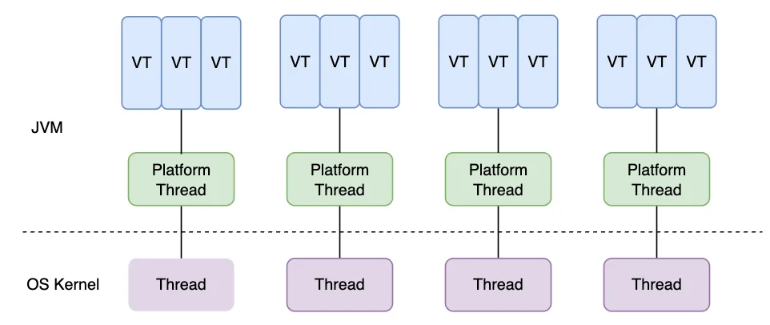

Java 21 里，虚拟线程（Virtual Threads）算是最值得关注的特性之一。它并不是让单个任务“跑得更快”，而是让我们在处理大量阻塞型任务时，可以用更自然的同步写法拿到更高的并发能力。

如果只用一句话概括它的价值，那就是：

- 以前为了扛高并发，很多时候要写线程池、回调和异步编排
- 现在很多 I/O 型任务可以重新回到“一任务一线程”的直觉写法



## 虚拟线程是什么

传统的 Java 线程，本质上更接近操作系统线程，创建和切换成本都比较高，所以我们通常不敢开太多。

虚拟线程则不同：

- 它由 JVM 负责调度
- 它很轻量，可以创建很多个
- 当线程因为 I/O 阻塞时，底层载体线程可以去执行别的任务

所以它最适合的不是“疯狂做计算”，而是这种场景：

- 调远程接口
- 查数据库
- 访问缓存
- 做批量网络请求

也就是说，**虚拟线程更擅长高并发的阻塞型任务，而不是 CPU 密集型任务。**

## 为什么它有价值

过去做高并发接口时，一个很常见的问题是：  
同步代码好理解，但线程太贵；异步代码并发高，但代码容易越来越绕。

虚拟线程的价值就在这里：

- 保留同步代码的可读性
- 降低线程资源成本
- 让服务端聚合调用、批处理、爬虫这类场景写起来更直接

所以很多人会觉得虚拟线程“很香”，不是因为 API 多么复杂，而是因为它让代码模型变简单了。

## 最基本的用法

Java 21 里最直接的启动方式就是 `Thread.startVirtualThread(...)`。

```java
public class VirtualThreadDemo {

    public static void main(String[] args) throws InterruptedException {
        Thread thread = Thread.startVirtualThread(() -> {
            System.out.println("current thread = " + Thread.currentThread());
            System.out.println("is virtual = " + Thread.currentThread().isVirtual());
        });

        thread.join();
    }
}
```

如果你想自己先创建、再启动，也可以这样写：

```java
Thread thread = Thread.ofVirtual()
        .name("order-query-vt-", 1)
        .unstarted(() -> {
            System.out.println(Thread.currentThread().getName());
        });

thread.start();
thread.join();
```

这两种方式都很直观，适合先理解“虚拟线程到底怎么开”。

## 更实用的写法

在业务代码里，更常见的方式其实是配合 `ExecutorService` 使用。

```java
import java.util.ArrayList;
import java.util.List;
import java.util.concurrent.Callable;
import java.util.concurrent.Executors;
import java.util.concurrent.Future;

public class VirtualThreadExecutorDemo {

    public static void main(String[] args) throws Exception {
        try (var executor = Executors.newVirtualThreadPerTaskExecutor()) {
            List<Callable<String>> tasks = List.of(
                    () -> query("user-service"),
                    () -> query("order-service"),
                    () -> query("point-service")
            );

            List<Future<String>> futures = new ArrayList<>();
            for (Callable<String> task : tasks) {
                futures.add(executor.submit(task));
            }

            for (Future<String> future : futures) {
                System.out.println(future.get());
            }
        }
    }

    private static String query(String serviceName) throws InterruptedException {
        Thread.sleep(300);
        return serviceName + " response from " + Thread.currentThread();
    }
}
```

这个例子虽然简单，但已经很接近真实业务了。  
比如一个接口要并发查用户信息、订单信息、积分信息，虚拟线程就很适合这种“多个阻塞调用并发执行，最后再汇总”的模型。

## 它适合什么场景

如果你只想记住最重要的判断标准，可以记这一条：

- 任务很多
- 大量时间耗在等待 I/O
- 希望代码保持同步风格

常见适用场景有：

- 聚合多个下游服务的接口
- 批量调用第三方 API
- 爬虫和抓取程序
- 高并发但以网络 / 数据库等待为主的服务

## 不适合什么场景

虚拟线程很好用，但它不是银弹。

下面这些点最好在文章里明确告诉读者：

- 它不会让 CPU 密集型任务突然变快
- 它不能绕过数据库连接池、HTTP 连接池这些真实瓶颈
- 如果代码里有长时间 `synchronized`、native 调用或特殊阻塞，收益可能没想象中大

所以更准确的理解应该是：

**虚拟线程优化的是并发模型，不是凭空制造计算资源。**

## 一点实践建议

如果项目里准备尝试虚拟线程，我会建议从边缘场景开始，比如：

- 某个聚合查询接口
- 某个批量同步任务
- 某个大量远程调用的模块

先在这些 I/O 密集型场景里试点，通常最容易看出收益，也更方便观察：

- 代码是否更简单
- 吞吐量是否更高
- 线程使用是否更平滑

## 总结

Java 21 的虚拟线程，本质上是在告诉我们一件事：  
**面对大量阻塞型并发任务时，同步编程模型又重新变得很有竞争力了。**

如果你的系统里有很多“查库、调接口、等返回”的工作，那虚拟线程很值得了解；如果只是纯计算逻辑，那它就不是重点。

对大多数 Java 开发来说，先掌握这两件事就够了：

- 知道它适合 I/O 密集型并发场景
- 知道怎么用 `Thread.startVirtualThread(...)` 和 `Executors.newVirtualThreadPerTaskExecutor()`

这基本就已经能把它用到实际代码里了。
