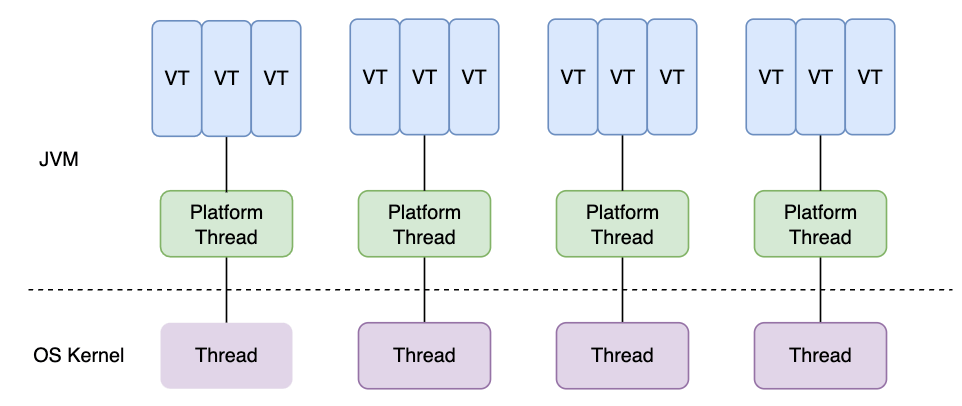

JDK21是LTS（长期支持版），共有15个新特性：

- 8个正式特性
- 6个预览版特性
- 1个处于孵化阶段特性

我们在这里介绍这些正式特性。

## JEP 431 有序集合

JDK21在集合框架中新增了`SequencedCollection`, `SequencedSet`, `SequencedMap`接口。


`SequencedCollection`定义的方法如下。它主要定义了在两端添加、删除、获取元素，以及`reverse()`方法。同理，`SequencedMap`也定义了类似方法。

```java
public interface SequencedCollection<E> extends Collection<E> {
    // 新引入的方法
    SequencedCollection<E> reversed();
    
    void addFirst(E);
    void addLast(E);
    E getFirst();
    E getLast();
    E removeFirst();
    E removeLast();
}
```

## JEP 439 分代ZGC

ZGC 拥有极致的性能，有几个重要特性

1. 并发收集，并且使用了染色指针、读屏障等技术
2. 低延迟，承诺停顿时间小于 1ms (刚开始引入时是 10ms)
3. 基于 Region，支持的堆内存范围是 16MB ~ 16TB
4. 与 G1 相比，ZGC 对应用程序吞吐量的影响小于 15%

在 Java 21 之前，ZGC 是不分代的，不区分新生代和老年代，都使用同一套回收算法。虽然整体性能很出色，但是仍然有性能优化的空间，因为新生代的对象存活时间较短，具有更高的回收价值。

Java 21 对此做了性能优化，实现了 ZGC 的分代收集，更频繁地对新生代进行垃圾收集。在 ZGC 的基础上，分代 ZGC 有以下新特性。

1. 引入了写屏障技术
2. 分配停顿风险更小
3. 堆内存开销更小
4. GC CPU 开销更小

目前，分代 ZGC 是更好的解决方案，适用于绝大多数场景。在后续的版本中，非分代 ZGC 会逐渐废弃，以减少维护成本。

在JVM参数中配置如下参数即可开启分代ZGC

```
-Xmx100m
-Xlog:gc:file=/Users/jason315/Desktop/gc/zgc-gen.log
-Xlog:gc*:file=/Users/jason315/Desktop/gc/zgc-gen-detail.log
-XX:+UseZGC
-XX:+ZGenerational
```

## JEP 440 Record模式

Records表示一种特殊的类，极大地简化了不可变类的定义。Record 模式增强了 Java 编程语言以便于解构 Record 对象的值，这可以嵌套 Record 模式和 Type 模式，实现强大的、声明式的和可组合的数据处理形式.

```java
record Point(int x, int y) {}

// Java 21 写法
static void printSumInJava21(Object obj) {
    if (obj instanceof Point(int x, int y)) {
        System.out.println(x+y);
    }
}

public static void main(String[] args) {
    Point point = new Point(3, 6);
    printSumInJava21(point);
}
```

## JEP 441 switch模式匹配

switch 表达式支持更多的类型，并且支持模式匹配，自动解构赋值。

```java
static String formatterPatternSwitch(Object obj) {
    return switch (obj) {
        case Integer i -> String.format("int %d", i);
        case Long l    -> String.format("long %d", l);
        case Double d  -> String.format("double %f", d);
        case String s  -> String.format("String %s", s);
        default        -> obj.toString();
    };
}
```

## JEP 444 虚拟线程

虚拟线程是 Java 21 最受关注的正式特性。虚拟线程，也就是轻量级线程。虚拟线程极大地降低了高吞吐量应用的开发和维护成本。

平台线程（原有线程）是在 OS 线程上做的封装，它的创建和切换成本很高，可用的线程数量也有限制。对于并发较高的应用，想要提高系统的吞吐量，之前一般是做异步化，但这种方式很难定位线上问题。

虚拟线程的资源分配和调度由 Java 平台实现，它不再直接与 OS 线程强关联，而是直接将平台线程作为载体线程，这使得虚拟线程的可用数量大大增加。



### 应用场景

虚拟线程在如下两种场景下，才能大幅提高应用系统的吞吐量

- 并发任务量很大（万级）
- 线程工作量不会使 CPU 受限（不是 CPU 密集型任务）

### 虚拟线程创建方式

```java
class Task implements Runnable{
    @Override
    public void run() {
        Thread currentThread = Thread.currentThread();
        long threadId = currentThread.threadId();
        System.out.printf("[%d]Task start to run...\n", threadId);
        int sum = IntStream.range(0, 100).sum();
        System.out.printf("[%d]sum=%d, 线程名称: '%s', 是否虚拟线程: %s\n", threadId, sum, currentThread.getName(), currentThread.isVirtual());
        System.out.printf("[%d]Task end.\n", threadId);
    }
}

// 方式一：直接启动，虚拟线程名称为空
private void way1() {
    Thread.startVirtualThread(new Task());
}

// 方式二：Builder 模式构建
private void way2() {
    Thread vt = Thread.ofVirtual()
        .name("VirtualWorker-", 1)
        .unstarted(new Task());
    vt.start();
}

// 方式三：Factory 模式构建
private void way3() {
    ThreadFactory factory = Thread.ofVirtual()
        .name("VirtualFactoryWorker-", 1)
        .factory();
    Thread vt = factory.newThread(new Task());
    vt.start();
}

// 方式四：newVirtualThreadPerTaskExecutor
private void way4() {
    try (var executor = Executors.newVirtualThreadPerTaskExecutor()) {
        executor.submit(new Task());
    }
}

// 方式五：构建"虚拟线程池"
private void way5() {
    ThreadFactory factory = Thread.ofVirtual()
        .name("VirtualFactoryWorker-", 1)
        .factory();
    ExecutorService executorService = Executors.newThreadPerTaskExecutor(factory);
    executorService.submit(new Task());
}
```

## JEP 449 废弃32位x86架构Windows移植

Java 21宣布废弃对32位x86架构Windows的移植。

## JEP 451 准备禁用代理的动态加载

当代理在运行中的 JVM 中动态加载时，会发出警告。这些警告的目的是让用户为将来的版本做好准备，将来的版本默认不允许动态加载代理，以提高 Java 安全性。

在任何版本中，Java 自带的工具在启动时加载代理不会发出警告。

## JEP 452 密钥封装机制API

KEM（Key Encapsulation Mechanism，密钥封装机制）是一种加密技术，它允许两个通信方安全地共享一个秘密密钥，而无需通过不安全的通道直接传输密钥。KEM 通常与对称加密算法结合使用，以实现高效的数据加密和安全通信。

加密时，传统方法是使用公钥随机生成一个对称密钥，但这需要填充，也难以保证安全性。而密钥封装机制（KEM）则利用公钥的属性派生出一个相关的对称密钥，这种方法不需要填充。

Java 平台传统的加密方式无法抵御量子攻击，而 KEM API 则可以有效弥补这个短板。

### KEM API

KEM API 相关的接口和类都位于`javax.crypto`包下。

Java 21 新增了`KEMSpi`（KEM Service Provider Interface），其中包括`EncapsulatorSpi`和`DecapsulatorSpi`。Java 提供的默认实现是 DHKEM，即 Diffie-Hellman KEM。

```java
public interface KEMSpi {
    EncapsulatorSpi engineNewEncapsulator(PublicKey var1, AlgorithmParameterSpec var2, SecureRandom var3) throws InvalidAlgorithmParameterException, InvalidKeyException;

    DecapsulatorSpi engineNewDecapsulator(PrivateKey var1, AlgorithmParameterSpec var2) throws InvalidAlgorithmParameterException, InvalidKeyException;

    public interface DecapsulatorSpi {
        SecretKey engineDecapsulate(byte[] var1, int var2, int var3, String var4) throws DecapsulateException;
        int engineSecretSize();
        int engineEncapsulationSize();
    }

    public interface EncapsulatorSpi {
        KEM.Encapsulated engineEncapsulate(int var1, int var2, String var3);
        int engineSecretSize();
        int engineEncapsulationSize();
    }
}
```

---

:::note[Reference]
- [JDK 21](https://openjdk.org/projects/jdk/21/)
- [JDK 21 正式特性全面体验](https://juejin.cn/post/7383311950174339110)
- [Java 21 新特性概览（重要）](https://javaguide.cn/java/new-features/java21.html#jep-440-%E8%AE%B0%E5%BD%95%E6%A8%A1%E5%BC%8F)
:::
