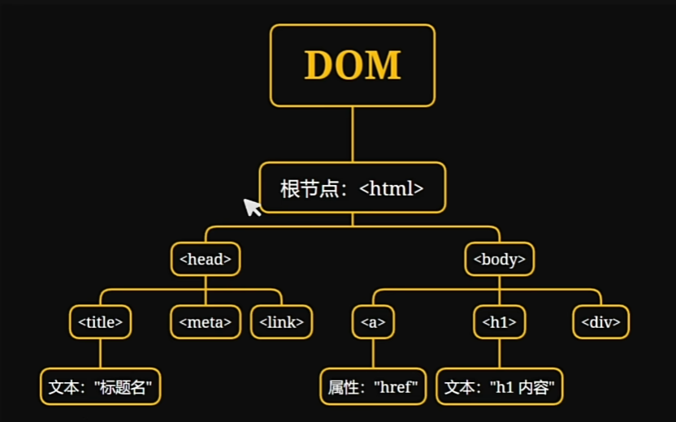

**JavaScript**是一种轻量级、解释型、面向对象的脚本语言。它主要用于网页开发，能够在网页上实现动态效果，增强用户与网页的交互体验。

作为一种客户端脚本语言，JS可以直接嵌入HTML，并在浏览器中执行，使得网页不再是静态的，而是可以根据用户操作动态变化。

## JavaScript的应用场景

JavaScript 主要用于以下几个方面：

- **客户端脚本**：在浏览器端执行，实现动态效果和用户交互。
- **网页开发**：与HTML和CSS结合，使网页更具交互性和动态性。
- **后端开发**：通过Node.js，JavaScript也可以在服务器端运行，实现后端应用开发。

示例代码：

```javascript
console.log("Hello JavaScript!");
```

## JavaScript基础语法

### 变量声明

```javascript
var x;                  // 变量，具有函数作用域
let y = 5;              // 变量，具有块级作用域，更安全灵活
const pi = 3.14;        // 常量
console.log(x, y, pi);  // 输出: undefined 5 3.14 (undefined表示已被声明但未赋值)

let name = 'lllirunze';
console.log(name);

let empty_value = null;
console.log(empty_value); // 输出: null，表示明确为空
```

### 条件判断与循环

```javascript
if (condition1) {
    // code
} else if (condition2) {
    // code
} else {
    alert("error: xxx");
}

for (let i = 0; i < 10; i++) {
    console.log(i);
}

let count = 1;
while (count <= 10) {
    console.log(count);
    count++;
}

// break语句用于终止循环
// continue语句用于跳过当前循环的剩余部分，直接进入下一次循环
```

### 函数

```javascript
function functionName(param1, param2) { 
    return param1 + param2;
}

let result = functionName(3, 5);
console.log(result); // 输出: 8
```

### 变量作用域

```javascript
let global_var = 'global variable';
function localVarFunction() {
    let local_var = 'local variable';
    console.log('global variable:' + global_var);
    console.log('local  variable:' + local_var);
}

localVarFunction();
```

## 事件（Events）

事件是文档或浏览器窗口中发生的特定瞬间，例如：

- `onClick`：点击事件
- `onMouseOver`：鼠标悬停
- `onMouseOut`：鼠标移出
- `onChange`：文本内容改变
- `onSelect`：文本框选中
- `onFocus`：输入框获得焦点
- `onBlur`：输入框失去焦点

JavaScript绑定事件有三种方式：

1. HTML属性方式
2. DOM属性方式
3. `addEventListener` 方式

```html
<script>
    function clickEvent() {
        alert('点击事件触发了');
    }
    function focusEvent() {
        console.log('获取焦点');
    }
    function blurEvent() {
        console.log('失去焦点');
    }
</script>

<button onclick="clickEvent()">click button</button>
<input type="text" onfocus="focusEvent()" onblur="blurEvent()">
```

## 文档对象模型（DOM）

当网页被加载时，浏览器会创建DOM，将HTML结构解析为树形结构。DOM提供了一个编程接口，允许开发者通过JavaScript操作网页元素。



### 获取DOM元素

```javascript
var elementById = document.getElementById('box1');                // 通过 id 获取元素
var elementByClass = document.getElementsByClassName("box2")[0];  // 通过 class 获取元素
var elementByTag = document.getElementsByTagName('div');          // 通过标签名获取元素
```

### 修改元素内容

```javascript
elementById.innerHTML = 'edit html content';  // 解析HTML
elementByClass.innerText = 'edit text';       // 仅修改文本
elementByTag.style.color = 'red';             // 修改元素样式
```

### 绑定事件

```javascript
var buttonElement = document.getElementsByTagName('button')[0];

// 方式1：直接绑定onclick事件
buttonElement.onclick = function() {
    alert('Click events triggered by DOM.');
};

// 方式2：使用addEventListener绑定事件
buttonElement.addEventListener('click', function() {
    alert('Trigger the click event by addEventListener.');
});
```

---

:::note[Reference]
- [3小时前端入门教程（HTML+CSS+JS）](https://www.bilibili.com/video/BV1BT4y1W7Aw)
:::
