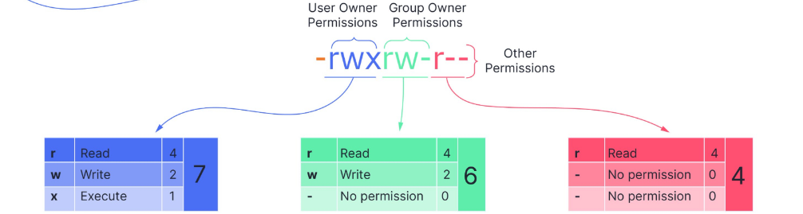

**Linux命令**是用于与Linux操作系统进行交互的指令，通常通过终端或命令行界面输入。这些命令可以用于执行各种任务，如文件管理、系统监控、用户管理、程序执行等。每个命令通常有一个特定的功能，并且可以带有选项或参数来改变命令的行为。

## Linux目录结构

linux目录是以树状管理的，我们可以输入`ls /`获得根目录内容。

| 根目录内容 | 功能                                                         |
| ---------- | ------------------------------------------------------------ |
| `bin`      | 存放基本的系统命令和二进制可执行文件                         |
| `boot`     | 包含启动系统所需的文件，例如Linux内核文件和启动加载器相关文件 |
| `dev`      | 存储设备文件                                                 |
| `etc`      | 存放系统配置文件和管理文件                                   |
| `home`     | 存储普通用户的个人目录                                       |
| `lib`      | 存放系统和应用程序所需的共享库文件。这些库文件包含程序运行所需的函数和资源。 |
| `media`    | 用于挂载可移动媒体设备（如USB驱动器、CD/DVD等）              |
| `mnt`      | 也是一个用于挂载临时文件系统的目录，通常用于挂载网络文件系统或其他临时设备。 |
| `opt`      | 存放第三方应用程序和软件包的目录                             |
| `proc`     | 包含了关于系统内核、进程、硬件等的虚拟文件                   |
| `root`     | 超级用户（root）的个人目录，类似于 `/home` 目录下普通用户的目录。这个目录通常只由超级用户访问。 |
| `sbin`     | 存放系统管理员使用的二进制可执行文件                         |
| `usr`      | 存放系统用户程序、共享库、文档和其他资源，包括应用程序、开发工具、文档等内容 |

## 终端颜色含义

当我们进行`ls`操作时候，会看到不同的文件(夹)的颜色不同，不同颜色具有不同含义：

- 白色：普通文件
- 蓝色：目录
- 绿色：可执行文件
- 青色：链接文件
- 红色：压缩包
- 黄色：设备文件
- 灰色：其他文件

## Linux终端常用快捷键

- ctrl+b：保证不撤回字符的情况下，向左移动一个光标
- ctrl+f：向右移动一个光标
- ctrl+a：光标移动至行首
- ctrl+e：光标移动到行尾
- ctrl+d：移除光标后面第一个字符
- ctrl+u：删除光标之前的所有字符（不包含光标所在字符）
- ctrl+k：删除光标之后的所有字符（包含光标所在字符）
- ctrl+w：删除光标所在的整个单词
- ctrl+y：恢复之前一个删除的内容（撤销）
- 双击tab：列出所有以当前输入内容作为前缀的命令/文件(夹)全称
- 单击tab：补全命令/文件(夹)内容（如果你输入的命令为正确）

## 文件权限

通过`ls la`命令，我们可以看到每一行对应一个文件(夹)，但是前面第一列有一些`d, r, w, x, -`之类的内容，这些被称为权限。

- `r`：可读
- `w`：可写
- `x`：可执行
- `-`：无权限

我们可以看到，每个文件的前面包含总共10个字符，一般来说，第2-4位代表用户权限，第5-7位代表组权限，第8-10位代表其他权限。



## 通配符

- `*`：匹配0个或者多个字符串
- `?`：匹配1个字符
- `[abcd]`：匹配方括号内（a, b, c, d）内任意一个字符
- `[a-z]`：匹配a-z范围内的任意一个字符
- `[!abc]`：不匹配方括号里的任意一个字符，与`[^abc]`一致

## 帮助命令

### `man`

`man`是一个非常有用的命令，用于查看各种命令的[手册页面（manual pages）](https://man7.org/linux/man-pages/)。

```shell
man <command>           # 查看命令的手册页
man <section> <command> # 查看特定章节的手册页
man -f <command>        # 显示给定关键字的简短信息
man -k <command>        # 根据关键词搜索帮助手册
man -w <command>        # 显示手册文件所在位置
```

良好的英文是必备的。

### `info`

`info`命令是另一个用于查看Linux命令和工具文档的命令，与`man`命令类似，但它提供了更详细和结构化的帮助信息。`info`命令可以提供比`man`更丰富的内容，包括更全面的选项和说明，并且通常具有超链接式的导航功能。

```shell
info <command> # 查看命令的详细帮助信息
```

### `whatis`

`whatis`命令是一个用于显示命令简短描述的工具，它可以快速告诉你一个命令或程序的基本功能。

```shell
whatis <command> # 查看命令的简短描述
```

## 文档操作命令

### `touch`

`touch` 命令主要用于更改文件的时间戳（修改时间和访问时间）或者创建空文件。它不会修改文件的内容，只会影响文件的时间属性。

```shell
touch <file>             # 如果文件不存在，创建空文件；如果存在，更新文件的时间戳
touch -t <time> <file>   # 设置特定时间戳
touch -a <file>          # 只更新文件的访问时间(atime)
touch -m <file>          # 只更新文件的修改时间(mtime)
touch -r <file1> <file2> # 将file2的时间戳与file1的时间戳相同
```

### `mkdir`

`mkdir`命令主要用于创建新目录。

```shell
mkdir <dir>                  # 创建一个目录
mkdir -p <dir1/dir2/xxx/xxx> # 创建递归目录
mkdir -m <permission> <dir>  # 设置新目录的权限，默认775
mkdir -v <dir>               # 创建目录的时候显示详细信息
```

### `rm`

`rm`命令是用于删除文件或目录的命令。

一般来说删除的文件和目录是不可恢复的，因此在使用 `rm` 命令时需要小心。

```shell
rm <file>    # 删除一个文件
rm -r <dir>  # 删除目录以及里面的所有内容
rm -rf <dir> # 递归并强制删除目录
rm -i <dir>  # 删除时提示确认
```

### `rmdir`

`rmdir` 命令用于删除空目录。它与 `rm` 命令类似，但只适用于删除空目录，而不能删除包含文件或子目录的目录。使用 `rmdir` 删除目录时，如果目录中包含任何内容，命令会失败并显示错误信息。

```shell
rmdir <dir> # 删除空目录
rmdir -p <dir1/dir2/dir3> # 删除目录及其所有空父目录
```

### `mv`

`mv`命令是用于移动文件或目录的命令，它也可以用来重命名文件或目录。

```shell
mv <file|dir1> <dir2>    # 移动文件或目录到目录
mv <oldfname> <newfname> # 重命名文件或目录
mv -f <file> <dir>       # 强制覆盖文件
mv -i <file> <dir>       # 在覆盖文件时提示确认
mv -v <file> <dir>       # 显示详细信息
```

### `cp`

`cp`是用于将文件或目录从一个位置复制到另一个位置。

```shell
cp <file> <dir>     # 复制文件
cp -r <dir1> <dir2> # 递归复制目录
cp -i <file> <dir>  # 提示覆盖文件
```

---

:::note[Reference]
- [Top 50+ Linux Commands You MUST Know](https://www.digitalocean.com/community/tutorials/linux-commands)
- [一张图带你学习Linux文件权限，简单易懂！](https://developer.aliyun.com/article/1635488)
:::
