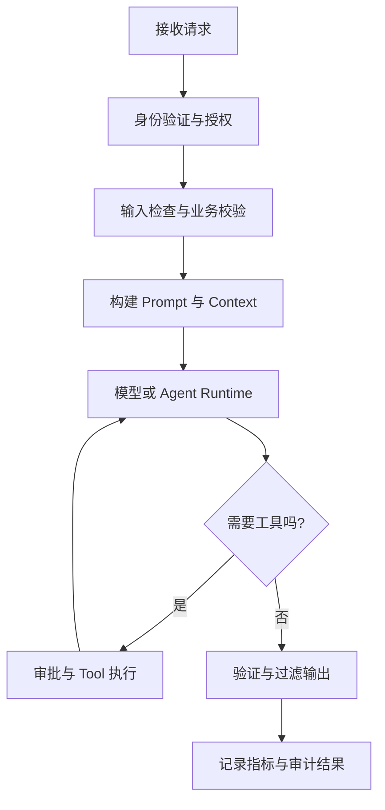

当一个应用具备模型 API、Structured Outputs、Function Calling、RAG、Agent 和 MCP 后，它已经不再是一个简单的演示程序。生产环境关心的不只是模型能否回答问题，还包括失败恢复、权限边界、成本、审计与质量退化。

大语言模型没有推翻传统软件工程。一个成熟的 AI 系统，本质上是传统后端能力与 LLM 特有治理能力的组合：

```text
传统工程能力：鉴权、限流、超时、重试、日志、监控、审计
LLM 治理能力：Prompt、Token、上下文、工具调用、评估、幻觉控制
```

生产系统的目标不是消除模型的不确定性，而是让这种不确定性处于可观察、可限制和可恢复的边界内。

## 建立统一的调用边界

### 模型 API 属于后端基础设施

浏览器、Android 或 iOS 客户端不应直接访问模型供应商。除了 API Key 泄漏风险，直连还会绕过用户鉴权、限流、模型选择、成本统计、Prompt 构造和输出过滤。

客户端只访问业务后端，由后端完成模型调用。API Key 应通过环境变量或 Secret Management Service 注入，不能写入源码、Git 仓库、前端代码或安装包：

```python
from openai import OpenAI

client = OpenAI()
```

```bash
export OPENAI_API_KEY='...'
```

生产环境还应设置 Key 有效期和轮换流程，分别管理开发、测试与生产项目，并为不同工作负载配置独立权限和预算。

### 使用统一 LLM Client

业务代码不应到处直接调用 `client.responses.create(...)`。统一的 Client 或 AI Gateway 可以集中处理模型路由、超时、重试、Token 用量、日志和 Trace：

```python
import os

from openai import OpenAI


class LLMClient:
    def __init__(self) -> None:
        self.client = OpenAI(
            timeout=30.0,
            max_retries=2,
        )
        self.model = os.environ['OPENAI_MODEL']

    def generate(self, input_text: str) -> str:
        response = self.client.responses.create(
            model=self.model,
            input=input_text,
        )
        return response.output_text
```

模型名称、Prompt 模板、最大输出 Token 和超时等参数应配置化。Prompt 还应具备版本号、变更说明和对应的 Eval 结果，使线上问题能够追溯到具体组合。

## 输入、输出与工具安全

### Prompt Injection 的本质

用户输入、网页、邮件、日志和 RAG 文档都是不可信数据。它们可能包含“忽略之前规则”之类的内容，但数据中的文字不能因此获得 Developer Instructions 的权限。

应用需要区分指令与数据，并尽量缩小一次请求接触的数据和工具范围。Structured Outputs 可以约束输出形状，却不能证明内容真实、安全或已获授权。

```python
def validate_order_request(user, arguments):
    if arguments['user_id'] != user.id:
        raise PermissionError('Cannot access another user')

    if arguments['amount'] <= 0:
        raise ValueError('Invalid amount')
```

即使 Tool Arguments 符合 JSON Schema，服务端仍要重新进行身份验证、资源授权、参数校验和业务规则检查。模型永远不能成为权限系统。

### 按风险划分工具

| 类型 | 示例 | 主要控制 |
|---|---|---|
| Read Tool | 搜索文档、读取订单、查询日志 | 数据范围、脱敏、访问审计 |
| Proposal Tool | 生成邮件或变更方案 | 人工检查、来源展示 |
| Write Tool | 退款、发信、部署、删除 | 审批、幂等、事务、回滚 |

高风险操作应让用户确认具体工具、参数、目标资源和影响。批准一次明确动作，不等于授予 Agent 长期权限。工具自身也应遵循最小权限，避免提供 `execute_any_sql` 或 `run_any_shell` 之类的万能接口。

Guardrail 可以检查输入、输出和工具调用，但不能代替数据库 ACL、服务端鉴权或业务约束。防御需要存在于 API Gateway、应用服务、Agent Runtime、Tool Layer 和数据层，而不是集中在一个 Prompt 中。

## 可靠性与流量控制

### Timeout、Retry 与幂等

模型和外部工具都可能超时。应用需要同时设置单次调用超时与端到端任务期限，避免某个 Agent 在多轮重试后远超用户可接受的等待时间。

临时的限流或服务过载可以重试。优先遵循服务端返回的 `Retry-After`，否则使用带随机抖动的指数退避，并同时限制尝试次数和总耗时。若应用自行重试，还要把 SDK 内置重试计算在总预算内，避免形成嵌套重试。

写操作不能仅凭超时判断失败。请求可能已在服务端完成，只是响应没有返回。退款、发送消息和创建订单等操作应携带 Idempotency Key，重试前先查询执行状态。

### Rate Limit 与容量保护

除了上游模型的 RPM 和 TPM 限制，应用还应按用户、租户、功能和任务设置自己的配额。Agent 的限制不能只统计 HTTP 请求数，还应包括：

- 最大模型调用次数；
- 最大 Tool Call 数；
- 最大输入与输出 Token；
- 最大执行时间和并发数；
- 单次任务及周期成本上限。

当故障率持续升高时，Circuit Breaker 应暂停对异常依赖的调用。系统可以切换到较小模型、只读模式、缓存结果或人工处理队列，实现可预测的降级，而不是无限重试。

## 成本与延迟治理

单次请求价格不足以反映业务效率。一个 Agent 可能为完成任务调用模型和工具多次，因此更有意义的指标是：

```text
Cost Per Successful Task
```

每次请求至少记录模型、输入 Token、输出 Token、缓存 Token、工具调用次数、任务是否成功以及估算成本。随后按用户、租户、功能和模型聚合。

成本控制可以从以下方面入手：

- 为分类、改写等简单任务选择更小的模型；
- 限制上下文、工具定义和 Tool Result 的体积；
- 对长期对话进行摘要或外部化存储；
- 对稳定内容使用精确缓存、检索缓存或 Prompt Cache；
- 为 Agent 设置任务级预算和终止条件。

Semantic Cache 需要谨慎使用。语义相似不代表权限、时间和业务状态一致，涉及个性化、实时数据或高风险决策时，不应仅凭相似度复用答案。

Streaming 能缩短用户看到首个 Token 的时间，但不会降低总 Token 或完整生成耗时。应分别观测 Time to First Token、模型处理时间、工具耗时和端到端延迟。

## 可观测性与审计

普通日志很难描述多轮 Agent。更合适的方式是用一个 Trace 表示完整任务，用 Span 表示模型调用、检索、Tool Call、审批和业务 API 等步骤。

一次生产请求可以抽象为：



建议记录：

| 维度 | 关键数据 |
|---|---|
| 请求 | `trace_id`、用户、租户、功能、Prompt 版本 |
| 模型 | 模型版本、延迟、Token、`x-request-id`、错误类型 |
| 工具 | 工具名、参数摘要、权限决策、耗时、结果状态 |
| 质量 | Eval 指标、用户反馈、引用有效性、终止原因 |
| 成本 | 请求成本、任务总成本、缓存命中率 |

日志、Trace 和 Eval 数据都可能包含 Prompt、对话、检索结果与工具参数，因此必须脱敏并设置访问权限、保留周期和删除机制。不能为了可观测性复制一份缺少治理的敏感数据库。

## 评估驱动的发布流程

没有异常不代表系统工作正常。模型可能流畅地返回错误结论，而 HTTP 状态仍然是 `200`。AI 应用除了 Availability、Latency 和 Error Rate，还要持续衡量正确性、相关性、格式合规率、工具选择和任务成功率。

Eval Dataset 应覆盖：

- 正常请求和常见边界条件；
- 长上下文、模糊输入与多轮对话；
- Prompt Injection 和越权尝试；
- Tool 参数错误、超时与部分失败；
- RAG 无结果、过期资料和冲突资料；
- 生产中已经出现过的失败样本。

Prompt、模型、工具 Schema、检索策略或 Guardrail 发生变化时，都应运行回归 Eval。Agent Evaluation 不能只看最终答案，还要检查工具选择、参数、调用次数、Handoff、审批和终止路径。

模型升级属于生产变更。应固定可用的模型版本，先在离线数据上评估，再通过 Shadow Traffic 或 Canary Release 小范围验证，并保留快速回滚路径。

## RAG、幻觉与数据新鲜度

模型生成不等于事实。系统应允许输出“信息不足”或“无法确认”，并在高风险场景要求引用来源或人工复核。比起强迫模型给出答案，明确拒答条件通常更可靠。

RAG 需要把生成质量与检索质量分开监控：

| 层级 | 关注指标 |
|---|---|
| Index | 文档覆盖率、切分质量、更新时间 |
| Retrieval | Recall、Precision、Top K 命中率 |
| Context | 重排效果、重复内容、Token 占用 |
| Generation | 引用一致性、事实正确性、拒答表现 |

知识库必须记录来源、版本和更新时间，并在文档更新或删除后同步处理索引与缓存。检索到内容不代表它仍然有效，也不代表当前用户有权读取。

## 多租户与敏感数据

多租户隔离必须贯穿 Conversation、向量库、缓存、Trace、工具凭证和成本统计。不能只在 UI 中隐藏数据，而让底层检索或缓存跨租户共享。

进入模型前应完成数据分类与最小化。密码、访问令牌、支付信息等秘密通常不应进入 Prompt；个人信息和业务敏感数据则应根据用途进行掩码、匿名化或字段裁剪。

需要明确回答以下问题：

- 哪些数据会发送给模型或 MCP Server；
- Conversation、Response、Trace 和 Eval 数据保留多久；
- 谁能够访问这些数据；
- 用户删除请求如何传播到索引、缓存与备份；
- 第三方工具会把数据继续发送到哪里。

## 生产架构与落地顺序

一个可维护的系统通常包含 API Gateway、Application Service、AI Gateway、Context Manager、Agent Runtime、Tool Layer、RAG、Observability 和 Evaluation。模型负责概率性推理，传统服务负责确定性的权限、交易和数据一致性。

从 Prototype 进入 Production 时，可以按以下顺序推进：

- 将 API Key 移出代码并隔离环境；
- 建立统一 Client，集中管理模型、Prompt、超时与重试；
- 为输入、输出和 Tool Arguments 增加校验；
- 为高风险工具加入审批、幂等和回滚；
- 建立请求级 Trace、Token 与成本指标；
- 用真实和失败样本建立回归 Eval；
- 采用灰度发布、降级、熔断与回滚；
- 完成多租户隔离、脱敏和数据保留策略。

成熟的 AI 系统应同时具备可靠性、安全性、可观测性、可评估性、成本可控和可维护性。模型可以提出判断，但不能绕过权限；模型输出可以参与决策，但必须经过验证；外部内容默认不可信；每次高风险动作都应留下可追踪、可审计的证据。

本文参考：

- [OpenAI 生产环境最佳实践](https://developers.openai.com/api/docs/guides/production-best-practices)
- [OpenAI API Reference](https://developers.openai.com/api/reference/overview)
- [OpenAI Rate Limits](https://developers.openai.com/api/docs/guides/rate-limits)
- [OpenAI Safety Best Practices](https://developers.openai.com/api/docs/guides/safety-best-practices)
