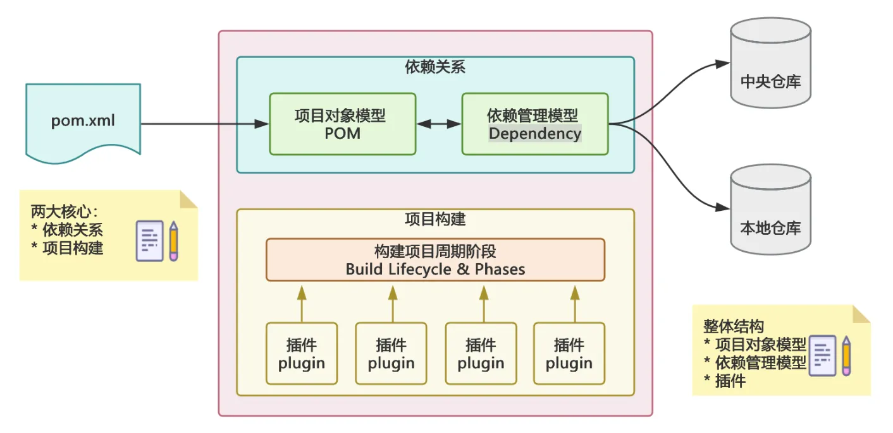

在 Java 项目里，`pom.xml` 往往是最先接触、也是最容易被低估的文件。很多人一开始把它理解成“写依赖的地方”，但只要项目稍微复杂一些，就会发现它实际承担的是项目描述、依赖管理、插件配置、构建控制这些核心职责。

如果把 Maven 看成一个构建管理工具，那么 `pom.xml` 就是这个工具的配置中心。掌握它的主流用法，基本就能覆盖大多数日常开发场景。

这篇文章不追求把 Maven 所有细节都讲完，而是聚焦最常用、最值得掌握的部分，帮助我们先把 `pom.xml` 的骨架和实践思路建立起来。

## 什么是 pom.xml

`POM` 是 `Project Object Model` 的缩写，可以理解为 Maven 对一个项目的统一描述。Maven 会根据 `pom.xml` 中的内容，决定这个项目该如何识别、如何下载依赖、如何编译测试，以及最后如何打包。

它通常负责这些事情：

- 定义项目坐标
- 管理依赖
- 配置插件
- 控制构建流程
- 支持多环境或多模块项目

所以，`pom.xml` 不是一个“附属文件”，而是 Maven 项目的核心入口。

## 一个最基础的 pom.xml 长什么样

先看一个最常见的基础结构：

```xml
<project xmlns="http://maven.apache.org/POM/4.0.0"
         xmlns:xsi="http://www.w3.org/2001/XMLSchema-instance"
         xsi:schemaLocation="http://maven.apache.org/POM/4.0.0
         http://maven.apache.org/xsd/maven-4.0.0.xsd">

    <modelVersion>4.0.0</modelVersion>

    <groupId>com.example</groupId>
    <artifactId>demo-project</artifactId>
    <version>1.0.0</version>
    <packaging>jar</packaging>

    <name>demo-project</name>
    <description>A demo maven project</description>

</project>
```

这里最核心的内容有四个：

- `groupId`：项目所属组织，通常使用倒置域名
- `artifactId`：项目名或者模块名
- `version`：当前项目版本
- `packaging`：打包类型，常见是 `jar`、`war`、`pom`

这几个字段合在一起，构成了 Maven 项目的基本身份。

## 项目坐标是 pom.xml 的第一层语义

在 Maven 里，一个构件通常通过下面三个字段唯一标识：

- `groupId`
- `artifactId`
- `version`

这三个字段通常被称为 Maven 坐标。无论是当前项目自己，还是我们引入的第三方依赖，本质上都依赖这一套坐标体系。

例如：

```xml
<dependency>
    <groupId>org.springframework.boot</groupId>
    <artifactId>spring-boot-starter-web</artifactId>
    <version>3.3.1</version>
</dependency>
```

Maven 之所以能知道我们要下载哪个包，就是因为有这组坐标。

## properties：把版本和公共参数收拢起来

在实际项目中，一个很推荐的习惯是使用 `properties` 统一管理版本号和公共参数，而不是把值分散写在各个地方。

```xml
<properties>
    <java.version>17</java.version>
    <spring.boot.version>3.3.1</spring.boot.version>
    <mysql.version>8.3.0</mysql.version>
    <project.build.sourceEncoding>UTF-8</project.build.sourceEncoding>
</properties>
```

然后在其他配置中引用：

```xml
<version>${mysql.version}</version>
```

这样做的好处很直接：

- 修改版本时更集中
- `pom.xml` 更容易阅读
- 多人协作时更不容易漏改

对于依赖稍微多一点的项目来说，`properties` 几乎是必备配置。

## dependencies：最常见也最重要的部分

`dependencies` 用来声明项目依赖，是大家最熟悉的区域。

```xml
<dependencies>
    <dependency>
        <groupId>org.springframework.boot</groupId>
        <artifactId>spring-boot-starter-web</artifactId>
    </dependency>

    <dependency>
        <groupId>com.mysql</groupId>
        <artifactId>mysql-connector-j</artifactId>
        <version>${mysql.version}</version>
        <scope>runtime</scope>
    </dependency>

    <dependency>
        <groupId>org.junit.jupiter</groupId>
        <artifactId>junit-jupiter</artifactId>
        <scope>test</scope>
    </dependency>
</dependencies>
```

这里最常见的几个字段值得重点掌握：

- `groupId`、`artifactId`、`version`：依赖坐标
- `scope`：依赖的作用范围
- `exclusions`：排除不需要的传递依赖

其中 `scope` 很实用，平时最常见的是下面几种：

- `compile`：默认作用域，编译、测试、运行都可用
- `provided`：编译时要用，但运行时由外部容器提供
- `runtime`：运行时需要，但编译时不直接参与
- `test`：仅测试阶段有效

如果只是想先掌握主流用法，把这几个记住已经足够覆盖大部分项目。

## build：描述项目怎么构建

`build` 节点主要控制构建行为，比如最终产物名称、插件执行方式等。

```xml
<build>
    <finalName>demo-project</finalName>
    <plugins>
        <plugin>
            <groupId>org.apache.maven.plugins</groupId>
            <artifactId>maven-compiler-plugin</artifactId>
            <version>3.11.0</version>
            <configuration>
                <source>${java.version}</source>
                <target>${java.version}</target>
            </configuration>
        </plugin>
    </plugins>
</build>
```

在日常开发里，`build` 最常见的用途通常有两个：

- 配置打包结果
- 配置插件行为

所以很多时候我们看 `build`，其实就是在看“这个项目是如何被 Maven 处理出来的”。

## plugins：真正执行构建动作的角色

Maven 自己更像一个统一调度器，很多具体能力都是插件完成的。编译、测试、打包、生成可执行包，这些事情背后基本都依赖插件。

几个最常见的插件包括：

- `maven-compiler-plugin`：负责编译 Java 源码
- `maven-surefire-plugin`：负责执行测试
- `maven-jar-plugin`：负责普通 `jar` 打包
- `spring-boot-maven-plugin`：负责 Spring Boot 项目的可执行包构建

例如在 Spring Boot 项目中，通常会看到这样的配置：

```xml
<build>
    <plugins>
        <plugin>
            <groupId>org.springframework.boot</groupId>
            <artifactId>spring-boot-maven-plugin</artifactId>
        </plugin>
    </plugins>
</build>
```

从实践角度看，理解插件最关键的一点不是记所有插件名，而是知道 Maven 的很多构建能力，其实是通过插件扩展出来的。

## parent：继承父 POM 是最主流的组织方式之一

很多项目不会从零开始管理所有依赖和插件，而是通过 `parent` 继承一套已经整理好的公共配置。

以 Spring Boot 项目为例，最常见的写法如下：

```xml
<parent>
    <groupId>org.springframework.boot</groupId>
    <artifactId>spring-boot-starter-parent</artifactId>
    <version>3.3.1</version>
    <relativePath/>
</parent>
```

这样做最大的好处是：

- 很多常见依赖版本已经被统一管理
- 常用插件配置往往已经准备好
- 子项目的 `pom.xml` 可以更简洁

所以我们在子项目里经常会看到只写依赖名、不写版本号的情况，因为版本已经由父 POM 接管了。

```xml
<dependency>
    <groupId>org.springframework.boot</groupId>
    <artifactId>spring-boot-starter-web</artifactId>
</dependency>
```

这类写法在现代 Java 项目里非常常见。

## dependencyManagement：它不是引入依赖，而是管理依赖版本

这是 Maven 里一个很容易混淆的点。`dependencies` 是“真正引入依赖”，而 `dependencyManagement` 更像是“预先约定版本和规则”。

```xml
<dependencyManagement>
    <dependencies>
        <dependency>
            <groupId>com.mysql</groupId>
            <artifactId>mysql-connector-j</artifactId>
            <version>8.3.0</version>
        </dependency>
    </dependencies>
</dependencyManagement>
```

上面的写法本身不会让当前项目自动拥有 `mysql-connector-j`，它只是告诉子模块或当前 POM：如果后面要用这个依赖，优先按这里的版本来。

真正引入依赖，还是要写在 `dependencies` 中：

```xml
<dependencies>
    <dependency>
        <groupId>com.mysql</groupId>
        <artifactId>mysql-connector-j</artifactId>
    </dependency>
</dependencies>
```

如果以后写多模块项目，这个点会特别重要。

## 一个更接近实战的 pom.xml

下面给一个比较常见的 Spring Boot Maven 示例，它基本覆盖了日常项目中最主流的配置方式。

```xml
<project xmlns="http://maven.apache.org/POM/4.0.0"
         xmlns:xsi="http://www.w3.org/2001/XMLSchema-instance"
         xsi:schemaLocation="http://maven.apache.org/POM/4.0.0
         http://maven.apache.org/xsd/maven-4.0.0.xsd">

    <modelVersion>4.0.0</modelVersion>

    <parent>
        <groupId>org.springframework.boot</groupId>
        <artifactId>spring-boot-starter-parent</artifactId>
        <version>3.3.1</version>
        <relativePath/>
    </parent>

    <groupId>com.example</groupId>
    <artifactId>demo</artifactId>
    <version>1.0.0</version>
    <packaging>jar</packaging>

    <name>demo</name>
    <description>Demo project for Maven</description>

    <properties>
        <java.version>17</java.version>
        <mysql.version>8.3.0</mysql.version>
    </properties>

    <dependencies>
        <dependency>
            <groupId>org.springframework.boot</groupId>
            <artifactId>spring-boot-starter-web</artifactId>
        </dependency>

        <dependency>
            <groupId>com.mysql</groupId>
            <artifactId>mysql-connector-j</artifactId>
            <version>${mysql.version}</version>
            <scope>runtime</scope>
        </dependency>

        <dependency>
            <groupId>org.springframework.boot</groupId>
            <artifactId>spring-boot-starter-test</artifactId>
            <scope>test</scope>
        </dependency>
    </dependencies>

    <build>
        <plugins>
            <plugin>
                <groupId>org.apache.maven.plugins</groupId>
                <artifactId>maven-compiler-plugin</artifactId>
                <version>3.11.0</version>
                <configuration>
                    <source>${java.version}</source>
                    <target>${java.version}</target>
                </configuration>
            </plugin>

            <plugin>
                <groupId>org.springframework.boot</groupId>
                <artifactId>spring-boot-maven-plugin</artifactId>
            </plugin>
        </plugins>
    </build>

</project>
```

如果我们把这个示例看懂，其实已经能够应对很多中小型项目的 `pom.xml` 阅读和维护工作。



## 日常开发中最实用的几条实践建议

讲完核心结构之后，更重要的是知道哪些写法更稳、更适合长期维护。下面这些习惯在真实项目里很有价值。

### 1. 版本号尽量集中管理

不要把依赖版本散落在很多位置。只要依赖数量一多，升级版本就会变成反复搜索和修改的体力活。

更推荐的方式是：

- 公共版本统一写到 `properties`
- 多模块项目统一放到父 POM

这样做能明显降低维护成本。

### 2. 能不重复写版本，就不要重复写

如果父 POM 已经管理了某个依赖的版本，那么子模块一般没必要再手动声明一次。重复声明不仅啰嗦，还可能在后续升级时产生不一致。

所以在继承体系明确的项目里，`pom.xml` 保持简洁本身就是一种实践能力。

### 3. 插件版本尽量固定

很多人会注意依赖版本，却忽略插件版本。但从构建稳定性的角度看，插件版本同样值得固定下来。

例如：

```xml
<plugin>
    <groupId>org.apache.maven.plugins</groupId>
    <artifactId>maven-compiler-plugin</artifactId>
    <version>3.11.0</version>
</plugin>
```

这样可以减少不同环境下构建行为不一致的问题。

### 4. 合理使用 scope

`scope` 虽然只是一个小字段，但它直接影响依赖在编译、测试和运行时是否生效。

几个很常见的经验是：

- 测试框架一般使用 `test`
- 容器提供的库一般使用 `provided`
- 数据库驱动通常可以使用 `runtime`

如果 `scope` 使用混乱，最终包往往也会跟着变乱。

### 5. 保持 pom.xml 清晰，而不是堆配置

一个好的 `pom.xml` 不是“配置越多越厉害”，而是结构清楚、职责明确。对于长期维护的项目来说，少一些重复、少一些历史遗留、少一些不必要的配置，往往比多写很多高级技巧更重要。

## 结语

对于大多数 Java 开发来说，`pom.xml` 不需要一开始就研究得很深，但至少应该把主流结构先掌握住。我们需要知道项目坐标是怎么定义的，依赖是怎么管理的，插件为什么会参与构建，以及哪些版本应该集中维护。

把这些基础问题理解清楚后，再去看多模块、私服、Profile、插件生命周期这些内容，就会顺很多。至少在日常开发里，一个结构清晰的 `pom.xml`，已经足够帮助我们把项目管理得更稳定、更可维护。

---

:::note[Reference]
- [Introduction to the POM - Apache Maven](https://maven.apache.org/guides/introduction/introduction-to-the-pom.html)
- [Maven Getting Started Guide](https://maven.apache.org/guides/getting-started/)
- [Apache Maven Project Documentation](https://maven.apache.org/guides/)
:::
