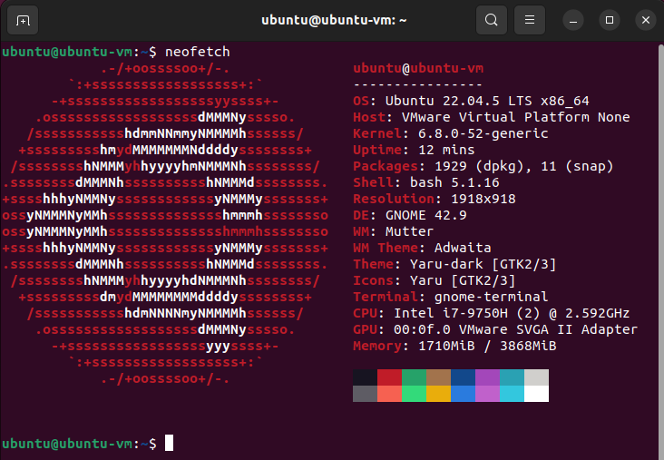

**Neofetch**是一款用 bash 3.2+ 编写的命令行系统信息工具。Neofetch能以美观、视觉愉悦的方式显示操作系统、软件和硬件的相关信息。用户可以快速查看关于操作系统、内核版本、桌面环境、硬件配置等的详细信息。

## Neofetch的主要特点

- **跨平台支持**：Neofetch支持Linux、macOS和Windows（通过WSL）等多种操作系统。
- **美观的输出**：Neofetch在终端中以整洁且富有美感的方式展示系统信息，包含了诸如操作系统名称、内核版本、CPU、内存、磁盘等信息，还会显示一个彩色的操作系统logo。
- **高度可定制**：用户可以根据自己的需求来定制Neofetch输出的信息，甚至可以修改显示的顺序和颜色主题。
- **轻量化设计**：Neofetch是一个非常轻量的工具，启动速度极快，占用的系统资源非常低，非常适合在资源有限的环境中使用。

## Neofetch显示的信息内容

默认情况下，Neofetch会显示以下系统信息：

- 操作系统名称及其版本
- 内核版本
- 当前的桌面环境或窗口管理器
- CPU 型号及其核心数
- 其他

## 如何使用Neofetch

以Ubuntu Linux为例，使用如下命令进行安装。

```shell
sudo apt-get update
sudo apt-get install neofetch
```

安装完毕之后，直接在终端中输入`neofetch`的命令就可以了。



如果我们希望在进入终端的时候直接获得Neofetch的信息，我们可以进行如下配置：

```shell
# 打开配置文件
vim ~/.bashrc
# 在文件的最后一行添加如下信息：
neofetch
# 保存并退出之后，使修改生效
source ~/.bashrc
```

重启进入终端就可以直接获取Neofetch的信息了。

---

:::note[Reference]
- [neofetch](https://github.com/dylanaraps/neofetch)
:::
