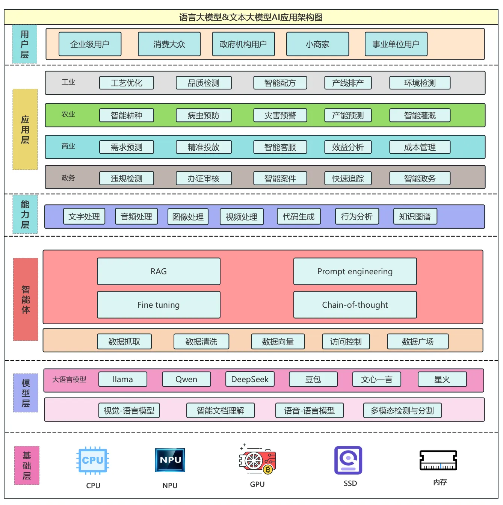
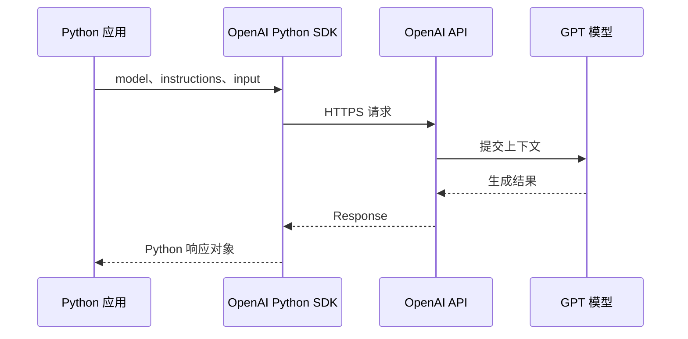
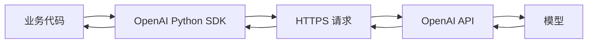
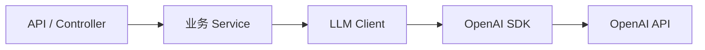
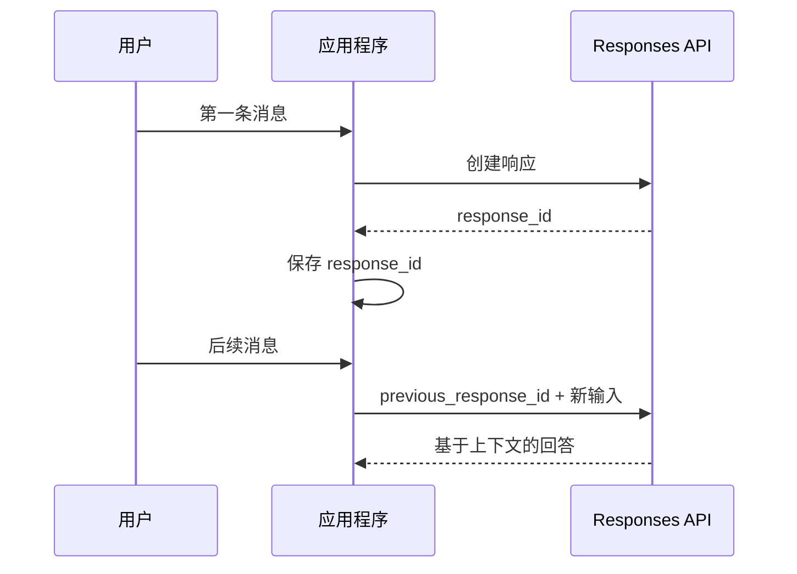
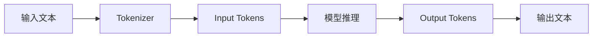
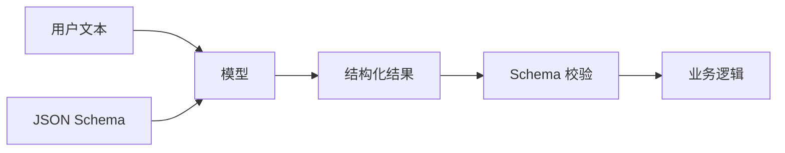
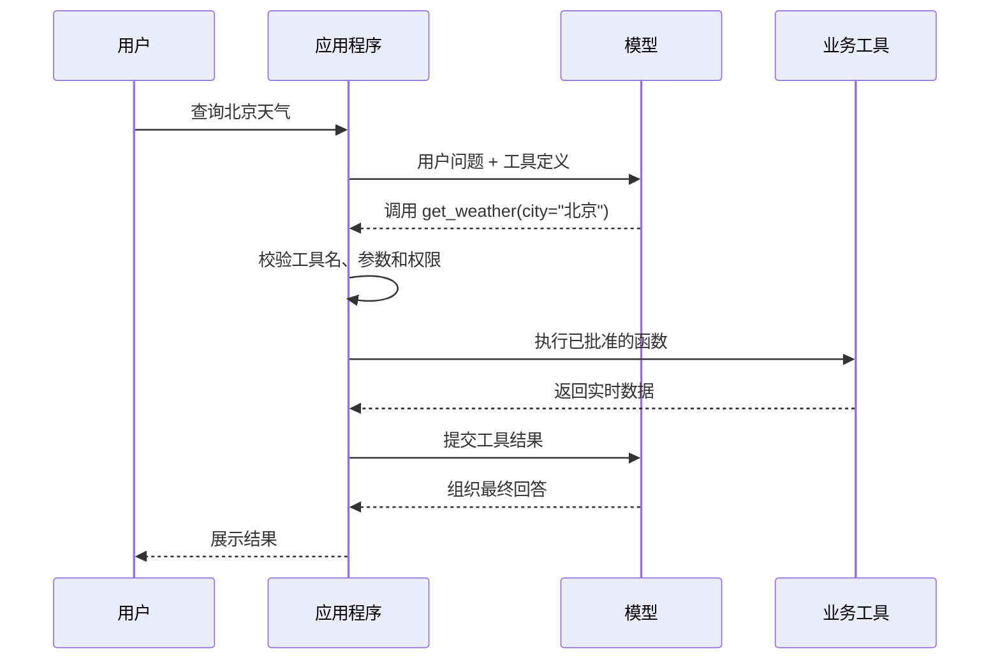
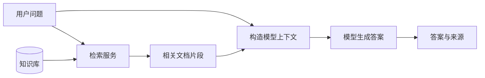
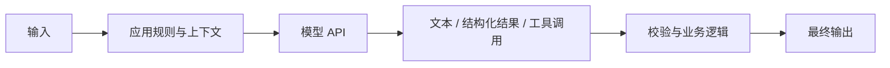

大语言模型并不只能通过 ChatGPT 一类的图形化产品使用。对于软件系统而言，更常见的方式是通过 API 将模型能力接入已有应用，例如生成文本、分析数据、提取结构化信息、查询知识库，或者调用业务工具。

从应用程序的角度看，大语言模型是一项远程服务：程序准备输入并发起请求，模型完成推理后返回结果，应用程序再决定如何展示、保存或继续处理它。

本文以 OpenAI Responses API 和 Python 为例，介绍一条从最小示例到工程化应用的完整路径。



## 认识 AI API

### 一次请求经历了什么

一次最基本的模型调用包含五个环节：应用程序准备输入，SDK 将数据转换为 HTTPS 请求，OpenAI API 调用模型，模型生成结果，SDK 再将响应转换为 Python 对象。



得到结果后，应用程序可以把内容打印到终端、返回给 Web 前端、保存到数据库，或将它作为后续流程的输入。

调用 AI API 与调用普通 HTTP API 的主要区别在于：传统 API 通常返回预先定义的业务数据，而模型根据上下文动态生成结果。即使输入相同，两次回答的措辞也不一定完全一致。

### SDK 与 HTTP API

只要一种语言能够发送 HTTPS 请求，就可以调用模型。Python SDK 并不是模型本身，而是一个 API 客户端，负责封装鉴权、请求序列化和响应解析。



不使用 SDK 时，也可以直接构造 HTTP 请求。其概念结构如下：

```http
POST /v1/responses
Authorization: Bearer $OPENAI_API_KEY
Content-Type: application/json
```

SDK 的价值在于让业务代码处理 Python 对象，而不必重复编写底层网络代码。

## 完成第一次模型调用

### 安装 SDK 与配置 API Key

先安装官方 Python SDK：

```bash
pip install openai
```

程序访问 API 时需要 API Key。不要把密钥直接写进代码，应通过环境变量或专门的密钥管理服务注入。

macOS 或 Linux：

```bash
export OPENAI_API_KEY="YOUR_API_KEY"
```

Windows PowerShell：

```powershell
$env:OPENAI_API_KEY="YOUR_API_KEY"
```

随后创建客户端即可，SDK 会自动读取 `OPENAI_API_KEY`：

```python
from openai import OpenAI

client = OpenAI()
```

> API Key 是服务端凭证，不应出现在前端 JavaScript、移动端安装包、公开仓库或客户端日志中。浏览器和移动应用应调用自己的后端，再由后端访问模型 API。

<!-- 图片占位：OpenAI 控制台创建 API Key 的界面截图；请遮盖真实密钥和账户信息 -->
<!--  -->

### 最小可运行示例

```python
from openai import OpenAI

client = OpenAI()

response = client.responses.create(
    model="gpt-5.4",
    input="请用三句话解释什么是 Docker。",
)

print(response.output_text)
```

这段代码里最重要的是三个概念：

| 名称 | 作用 |
|---|---|
| `model` | 指定处理请求的模型 |
| `input` | 提供本次请求的输入和上下文 |
| `response` | API 返回的完整响应对象 |

`response` 并不是一个普通字符串。它还可能包含响应 ID、状态、输出项、工具调用和 Token 用量等元数据。在纯文本场景中，`response.output_text` 是读取聚合文本的便捷方式。

### 区分 instructions 与 input

真实应用通常包含两类信息：固定的应用规则和用户每次提交的问题。前者放在 `instructions` 中，后者放在 `input` 中。

```python
from openai import OpenAI

client = OpenAI()

response = client.responses.create(
    model="gpt-5.4",
    instructions=(
        "你是一名软件工程技术助手。"
        "使用中文回答，内容准确、简洁；"
        "涉及代码时提供可运行的示例；"
        "不确定的信息需要明确说明。"
    ),
    input="ThreadLocal 为什么可能造成内存泄漏？",
)

print(response.output_text)
```

可以把它们理解为：

- `instructions` 定义模型应当如何工作；
- `input` 描述这一次具体要处理什么。

用户输入属于不可信数据。不要把用户输入直接拼接成更高优先级的规则，也不要让模型输出绕过原有的鉴权和业务校验。

### 将模型名称放进配置

模型会持续迭代，不宜把名称散落在各处。可以通过环境变量统一配置：

```python
import os

MODEL_NAME = os.getenv("OPENAI_MODEL", "gpt-5.4")
```

不同模型在能力、延迟、上下文窗口、工具支持和价格上可能存在差异。生产环境切换模型前，应先针对自己的任务建立评测集，而不是只比较单次回答。

## 从脚本走向工程代码

### 封装模型客户端

不要在每个业务函数里重复调用 `client.responses.create()`。先将模型配置、应用规则和结果提取集中到一层：

```python
import os
from openai import OpenAI

client = OpenAI()
MODEL_NAME = os.getenv("OPENAI_MODEL", "gpt-5.4")

SYSTEM_INSTRUCTIONS = """
你是一名软件工程技术助手。
请使用准确、简洁的中文回答。
涉及代码时提供可运行的示例。
"""


def ask_ai(question: str) -> str:
    response = client.responses.create(
        model=MODEL_NAME,
        instructions=SYSTEM_INSTRUCTIONS,
        input=question,
    )
    return response.output_text
```

业务代码只关心自己的问题：

```python
answer = ask_ai("什么是 CAP 理论？")
print(answer)
```

规模扩大后，可以把 API、业务逻辑、模型适配和配置继续拆开：

```text
project/
├── api/
│   └── chat.py
├── services/
│   └── chat_service.py
├── llm/
│   └── openai_client.py
├── config/
│   └── settings.py
└── main.py
```

模块调用关系如下：



这样可以集中处理模型切换、提示词、超时、重试、日志和监控，也能减少业务代码对特定供应商 SDK 的直接依赖。

### 异常、超时与重试

模型调用是远程网络请求，可能因为鉴权失败、参数错误、请求超时、频率限制、额度不足或服务端异常而失败。最小示例可以先保护调用边界：

```python
def ask_ai(question: str) -> str:
    try:
        response = client.responses.create(
            model=MODEL_NAME,
            input=question,
        )
        return response.output_text
    except Exception as exc:
        # 示例代码：生产环境应按 SDK 的具体异常类型分别处理
        raise RuntimeError("模型服务暂时不可用") from exc
```

生产环境不应长期使用一个宽泛的 `except Exception` 吞掉所有错误。不同错误需要不同策略：

| 错误类型 | 推荐处理 |
|---|---|
| 参数错误 | 记录并修正请求，不重试 |
| 鉴权失败 | 停止调用并检查凭证 |
| 频率限制 | 遵守服务端提示，退避后有限重试 |
| 网络或超时 | 根据业务幂等性有限重试 |
| 服务端异常 | 短暂重试，必要时降级 |

重试应设置最大次数和指数退避。无限重试不仅会拖慢请求，还可能重复产生费用或业务副作用。

### 一个完整的命令行程序

下面把输入、模型调用和错误边界组合成一个最小命令行助手：

```python
import os
from openai import OpenAI

client = OpenAI()
MODEL_NAME = os.getenv("OPENAI_MODEL", "gpt-5.4")

SYSTEM_INSTRUCTIONS = """
你是一名专业的软件开发助手。
使用中文回答，技术描述准确，内容尽量简洁。
涉及代码时提供可运行的示例。
"""


def ask_ai(question: str) -> str:
    response = client.responses.create(
        model=MODEL_NAME,
        instructions=SYSTEM_INSTRUCTIONS,
        input=question,
    )
    return response.output_text


def main() -> None:
    print("AI Developer Assistant（输入 exit 退出）")

    while True:
        question = input("You > ").strip()

        if question.lower() == "exit":
            break
        if not question:
            continue

        try:
            print(f"AI > {ask_ai(question)}\n")
        except Exception as exc:
            print(f"请求失败：{exc}\n")


if __name__ == "__main__":
    main()
```

将 `input()` 换成 Web Controller 的请求参数，再把 `print()` 换成 HTTP Response，这套结构就可以演化为一个 Web AI 服务。

<!-- 图片占位：命令行程序实际运行效果截图 -->
<!--  -->

## 对话上下文与 Token

### 多轮对话不是自动发生的

两个彼此独立的 API 请求默认没有共享上下文。如果希望模型理解“上一轮说了什么”，应用需要显式维护会话状态。

一种简单方式是保存上一次响应 ID，并在下一次请求中传入 `previous_response_id`：

```python
first = client.responses.create(
    model=MODEL_NAME,
    input="我的项目主要使用 Spring Boot。",
)

second = client.responses.create(
    model=MODEL_NAME,
    previous_response_id=first.id,
    input="那这个项目适合怎样实现缓存？",
)

print(second.output_text)
```



聊天记录与模型上下文并不完全等价。长期会话还需要考虑用户隔离、持久化、上下文裁剪、数据保留策略和提示词注入风险。

### Token、上下文与成本

模型会先把文本转换为 Token，再进行处理。输入长度、输出长度、上下文窗口、延迟和费用都与 Token 有关。



更长的上下文通常意味着更高的成本和延迟，也会压缩剩余可用空间。因此生产系统应记录模型、输入 Token、输出 Token、耗时和错误类型，同时避免把完整的敏感输入写入日志。

## 让模型进入业务流程

自然语言适合展示给人，却不总适合让程序消费。AI 应用从 Demo 走向业务系统，通常会逐步加入结构化输出、工具调用和检索增强生成。

### Structured Output：返回可靠的数据结构

假设程序需要模型分析工单，并返回：

```json
{
  "category": "技术问题",
  "priority": "high",
  "summary": "数据库连接池耗尽"
}
```

不要让模型随意输出一段“看起来像 JSON”的文本，再依赖字符串判断。Structured Output 的目标，是让输出符合应用定义的 Schema，随后程序仍需完成反序列化、Schema 校验和业务校验。



例如，关键业务代码不应依赖下面这种脆弱判断：

```python
if response.output_text == "YES":
    approve_request()
```

模型可能返回 `Yes`、`YES.` 或其他等价表达。需要稳定字段时，应定义枚举和 Schema，并对结果进行验证。

### Function Calling：让模型请求工具

模型本身未必拥有实时天气、库存或订单数据。应用可以向模型声明可用工具，由模型生成工具名和参数；真正的函数仍由应用程序执行。



模型负责理解意图和生成参数，但它不应拥有无限制的执行权限。应用必须维护工具白名单，并在执行前进行参数、权限和业务规则校验。转账、删除数据、发送消息等高风险操作还应增加人工确认或审批流程。

### RAG：使用外部知识回答问题

公司的内部文档、产品手册、项目 Wiki 和私有代码通常不在模型的训练知识中。RAG（Retrieval-Augmented Generation，检索增强生成）会先查找相关资料，再把资料连同用户问题交给模型。



RAG 的重点不只是“把文件交给模型”，还包括文档切分、索引、召回、权限过滤、引用来源和效果评估。检索到的资料也属于不可信输入，不能让其中的指令覆盖应用自身规则。

### 从 API 调用到 Agent

当模型可以围绕一个目标选择工具、读取结果并继续下一步时，系统逐渐具备 Agent 的形态。

| 阶段 | 核心能力 |
|---|---|
| API 调用 | 程序能够请求模型并读取结果 |
| Instructions | 约束模型的工作方式 |
| Structured Output | 输出程序可消费的数据 |
| Function Calling | 请求应用执行外部工具 |
| RAG | 使用应用提供的外部知识 |
| Agent | 围绕目标组合多个步骤与工具 |

这些能力不是互相替代的产品层级，而是可以按业务需要组合的构件。很多场景只需要一次结构化调用，并不需要构建 Agent。

<!-- 图片占位：Structured Output、Function Calling、RAG 与 Agent 的能力演进图 -->
<!--  -->

## 生产环境检查清单

### 安全与数据治理

- API Key 只保存在服务端，通过环境变量或 Secret Manager 注入；
- 不把用户敏感数据、密钥和完整提示词直接写入日志；
- 对工具调用执行白名单、参数、权限和业务规则校验；
- 把模型输出视为不可信数据，在使用前完成转义与验证；
- 为高风险或不可逆操作设置人工确认；
- 明确会话和模型数据的保存、删除与访问策略。

### 稳定性与可观测性

- 为连接、读取和整次请求设置合理超时；
- 只对可恢复错误进行有限重试，并使用退避策略；
- 记录请求 ID、模型、耗时、Token 用量、错误类型和调用时间；
- 准备限流、熔断、降级和备用提示；
- 使用固定评测集检查模型或提示词升级带来的回归。

### 成本与输出质量

- 限制输入长度和最大输出规模；
- 按任务难度选择模型，不让所有请求默认使用最高成本方案；
- 缓存适合复用且不含敏感信息的结果；
- 对结构化输出做 Schema 与业务双重校验；
- 对关键结论要求引用来源或人工复核；
- 同时监控质量、延迟与成本，而不是只看回答是否生成成功。

模型应该被视为一个具有概率性的计算组件，而不是事实数据库或权限系统。它可以参与判断，但关键业务约束仍应由确定性的程序代码执行。

## 总结

接入大语言模型的起点只有几行代码：创建客户端、提交输入、读取响应。但一个真正可维护的 AI 应用还需要处理配置、鉴权、异常、上下文、数据结构、监控、成本和安全。



理解这条主线后，Structured Output、Function Calling、RAG 和 Agent 都可以看作是在基础 API 调用上增加新的输入、输出和控制环节。大语言模型并没有脱离传统软件工程；它只是为系统增加了一类能够理解自然语言、进行生成与推理的计算能力。

## 参考资料

- [OpenAI API 快速入门](https://developers.openai.com/api/docs/quickstart)
- [文本生成指南](https://developers.openai.com/api/docs/guides/text)
- [对话状态管理](https://developers.openai.com/api/docs/guides/conversation-state)
- [Function Calling 指南](https://developers.openai.com/api/docs/guides/function-calling)
- [Structured Outputs 指南](https://developers.openai.com/api/docs/guides/structured-outputs)
