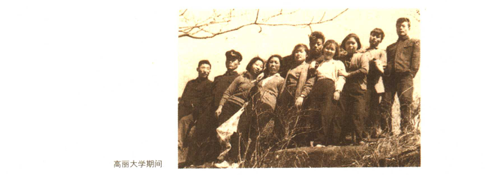

## 前言

自小就有的梦想，一生都在我心中澎湃；

我喜欢冒险与挑战所带来的热情与振奋，我一直梦想社会安定、经济安乐以及透过文化而获得快乐的”幸福世界“。

我要成为”自己的主人“、”良心的主人”和“事业的主人”。

从一个清理垃圾卖苦力的工读学生，到敢于迎接挑战的学生会主席，到军事政权的反抗者，到打工者，到职业经理人，到首尔市长，到当选总统，是贫困教会了我善于学习、教会了我冷静地思考人生和社会地意义；迫使我执意进取，直面挑战，勇于变革；更让我懂得了把握未来、经营未来的重要。

人必有所守护，方能有所坚持。我贯彻一生要为国民幸福坚持奋力拼搏；我愿意在任何危机、挑战面前，毅然迎上前去；我坚持再苦、再难也要堂堂正正地做人。这是在经历了艰难的成长、求学、事业开拓之后，珍藏于内心的一个坚定信念。

> 李明博   
> 2008年2月

## 妈妈，请让我上高中吧！

在我即将从浦项中学毕业的时候，家里的处境更加困难了。大哥已经参军，二哥从同志商业高中毕业后考上了一所免学费的陆军军官学校，但因为身体原因退了学，只得重新准备考大学。我知道家里根本没钱供我继续念高中，便把升学的念头抛在一边。但是，我们的班主任却无论如何也不想放弃我。

毕业前，学校召开了升学讨论会。按照已往的情况，浦项中学的优秀毕业生都能进入庆北高中等名校。班主任认为，成绩一直名列全校第二的我肯定能考入好学校，因此让我的家长务必去一趟学校，商量我的升学问题。那时候，母亲刚开始卖红豆烤饼，从一大早忙到大半夜，根本没有时间来学校。在她看来，拼命赚钱为二哥筹学费是第一要紧的事。

但我还是抱着提一下的想法，向母亲传达了班主任的意思。母亲默默地做着红豆烤饼，好一会，她看着远方对我说：

“咱们家这个情况，你是不可能上高中的。如果你二哥落榜了，你还可以去试一试。如果一定要上高中，那也只能上免学费的邮政高中。可一要是一走，谁帮我做这个生意啊？我一个人可忙不过来。”

虽然早知道结果，可听母亲这么一字一句说出来，泪水还是忍不住在眼眶里打转。

班主任知道我家的情况后，又给我出了一个主意：

“你不上高中的话，真是太可惜了……对了，浦项同志商业高中有个夜校。你可以白天帮家里干活，晚上再去念书。你现在还小，可能不知道，以后要找工作的话，高中毕业证可比初中毕业证有用多了。”

我满怀期望地跟母亲说了班主任的建议，可母亲还是不同意。

“你得帮我做生意，帮哥哥挣学费。生意做得好，也一样可以过上好日子。再说，上夜校也是要钱的，我们家可实在拿不出你的学费啊。”

好心的班主任还在执著地跟母亲进行“攻防持久战”。两边传话的我也累得够呛。

“全部课程都拿第一的学生可以免学费，我相信明博可以做到。”

终于，班主任的最后一个提议被母亲接受了。

“这样的话，咱们做个约定好了。我同意你去上夜校，但前提是不用家里出学费。只能靠你自己努力了。”

因为这个约定，我一直读到了高中毕业。三年夜校，我每门课的成绩都是第一名。

上高中后，我开始随着季节变化做买卖：春天卖麦芽糖，夏天卖冰棍儿，冬天卖爆米花儿。

不管晴天下雨，我总穿着同一件校服，因为穿得出门的衣服就这么一件。我做买卖的那条街上总有许多女校学生来来往往，我的破旧校服、脏兮兮的脸、低着头傻乎乎的样子都成了她们取笑的对象。我不停地对自己说要泰然处之，但强烈的自尊心，加上内向的性格、青春期的焦虑，我又如何做到泰然处之？

思来想去，只好拿顶草帽一遮了事。

到高二时，我决定尝试着做水果生意，一来赚钱比较多，二来也可以躲避那些女生的异样眼光。我白天去市场进水果，晚上放学后推到热闹的剧院门口去卖。刚开始颇有些紧张。我把水果擦得亮亮的，还准备了一盏炭化灯。有一天夜里下着雨，路上行人不多。我正巴巴地盯着剧院门口，盼望电影散场后能有人光顾我的水果摊，突然，有辆小汽车在倒车时撞倒了我的推车，车上的水果咕噜噜撒了一地，几个西瓜都摔烂了。我连忙冲过去捡我的水果，这时，一个声音冲我骂了起来：

“喂，臭小子，推车就好好推，干吗停在中间拦道？你以为这路时你们家的吗？”

我一时慌了神，赶紧向他道歉；可等到那车开走以后，我突然觉得很愤怒。其实我做错了什么了呢？这样被人欺负，感觉真窝囊。想到贫穷带来的屈辱，悲伤、委屈、愤怒一股脑儿涌上心头。

“这么活着有什么意思？就算高中毕业又能怎样？干脆离开这个鬼地方算了！”

这么恨恨地想着，掏出口袋里地钱数了数，足够去首尔地路费了。我偷偷擦干眼泪，走进了路边的小吃摊，想在出发前喝点酒。

“大婶，给我一瓶烧酒，一碟小菜！”我大声喊道。

“今天这孩子怎么了？”

一向看我很乖的大婶吃了一惊。

“快点上酒啊，怎么这么多话！给你钱就是了。”

我开始发脾气，可大婶还是磨磨蹭蹭地没给我拿酒。就在等待地几秒钟里，我突然想起一件事：

”卖了这么长时间地水果，还没有让妈妈尝过我的水果呢。“

每次我从市场进水果回来，母亲总是一边擦着水果，一边说：”这些水果真漂亮啊，一看就知道很好吃。“但是把这些都视为独立财产地我，抱着即使一分钱也要节约的心，总是假装没有听见母亲的话。

”是啊，又不是非要今天走。水果虽然撞烂了，但还是可以让妈妈好好吃个够。那就明天再走吧，晚一天也没关系。“这么打定了主意，我把水果重新装上车，推回了家。

”爸，妈，今天吃点水果吧，剩了很多呢。“

母亲看见被撞歪的拖车和摔碎的西瓜，还有我夸张的喊声，大约知道了发生的事情。她一句话也没说，转身进了被窝。那天夜里我躺在睡铺上，满脑子想的都是离家出走。

第二天清晨，母亲照例开始起到，但那一天，她给我的祈祷格外地长，似乎她也一夜没睡好。

”祈求上帝为我们家明博指引一条光明的路，让他健康成长，让他做每一件事都顺顺利利……“

母亲的祈祷撞击着我的心。”原来，母亲是这样地关心着我啊！“感激地心情促使我将离家出走地计划又推迟了一个月。这样反复几次之后，我又恢复成了原先那个穿着校服、买水果的我。

## 蜕变

我在戒严司令部受到盘问。为了要我交代他们需要的情况，他们用各种方法胁迫我，用得最多的是不让我睡觉。

“小子，我们可以把你塞进冷冻室，也可以把你扔进海里，如果你不想‘意外死亡’，最好乖乖交代！”

我始终咬紧牙关。我得遵守诺言。

审判时我们被转到了地方法庭。出庭时，在野党的政界人士以及宗教界、法律界、文化界人士，还有学生都给予了我们坚定的支持。我们仿佛成了英雄。

最终，和其他“主谋者”差不多，我被判处5年有期徒刑，关押在西大门监狱。我所在的牢房里有杀人犯、强奸犯、诈骗犯等等，平时这些人都以讲述自己的“传奇故事”打发时间。学生罪犯则把监狱当做另外一片斗争天地开展绝食运动。进行反专制斗争的人也想通过把我们捧成英雄来突破当时的斗争困境。但说实话，我始终觉得我们所做的一切，与那些独立斗士、爱国志士相比，根本算不了什么。这只是年轻一代应当为国家所尽的义务，不能将其夸大为英雄主义。

我突然明白了自己在狱中应该做些什么：作为学生，我要把这段时间落下的功课补回来。我一边拼命读书，一边开始冷静地思考人生和社会的意义。

西大门的监狱生活从1964年6月末开始，于10月末结束。法院改判我3年有期徒刑，缓期5年执行。如今回头看，这段生活对我而言，不啻为一种幸运。我在监狱中学会了乐观。在那以前，我一直以为自己生活在最底层、经历过无可比拟的绝望。但是在狱中，我懂得了所谓悲观与乐观都是相对的。在监狱外的人看来，被囚禁之人都是极端悲惨的；但对死刑犯而言，只要活着就是莫大的幸福。艰苦的狱中生活还让我领悟到了人身上潜在的超强的适应能力。刚开始，每天早上分到的水连湿手都不够；一个月后，用那点水完全可以洗手、洗脸。

从当选学生会主席，到逃亡、坐牢，这一年的经历让我从幼虫蜕变成了长着翅膀的成虫！

出狱后，我发现自己一下子成了名人。

有一天，我突然收到从外婆家寄来的一箱苹果。箱子上的收件人地址让我永远难忘：

“首尔市龙山区，李明博收”

因为穷困，我们几乎和外婆家没什么联系。怎么突然出现这么一箱苹果呢？后来才知道，在看到我被释放的报道后，外婆她们想寄些苹果来慰问，可又不知道详细地址，只大约记得我们在首尔龙山的某个地方。这箱地址不详的苹果居然能顺利到达我家，可见我当时多么有名了。

但这时，母亲的身体因过度操劳，完全垮了。

从日本回来后的二十多年里，母亲没有睡过一天安稳觉，身体自然每况愈下。我在监狱的时候，母亲来探望我一次。我一看到母亲就知道她病得不轻，可她却努力装出不要紧的样子。那天，母亲直视我的眼睛，说：

“明博，我一直以为你是个不起眼的小东西，现在才发现，你才是真正了不起的家伙。你的想法是对的，以后就按照自己的信念去做吧，我会为你祈祷的。”

这是母亲第一次，也是最后一次肯定我。

等到我出狱的时候，母亲已经卧床不起。那年的12月15日，母亲永远地离开了我们。

父亲在京畿道利川度过了他的余生。大哥为父亲准备了一个小农场，父亲一到农场就把母亲移葬过去，并亲自为母亲立了碑铭：

“你千辛万苦把孩子们拉扯大，却没能看到孩子们成功，留下我一人享尽天伦，实在让我惭愧。”

父亲是在1981年我当现代建设社长地时候去世地。和母亲一样，都是在12月。
