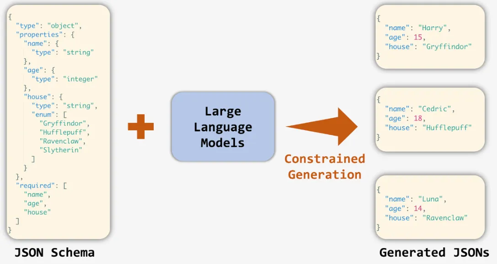
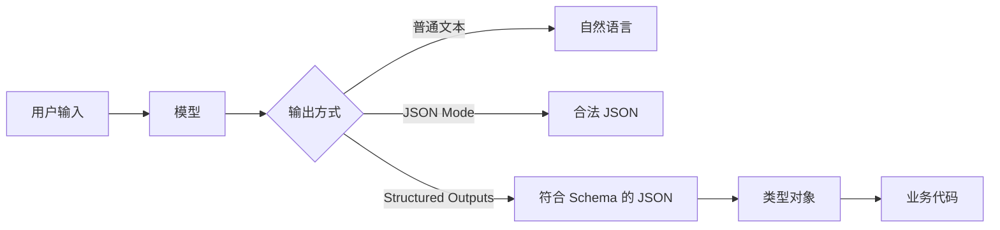
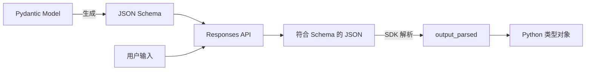
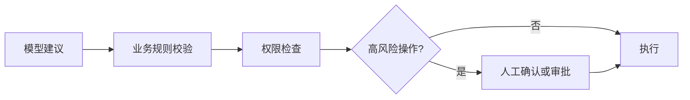
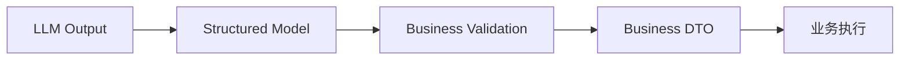
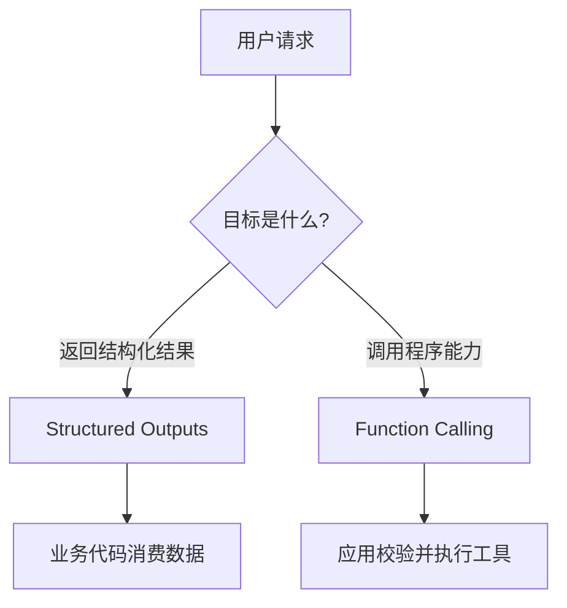
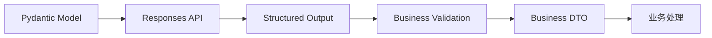

大语言模型最自然的输出形式是文本。例如，让模型分析一条故障日志，它可能返回：

```text
这是一个数据库连接异常，严重程度较高，建议检查连接池和数据库服务状态。
```

如果结果只是展示给人阅读，自然语言通常已经足够。但当模型参与软件系统时，程序更需要一个稳定的数据结构：

```json
{
  "category": "DATABASE",
  "severity": "HIGH",
  "summary": "数据库连接异常"
}
```

有了明确的数据结构，业务代码才能可靠地继续处理：

```python
if result.severity == Severity.HIGH:
    create_alarm()

if result.category == FaultCategory.DATABASE:
    route_to_database_team()
```

Structured Outputs 和 Schema 约束解决的核心问题是：**如何让模型输出不仅能被人看懂，也能被程序稳定地解析、校验和消费。**



## 为什么不能只在 Prompt 中约定 JSON

最简单的做法是在 Prompt 中告诉模型：

```text
请严格按照下面的 JSON 格式返回：

{
  "category": "...",
  "severity": "...",
  "summary": "..."
}
```

模型大多数时候会生成类似的结果，但“看起来像 JSON”不等于“满足业务契约”。模型可能增加额外字段：

```json
{
  "category": "DATABASE",
  "severity": "HIGH",
  "summary": "数据库连接异常",
  "suggestion": "检查连接池"
}
```

也可能修改字段名：

```json
{
  "category": "DATABASE",
  "level": "HIGH",
  "summary": "数据库连接异常"
}
```

甚至返回不符合业务枚举的值：

```json
{
  "category": "DATABASE",
  "severity": "严重",
  "summary": "数据库连接异常"
}
```

这些结果对人类来说都不难理解，但程序无法稳定处理。Prompt 可以描述格式，却不是类型系统，也不能代替正式的数据契约。

### JSON Mode 与 Structured Outputs

JSON Mode 和 Structured Outputs 很容易混淆，但两者解决的问题不同：

| 能力 | JSON Mode | Structured Outputs |
|---|---:|---:|
| 输出合法 JSON | 是 | 是 |
| 约束字段名称 | 否 | 是 |
| 约束字段类型 | 否 | 是 |
| 约束枚举值 | 否 | 是 |
| 约束必要字段 | 否 | 是 |
| 适合作为严格业务数据 | 一般 | 更适合 |

JSON Mode 主要保证输出能够被当作 JSON 解析；Structured Outputs 进一步要求输出满足指定的 JSON Schema。下游程序需要可靠消费模型结果时，应优先考虑 Structured Outputs。



## 用 Schema 定义数据契约

Schema 是描述数据结构的正式规则。下面这个 Schema 定义了故障类别、严重程度和摘要：

```json
{
  "type": "object",
  "properties": {
    "category": {
      "type": "string",
      "enum": ["DATABASE", "NETWORK", "APPLICATION", "UNKNOWN"]
    },
    "severity": {
      "type": "string",
      "enum": ["LOW", "MEDIUM", "HIGH"]
    },
    "summary": {
      "type": "string"
    }
  },
  "required": ["category", "severity", "summary"],
  "additionalProperties": false
}
```

它表达了几条明确规则：

- 最外层必须是对象；
- 三个字段都必须存在；
- `category` 和 `severity` 只能从指定枚举中选择；
- `summary` 必须是字符串；
- 不允许出现未定义字段。

OpenAI Structured Outputs 支持 JSON Schema 的一个子集，包括常见的字符串、数字、整数、布尔值、对象、数组、枚举和 `anyOf` 等结构。设计 Schema 时应以官方当前支持范围为准。

### 使用 Pydantic 定义模型

Python 项目通常不需要手工维护大段 JSON Schema。Pydantic 可以同时承担 Python 类型定义和 Schema 生成两项工作：

```bash
pip install openai pydantic
```

```python
from enum import Enum

from pydantic import BaseModel


class FaultCategory(str, Enum):
    DATABASE = "DATABASE"
    NETWORK = "NETWORK"
    APPLICATION = "APPLICATION"
    UNKNOWN = "UNKNOWN"


class Severity(str, Enum):
    LOW = "LOW"
    MEDIUM = "MEDIUM"
    HIGH = "HIGH"


class FaultAnalysis(BaseModel):
    category: FaultCategory
    severity: Severity
    summary: str
```

`FaultAnalysis` 是一个普通业务数据模型，同时也能生成对应的 JSON Schema：

```python
print(FaultAnalysis.model_json_schema())
```

这样可以避免分别维护 Python DTO 和 JSON Schema，减少两套定义逐渐不一致的问题。

### 优先使用明确的类型

下面这种定义虽然属于结构化输出，但约束很弱：

```python
class Result(BaseModel):
    result: dict
```

模型仍然可以在 `result` 中生成任意结构。更好的 Schema 应尽可能表达业务语义：

```python
class FaultAnalysis(BaseModel):
    category: FaultCategory
    severity: Severity
    summary: str
```

设计时可以遵循几个原则：

- 有限集合优先使用 Enum，不要使用不受约束的字符串；
- 字段名称应表达业务含义，避免 `type`、`value`、`data` 这类模糊名称；
- 一个字段只承担一种语义；
- 不要为了“通用”而大量使用 `dict` 和动态 Map；
- 避免过深嵌套和不必要的 Union；
- 将 Schema 当作接口协议，尽量保持稳定。

### 嵌套对象和数组

Structured Outputs 也适合代码审查、信息抽取等复杂结果：

```python
from enum import Enum

from pydantic import BaseModel


class RiskLevel(str, Enum):
    LOW = "LOW"
    MEDIUM = "MEDIUM"
    HIGH = "HIGH"


class CodeIssue(BaseModel):
    line: int
    problem: str
    suggestion: str
    risk: RiskLevel


class CodeReviewResult(BaseModel):
    summary: str
    issues: list[CodeIssue]
```

前端或后续服务可以直接遍历 `result.issues`，而不需要从一段自然语言中重新提取问题列表。

信息抽取场景也可以把数组作为对象字段：

```python
class Task(BaseModel):
    title: str
    owner: str
    deadline: str


class MeetingResult(BaseModel):
    tasks: list[Task]
```

### 可空字段与额外字段

如果字段业务上可以没有值，通常应让字段存在但允许为 `null`：

```python
class UserInfo(BaseModel):
    name: str
    email: str | None
```

对应结果是：

```json
{
  "name": "Alice",
  "email": null
}
```

这比直接省略字段更稳定，因为下游程序始终知道 `email` 字段存在，只是值可能为空。

对象 Schema 还应禁止随意添加字段：

```json
"additionalProperties": false
```

如果业务需要新增 `root_cause` 或 `suggestion`，应当显式升级 Schema，而不是允许模型自由扩展。

## 使用 Responses API 获取类型对象

OpenAI Python SDK 可以通过 `client.responses.parse()` 接收 Pydantic 模型，并将符合 Schema 的结果解析为 Python 对象。

```python
from enum import Enum

from openai import OpenAI
from pydantic import BaseModel


class FaultCategory(str, Enum):
    DATABASE = "DATABASE"
    NETWORK = "NETWORK"
    APPLICATION = "APPLICATION"
    UNKNOWN = "UNKNOWN"


class Severity(str, Enum):
    LOW = "LOW"
    MEDIUM = "MEDIUM"
    HIGH = "HIGH"


class FaultAnalysis(BaseModel):
    category: FaultCategory
    severity: Severity
    summary: str


client = OpenAI()

response = client.responses.parse(
    model="gpt-5.4",
    instructions="""
    你是系统故障分析组件。
    根据日志判断故障类别和严重程度。
    """,
    input="""
    java.sql.SQLTransientConnectionException:
    HikariPool-1 - Connection is not available,
    request timed out after 30000ms.
    """,
    text_format=FaultAnalysis,
)

result = response.output_parsed

if result is None:
    raise RuntimeError("模型没有返回可解析的结构化结果")

print(result.category)
print(result.severity)
print(result.summary)
```

可能得到：

```text
FaultCategory.DATABASE
Severity.HIGH
数据库连接池无法获取可用连接，请求在 30 秒后超时。
```

### output_text 与 output_parsed

普通文本调用经常读取：

```python
response.output_text
```

它表示模型输出的文本，本质上仍然是字符串。Structured Outputs 更应关注：

```python
response.output_parsed
```

它表示 SDK 已经按照 `text_format` 完成解析的 Python 对象。使用 `output_parsed` 可以保留 Pydantic 的类型校验，也能让业务代码更清晰。



### 直接使用 JSON Schema

不使用 Pydantic 时，也可以直接向 Responses API 提供原始 JSON Schema：

```python
from openai import OpenAI

client = OpenAI()

response = client.responses.create(
    model="gpt-5.4",
    input="分析日志：数据库连接池已耗尽。",
    text={
        "format": {
            "type": "json_schema",
            "name": "fault_analysis",
            "strict": True,
            "schema": {
                "type": "object",
                "properties": {
                    "category": {
                        "type": "string",
                        "enum": [
                            "DATABASE",
                            "NETWORK",
                            "APPLICATION",
                            "UNKNOWN",
                        ],
                    },
                    "severity": {
                        "type": "string",
                        "enum": ["LOW", "MEDIUM", "HIGH"],
                    },
                    "summary": {
                        "type": "string",
                    },
                },
                "required": ["category", "severity", "summary"],
                "additionalProperties": False,
            },
        }
    },
)

print(response.output_text)
```

这种方式更接近底层 API 协议，也适用于不使用 Pydantic 的语言或项目。Python 项目通常优先选择 Pydantic，以保持类型定义和模型输出契约一致。

## Schema 只能保证结构正确

Structured Outputs 可以保证下面的数据符合 Schema：

```json
{
  "category": "NETWORK",
  "severity": "HIGH",
  "summary": "数据库连接失败"
}
```

但它不能保证 `NETWORK` 是正确分类。这个结果结构完全合法，业务判断却可能有误。

因此系统需要区分不同层次的约束：

| 约束层 | 负责的问题 |
|---|---|
| Instructions | 告诉模型如何理解和判断 |
| Schema | 保证字段、类型和枚举合法 |
| Business Validation | 判断内容是否符合业务规则 |
| Permission | 决定是否允许执行操作 |

Schema 决定“怎么输出”，Instructions 决定“怎么判断”。两者不能互相替代。


### 在 Instructions 中定义业务语义

枚举只能限制取值范围，无法解释每个枚举代表什么。严重程度规则仍需要写进 Instructions：

```python
SYSTEM_INSTRUCTIONS = """
你是系统故障分类组件。

LOW：
不影响核心业务，仅产生轻微告警。

MEDIUM：
影响部分功能，但存在降级或重试机制。

HIGH：
造成核心业务不可用、数据无法访问，
或大量请求持续失败。
"""
```

一个稳定的模型服务通常依赖三部分共同约束：

```text
Instructions + Schema + Business Validation
```

### 不让模型直接授权高风险操作

下面的设计即使结构正确，也很危险：

```python
class RiskResult(BaseModel):
    should_delete_user: bool


if result.should_delete_user:
    delete_user()
```

Structured Outputs 只能保证 `should_delete_user` 是布尔值，不能保证模型判断一定正确。对于删除数据、转账、修改权限、发布内容和执行运维命令等操作，模型结果只能作为决策输入，不能作为最终授权。



## 工程化封装与异常处理

真实项目不应把 `client.responses.parse()` 散落在业务代码中。可以建立独立的模型服务层：

```python
from openai import OpenAI


class FaultAnalysisService:
    def __init__(self) -> None:
        self.client = OpenAI()
        self.model = "gpt-5.4"

    def analyze(self, log: str) -> FaultAnalysis:
        response = self.client.responses.parse(
            model=self.model,
            instructions="""
            你是系统故障分析组件。

            DATABASE：数据库连接、SQL、事务和连接池问题。
            NETWORK：DNS、TCP、HTTP 和网络连通性问题。
            APPLICATION：应用代码和运行时异常。
            UNKNOWN：无法明确分类的问题。
            """,
            input=log,
            text_format=FaultAnalysis,
        )

        result = response.output_parsed

        if result is None:
            raise RuntimeError("模型未返回有效的结构化结果")

        return result
```

业务代码只需要处理类型对象：

```python
service = FaultAnalysisService()
result = service.analyze(log)

if result.category == FaultCategory.DATABASE:
    route_to_database_team()
```

### 处理拒绝和失败

应用不能假设 `output_parsed` 永远存在。模型可能拒绝请求，API 也可能发生网络、鉴权、频率限制或服务端错误。

生产系统至少应区分：

- 正常结构化输出；
- 模型拒绝；
- 输出解析或校验失败；
- 请求超时与网络异常；
- 频率限制；
- 鉴权或参数错误；
- 服务端错误。

基础封装可以先保护调用边界：

```python
from pydantic import ValidationError


def analyze_fault(log: str) -> FaultAnalysis:
    try:
        response = client.responses.parse(
            model="gpt-5.4",
            input=log,
            text_format=FaultAnalysis,
        )

        result = response.output_parsed
        if result is None:
            raise RuntimeError("模型没有返回结构化结果")

        return result

    except ValidationError as exc:
        raise RuntimeError("模型输出校验失败") from exc
```

实际项目还应按照 SDK 的具体异常类型分别处理，不要用一个宽泛的异常分支吞掉全部错误。对于拒绝响应，可以进一步检查 `response.output` 中的对应输出项。

### 映射到业务 DTO

AI 层对象不一定应该贯穿整个系统。可以在边界处把它转换成业务 DTO：

```python
def convert_to_alarm(analysis: FaultAnalysis) -> AlarmCommand:
    return AlarmCommand(
        type=analysis.category.value,
        level=analysis.severity.value,
        description=analysis.summary,
    )
```

整体链路变成：



这种边界可以防止 AI 层模型和核心业务过度耦合，也方便以后替换模型或修改提示词。

### 管理 Schema 版本

当结构化输出被多个模块消费以后，Schema 就成为接口协议。增加必填字段可能影响所有下游消费者，因此可以像传统 API 一样管理版本：

```python
class FaultAnalysisV1(BaseModel):
    category: FaultCategory
    severity: Severity
    summary: str


class FaultAnalysisV2(BaseModel):
    category: FaultCategory
    severity: Severity
    summary: str
    root_cause: str
    suggestion: str
```

Prompt 是模型行为配置，Schema 是程序接口，两者生命周期并不相同。不要因为调整 Prompt 就频繁改变 Schema。

## 完整示例：工单智能分类

假设系统需要从用户工单中提取类别、严重程度、摘要、处理团队以及是否需要人工介入。

先定义类型：

```python
from enum import Enum

from pydantic import BaseModel


class TicketCategory(str, Enum):
    DATABASE = "DATABASE"
    NETWORK = "NETWORK"
    APPLICATION = "APPLICATION"
    ACCOUNT = "ACCOUNT"
    UNKNOWN = "UNKNOWN"


class Severity(str, Enum):
    LOW = "LOW"
    MEDIUM = "MEDIUM"
    HIGH = "HIGH"


class Team(str, Enum):
    DBA = "DBA"
    NETWORK = "NETWORK"
    BACKEND = "BACKEND"
    SUPPORT = "SUPPORT"


class TicketAnalysis(BaseModel):
    category: TicketCategory
    severity: Severity
    summary: str
    need_manual_review: bool
    team: Team
```

然后建立模型服务：

```python
from openai import OpenAI


class TicketClassifier:
    def __init__(self) -> None:
        self.client = OpenAI()
        self.model = "gpt-5.4"

    def classify(self, content: str) -> TicketAnalysis:
        response = self.client.responses.parse(
            model=self.model,
            instructions="""
            你是企业技术支持工单分类组件。

            DATABASE：SQL、数据库连接、连接池、性能和事务问题。
            NETWORK：DNS、HTTP、TCP、路由和网络连通性问题。
            APPLICATION：后端服务代码、运行时异常和应用逻辑错误。
            ACCOUNT：用户、账号、登录和权限问题。
            UNKNOWN：无法确定类别。

            LOW：不影响主要业务。
            MEDIUM：影响部分用户或部分功能。
            HIGH：大量请求失败、核心功能不可用，或存在持续影响。
            """,
            input=content,
            text_format=TicketAnalysis,
        )

        result = response.output_parsed
        if result is None:
            raise RuntimeError("工单分类失败")

        return result
```

业务代码调用：

```python
classifier = TicketClassifier()

result = classifier.classify(
    """
    应用今天下午开始大量报错，数据库连接经常超时，
    重启服务后只能恢复几分钟，随后又出现同样问题。
    """
)

if result.need_manual_review:
    create_manual_ticket()

if result.team == Team.DBA:
    assign_to_dba()

if result.severity == Severity.HIGH:
    create_high_priority_alarm()
```

模型返回的不再是一段需要重新解析的文字，而是可以直接交给业务校验层处理的 `TicketAnalysis` 对象。

<!-- 图片占位：工单智能分类从输入、结构化输出到业务路由的架构图 -->
<!--  -->

## Structured Outputs 与 Function Calling

Structured Outputs 和 Function Calling 都会使用 Schema，但职责不同。

| 能力 | 解决的问题 | 示例 |
|---|---|---|
| Structured Outputs | 模型最终返回什么结构的数据 | 返回工单分类结果 |
| Function Calling | 模型需要调用什么函数及传入哪些参数 | 调用 `create_ticket(...)` |

如果目标是让模型最终返回可供程序消费的数据，使用 Structured Outputs；如果目标是让模型连接应用功能、数据库或外部工具，使用 Function Calling。



两种能力也可以组合：模型先通过 Function Calling 请求查询数据，应用执行工具后，再让模型以 Structured Outputs 返回最终结果。

## 总结

仅在 Prompt 中写“请严格返回 JSON”，无法建立可靠的数据契约。Structured Outputs 的价值在于把概率性的自然语言输出约束为具有确定结构的数据对象。

在 Python 项目中，一条清晰的实践路径是：



其中：

- Pydantic Model 定义字段、类型、枚举和嵌套关系；
- Instructions 定义分类和判断规则；
- Structured Outputs 保证返回结构符合 Schema；
- Business Validation 校验内容是否合理；
- 权限系统决定操作是否允许执行。

Schema 提升的是接口可靠性，并不能保证模型的业务判断永远正确。只有把模型放进传统的软件工程边界中，结构化输出才会真正成为稳定、可维护的系统能力。

## 参考资料

- [OpenAI Structured Outputs 指南](https://developers.openai.com/api/docs/guides/structured-outputs)
- [OpenAI 文本生成指南](https://developers.openai.com/api/docs/guides/text)
- [OpenAI Function Calling 指南](https://developers.openai.com/api/docs/guides/function-calling)
