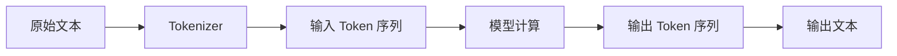
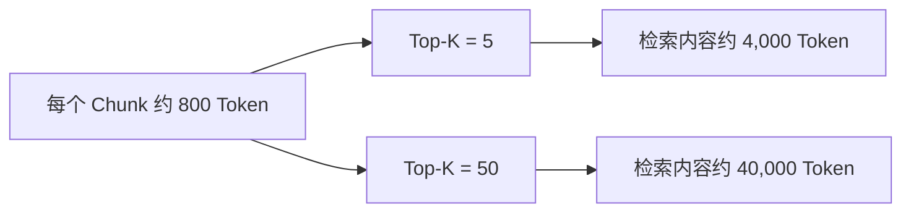

使用大语言模型 API 时，经常会遇到这些概念：

```text
Token
Input Tokens
Output Tokens
Reasoning Tokens
Cached Tokens
Context Window
```

Token 既不是固定数量的字符，也不等于一个完整单词。它是模型处理信息时使用的基本离散单位，直接影响请求能够携带多少内容、模型能够生成多少内容，以及一次调用的成本和延迟。

从模型的角度看，一次文本请求可以简化为：



因此，理解 Token 不只是理解一个模型底层术语，也是设计多轮对话、RAG、Function Calling 和 Agent 系统的基础。

## Token 是什么

### Token 与字符、单词的区别

Tokenizer 会按照模型使用的编码和词表拆分文本。例如：

```text
I love programming.
```

它可能被拆成完整单词、子词和标点，但具体结果取决于模型所使用的 Tokenizer。少见单词、代码标识符、URL 和多语言文本通常会被拆成更细的单位。

所以不存在通用的等式：

```text
1 Token = 1 个英文单词
1 Token = 1 个中文字符
```

同一段内容在不同模型上也可能得到不同的 Token 数量。`len(text)` 只能统计字符，不能准确表示模型实际收到的 Token。

Tokenizer 使用子词而不是只使用完整单词，是为了用有限词表处理新词、词形变化和人为创建的字符串。例如 `getUserInformation` 即使不在词表中，也可以由多个已有单位组合表示。

### Token 来自哪些内容

一次 API 调用的 Token 不只来自用户输入，还可能来自：

- Instructions 和历史消息；
- Function Definition 与 Tool Output；
- Structured Outputs 的 JSON Schema；
- RAG 检索片段；
- 图片、PDF 等多模态输入；
- 模型生成的文本、工具调用和内部推理。

因此，用户只输入一句话，也不代表整个请求只包含这一句话的 Token。

## 认识 Usage 数据

### Input、Output 与 Reasoning Tokens

Responses API 会在 `usage` 中返回一次请求的实际用量：

```python
from openai import OpenAI

client = OpenAI()

response = client.responses.create(
    model='gpt-5.6',
    instructions='你是一名 Java 技术助手。',
    input='解释一下什么是 ThreadLocal。',
)

usage = response.usage

print('input:', usage.input_tokens)
print('output:', usage.output_tokens)
print('total:', usage.total_tokens)
print(
    'reasoning:',
    usage.output_tokens_details.reasoning_tokens,
)
```

不同 Usage 字段的含义如下：

| 字段 | 含义 |
|---|---|
| `input_tokens` | 模型实际接收的输入 Token |
| `output_tokens` | 模型生成的全部 Token |
| `reasoning_tokens` | 输出中用于内部推理的 Token |
| `total_tokens` | 输入和输出 Token 总和 |
| `cached_tokens` | 输入中命中 Prompt Cache 的 Token |

`output_tokens` 不一定只等于最终可见文本。它还可能包含推理、工具调用、消息结构和格式组织等不可直接看到的生成 Token。因此，`reasoning_tokens` 已经属于输出用量的一部分，不应再次加到 `total_tokens` 上。

工程系统应以 API 返回的 Usage 作为统计依据，而不是对最终文本再次执行字符数估算。

### 请求前计算输入 Token

有些场景不能等请求结束后再统计。例如发送大型 Prompt 前，需要先判断它是否超过业务预算。Responses API 提供了 Input Token Counting API：

```python
count = client.responses.input_tokens.count(
    model='gpt-5.6',
    instructions='你是一名专业的软件工程技术助手。',
    input='解释一下什么是 Redis。',
)

print(count.input_tokens)
```

这个接口接受与 Responses API 相近的输入结构，可以计算消息、工具、图片和支持的文件输入。请求结构中的 Role、边界和其他格式 Token 也会计入结果。

本地 `tiktoken` 更适合分析纯文本：

```python
import tiktoken

encoding = tiktoken.get_encoding('o200k_base')
tokens = encoding.encode('大语言模型中的 Token 是什么？')

print(tokens)
print(len(tokens))
```

但本地 Tokenizer 无法完整覆盖图片、文件、工具定义和 API 消息结构。需要做容量检查或成本预估时，应优先使用官方 Token Counting API。

## 上下文窗口

### Context Window 包含什么

上下文窗口表示模型在一次请求生命周期中能够处理的 Token 总容量。它并不只是用户输入上限，而要同时容纳：

```text
输入 Token
+ 输出 Token
+ 部分模型的推理 Token
```

假设某模型的上下文窗口是 100,000 Token，这只是用于说明概念的假设数字。如果输入已经占用 90,000 Token，就不能再认为模型仍可生成 20,000 Token。

模型的上下文窗口和最大输出长度也是两个不同限制：

| 限制 | 含义 |
|---|---|
| Context Window | 整个请求能够处理的总 Token 容量 |
| Max Output Tokens | 一次响应最多允许生成的 Token |

具体数值与模型快照可能变化，应查阅当前模型文档，而不是把某个数字长期写死在业务代码中。

### 为输出预留空间

Instructions、历史消息、RAG 内容和工具定义占用越多，留给模型回答和推理的空间就越少。长 Prompt 可能导致请求失败、输出被限制或者内容被截断。

可以通过 `max_output_tokens` 控制生成预算：

```python
response = client.responses.create(
    model='gpt-5.6',
    input='介绍 Redis 的核心数据结构。',
    max_output_tokens=1_000,
)
```

这个参数限制模型生成的全部 Token，而不只是用户最终看到的文本。使用推理模型时尤其要为 Reasoning Tokens 和其他非可见输出留出余量。

Responses API 还支持不同的截断策略。自动截断可以作为最后的保护机制，但不应替代主动的上下文管理，因为被删除的早期内容可能恰好是关键业务约束。

### 多轮对话仍会累积 Token

使用 `previous_response_id` 时，客户端不需要重新发送全部历史文本，但 Response 链中的历史输入仍会作为输入 Token 计费。

因此，多轮对话越长，输入成本通常越高。滑动窗口、历史摘要、结构化记忆和 Compaction，本质上都在控制长期会话的 Token 数量。

Context Window 也不等于长期记忆。它只表示单次推理可以看到多少内容；下一次独立请求如果没有再次提供相关信息，模型就无法继续使用这些上下文。

## Token Budget 与调用成本

### 为一次请求分配预算

可以把上下文窗口看成一个有限预算。例如：

| 内容 | 应用预算示例 |
|---|---:|
| 固定 Instructions | 5,000 |
| 历史消息 | 20,000 |
| RAG 内容 | 50,000 |
| 当前输入 | 5,000 |
| 输出和推理预留 | 20,000 |

这些数字不是 API 规定，只是在说明工程设计思路。应用需要决定有限空间应优先分配给规则、历史、检索内容还是输出。

业务 Token Budget 通常应该比模型技术上限更严格。例如普通问答、RAG 和高级分析可以采用不同预算，避免单个请求带来过高成本和延迟。

```python
class TokenBudgetExceeded(Exception):
    pass


def check_input_budget(
    client: OpenAI,
    model: str,
    input_data,
    max_input_tokens: int,
) -> int:
    result = client.responses.input_tokens.count(
        model=model,
        input=input_data,
    )

    if result.input_tokens > max_input_tokens:
        raise TokenBudgetExceeded(
            '输入超过应用允许的 Token Budget',
        )

    return result.input_tokens
```

“模型能够处理”并不代表“业务应该允许”。

### 计算请求成本

基础成本可以表示为：

```text
输入成本 = 输入 Token / 1,000,000 × 每百万输入 Token 单价
输出成本 = 输出 Token / 1,000,000 × 每百万输出 Token 单价
```

```python
def calculate_cost(
    input_tokens: int,
    output_tokens: int,
    input_price_per_million: float,
    output_price_per_million: float,
) -> float:
    input_cost = (
        input_tokens / 1_000_000 * input_price_per_million
    )
    output_cost = (
        output_tokens / 1_000_000 * output_price_per_million
    )
    return input_cost + output_cost
```

不同模型、服务层级、缓存状态和处理方式可能采用不同费率。模型价格不适合永久硬编码，应通过配置中心或模型配置表维护，并以调用时的官方价格页面为准。

## Prompt Caching

### Cached Tokens 解决什么问题

很多请求会重复包含固定 Instructions、工具定义、示例和历史前缀。Prompt Caching 可以复用相同前缀对应的计算状态，从而降低重复处理的成本和延迟。

```python
cached_tokens = (
    response.usage.input_tokens_details.cached_tokens
)
print(cached_tokens)
```

Cached Tokens 仍然属于输入上下文，也仍会占用 Context Window。缓存减少的是重复计算和对应费用，不会把模型的容量变成无限。

### 提高缓存命中率

缓存复用依赖公共前缀保持一致，因此 Prompt 通常应按以下顺序组织：

```text
稳定的 Instructions
稳定的 Tool Definition
稳定的背景或示例
历史上下文
动态数据
当前用户输入
```

保持固定内容的文本、顺序和请求设置稳定，把经常变化的内容放在后面，通常更容易形成可复用前缀。

不要为了命中缓存而加入本来不需要的内容。缓存优化必须建立在上下文本身合理的前提上，并通过 `cached_tokens`、缓存命中率、延迟和真实成本验证效果。

## 哪些功能会消耗上下文

### Function Calling 与 Structured Outputs

工具名称、描述和参数 Schema 都需要让模型理解，因此 Tool Definition 会占用输入 Token。一次注册大量工具，可能增加成本、首 Token 延迟以及工具选择难度。

Token Counting API 可以把工具定义一起计算：

```python
count = client.responses.input_tokens.count(
    model='gpt-5.6',
    tools=tools,
    input='查询订单状态。',
)
```

工具返回的 JSON 同样属于上下文，应该只保留模型完成当前任务需要的字段。Structured Outputs 的 JSON Schema 也会产生开销，过多字段、深层嵌套、冗长描述和大量枚举都应有明确业务价值。

### RAG

RAG 通常把文档切成 Chunk，再检索少量相关内容放入上下文。Chunk Size 更适合以 Token 衡量，而不是只看字符数。

假设每个 Chunk 为 800 Token：



这还没有计算 Instructions、历史对话、当前问题和输出空间。RAG 的 Top-K 并不是越大越好，应结合检索质量、Rerank 和 Context Budget 选择最相关的片段。

### 图片与文件

图片、PDF 和其他支持的文件也会转换成模型可处理的输入计量。文件大小不能直接换算成 Token，图片还可能受到尺寸和 Detail 设置影响。

涉及多模态请求时，应按照实际请求结构调用 Token Counting API，而不是使用“字符数除以四”之类的经验公式。

## Token 优化与监控

### 优化不是一味缩短 Prompt

Token 越少不一定越好。如果把完整任务要求压缩成“分析一下”，模型可能因为缺少目标、背景和输出约束而产生低质量回答，最终需要重新调用。

更合理的目标是 Token Efficiency：减少无关和重复信息，同时保留完成任务所需的有效上下文。

| 优化方式 | 主要作用 |
|---|---|
| 删除无关历史 | 减少会话噪声 |
| 历史摘要或 Compaction | 压缩长期上下文 |
| 结构化记忆 | 避免反复发送完整历史 |
| 限制 RAG Top-K | 控制检索内容规模 |
| Rerank | 保留更相关的 Chunk |
| 简化 Tool 和 Schema | 降低固定输入开销 |
| Prompt Caching | 复用稳定前缀 |
| `max_output_tokens` | 控制生成预算 |
| Token Counting | 请求前检查容量 |
| 模型路由 | 根据任务选择合适模型 |

长上下文模型提供了更高的能力上限，但没有取消 Context Engineering。无关内容仍然会增加成本、延迟、隐私风险和调试难度。

### 建立请求级可观测性

每次模型调用至少应该记录：

```text
request_id
user_id / conversation_id
model
request_type
input_tokens
cached_tokens
output_tokens
reasoning_tokens
total_tokens
latency
estimated_cost
```

有了请求级数据，才能分析哪个接口成本最高、哪个 Prompt 增长最快、RAG 平均占用多少上下文，以及缓存或模型路由是否真正有效。

Streaming 可以改善用户感知延迟，但不会减少模型实际生成的 Token。结构化短输出、合理的输出预算和更适合任务的模型，才会真正影响生成量和总体成本。

## Token、Context 与 Memory

这几个概念可以这样区分：

| 概念 | 含义 |
|---|---|
| Token | 模型处理信息的基本单位 |
| Context | 当前一次推理能够看到的信息 |
| Context Window | 当前 Context 的容量上限 |
| Memory | 应用长期保存、按需重新提供的信息 |

例如“用户的项目使用 Java”保存在数据库中时，它属于 Memory；某次请求把它加入 Prompt 后，它才进入 Context，并开始占用 Token。

Embedding 模型同样会对文本进行 Tokenization，但 Embedding Token 与生成模型的输出 Token 用途和价格并不相同，不能混为一谈。

## 总结

Token 是模型处理信息和 API 计量的基础单位。一次请求的有限 Token Budget 需要同时容纳 Instructions、历史消息、当前输入、工具定义、工具结果、RAG 内容、输出和推理。

工程系统不应只问“一段文字有多少 Token”，还应该持续回答：

- 当前上下文中的内容是否真正相关；
- 是否为输出和推理预留了空间；
- 是否在请求前执行了准确计数；
- 是否记录了 Usage 和实际成本；
- 是否通过裁剪、摘要、缓存和检索提高了 Token 效率。

理解 Token 与上下文窗口后，下一步就可以讨论如何在有限 Context Window 中检索并提供外部知识，也就是 Embedding、向量检索与 RAG。

本文 API 行为参考：

- [OpenAI Token Counting 官方文档](https://developers.openai.com/api/docs/guides/token-counting)
- [OpenAI Conversation State 官方文档](https://developers.openai.com/api/docs/guides/conversation-state)
- [OpenAI Prompt Caching 官方文档](https://developers.openai.com/api/docs/guides/prompt-caching)
