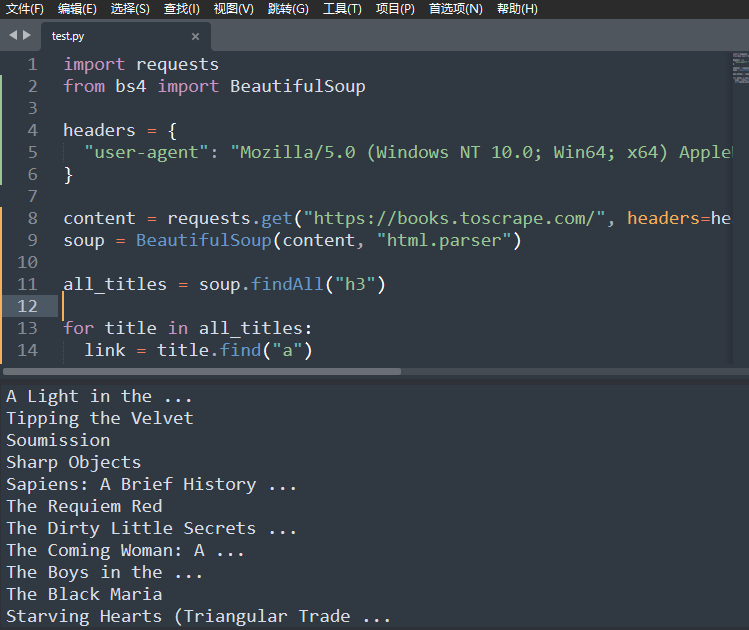

## 什么是爬虫？

**Python爬虫**是一种利用Python编程语言编写的程序，目的是从互联网上自动获取信息。这些信息可以是网页内容、图片、视频或者其他类型的数据。Python爬虫通过模拟浏览器的行为，访问网页并提取所需的数据，然后将数据保存或进一步处理，以供后续分析或使用。常见的Python爬虫库包括Beautiful Soup和Scrapy等，它们使得爬取网页数据变得更加高效和方便。

爬虫分几步？

1. 获取网页原始内容
2. 解析网页内容
3. 根据需求来储存或分析数据

爬虫需要注意一些事项：

- 不要爬取公民隐私数据
- 不要爬取受著作权保护的内容
- 不要爬取涉及到country事务，建设等
- 爬虫的请求数量和频率不要过高
- 网站如果存在反爬限制，请不要强行爬取
- 可以通过查看网站的`robots.txt`文件，了解可爬取的网页路径范围，该文件指明了哪些网页允许被爬取

请遵守以上内容，这样可以更好更礼貌地使用python爬虫。

## HTTP请求和响应

HTTP请求和响应是Web开发中非常重要的概念，用于客户端（例如浏览器）和服务器之间的通信。

HTTP有不同的请求方法，常见的有：

- GET：获得数据
- POST：创建数据
- ...

HTTP请求由三部分组成：

- 请求行：包含方法类型，资源路径和协议版本
- 请求头：包含关于请求的元数据，如内容类型、认证信息等
- 请求体：对于某些请求方法（如POST），可能包含发送到服务器的数据，比如表单数据或JSON数据

HTTP响应由三部分组成：

- 状态行：指示服务器[对请求的处理结果](https://javaguide.cn/cs-basics/network/http-status-codes.html)，如200表示成功，404表示未找到请求的资源等
- 响应头：包含关于响应的元数据，如内容类型、缓存控制信息等
- 响应体：包含实际请求的数据，如HTML文档、JSON数据或者其他类型的内容

## 如何用Python Requests发送请求？

首先打开终端，安装相关库，输入如下指令即可安装成功。

```shell
pip install requests
```

我们输入如下内容，进行对某网站http请求，得到如下结果。

```python
import requests

headers = {
  "user-agent": "Mozilla/5.0 (Windows NT 10.0; Win64; x64) AppleWebKit/537.36 (KHTML, like Gecko) Chrome/133.0.0.0 Safari/537.36",
}

response = requests.get("http://lllirunze.cn/", headers=headers)
print(response)
```

```shell
<Response [200]>
```

如果我们`print(response.text)`的话，会输出该页面的html代码，看起来会比较复杂。

在进行爬取的时候，建议添加一些headers内容，使用它的目的是为了模拟浏览器发送请求，这样可以让请求看起来像是通过正常浏览器发出的，而不是由脚本或爬虫发出的。这对于一些反爬虫机制可能会有所帮助，避免被网站认为是机器人访问，从而减少被封禁或限制访问的风险。

## HTML网页结构

HTML网页结构是用来定义网页内容的语言，它通过标签`tags`来组织和显示文本、图像、链接等信息。一个HTML网页通常由多个元素组成，这些元素按照一定的规则嵌套在一起，形成页面的结构。

可以看[前文](https://lllirunze.cn/2025/01/24/HTML-Introductory-Basics/#Common-Text-Tags)。

## 如何用Beautiful Soup解析HTML内容？

首先在终端输入指令安装对应库。

```shell
pip install bs4
```

以爬取[Books to Scrape](https://books.toscrape.com/)所有书名为例，通过在该网站点击F12，我们可以找到所有书名对应的代码块为h3标签，因此我们可以使用如下代码即可爬取到该网页的书名。

```python
import requests
from bs4 import BeautifulSoup

headers = {
  "user-agent": "Mozilla/5.0 (Windows NT 10.0; Win64; x64) AppleWebKit/537.36 (KHTML, like Gecko) Chrome/133.0.0.0 Safari/537.36",
}

content = requests.get("https://books.toscrape.com/", headers=headers).text
soup = BeautifulSoup(content, "html.parser")
all_titles = soup.findAll("h3")

for title in all_titles:
  link = title.find("a")
  print(link.string)
```



---

:::note[Reference]
- [How to Crawl the Web with Python](https://scrapfly.io/blog/crawling-with-python/)
- [【Python+爬虫】爆肝两个月！拜托三连了！这绝对是全B站最用心（没有之一）的Python+爬虫公开课程，从入门到（不）入狱 ！](https://www.bilibili.com/video/BV1d54y1g7db)
:::
